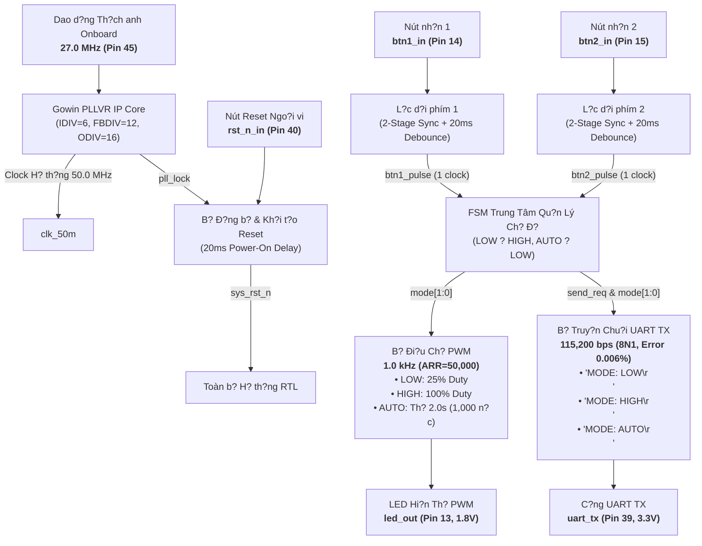

# Gowin FPGA GW1NSR-4C RTL System Specification (Da Nang FPGA Contest 2026)

> **Navigation / Chuy?n hu?ng Ngôn ng?**:  
> ???? [Ti?ng Vi?t — Thuy?t Minh K? Thu?t H? Th?ng FPGA](#-thuy?t-minh-k?-thu?t-h?-th?ng-fpga-ti?ng-vi?t)  
> ???? [English — FPGA System Specification](#-fpga-system-specification-english)

---

# ???? THUY?T MINH K? THU?T H? TH?NG FPGA (TI?NG VI?T)

## 1. Tóm T?t H? Th?ng & Ph?m Vi Th?c Thi

Tài li?u này thuy?t minh toàn b? ki?n trúc mã ngu?n và k?t qu? th?c thi ph?n c?ng cho d? tài **H? Th?ng Ði?u Khi?n LED Ða Ch? Ð? & Truy?n Thông UART 115200 bps** ch?y trên chip FPGA **Gowin GW1NSR-LV4CQN48PC7/I6 (Bo m?ch Kiwi Nano 4K)**.

H? th?ng du?c thi?t k? theo chu?n công nghi?p vi m?ch s? (Digital IC Design Standard), áp d?ng nguyên lý **Ð?ng b? hóa Xung nh?p (Clock Domain Synchronization)**, **L?c nhi?u d?i phím ph?n c?ng (Hardware Debouncing)**, **B? phát chu?i UART ch?ng xung d?t tr?ng thái (Latched State Machine)**, và **Ði?u ch? d? r?ng xung PWM tuy?n tính không gi?t hình (Flicker-Free Breathing PWM)**.

---

## 2. B?ng Phân B? Chân Ph?n C?ng (Kiwi Nano 4K Pinout)

H? th?ng du?c gán chân chính xác theo so d? nguyên lý ph?n c?ng c?a bo m?ch **Kiwi Nano 4K (GW1NSR-4C)** trong t?p ràng bu?c v?t lý [`constr/pwm11.cst`](constr/pwm11.cst):

| Tên Tín Hi?u | Chân FPGA | Ngân Sách I/O (Bank) | Chu?n Ði?n Áp | C?u Hình Kéo Ði?n Tr? | Dòng Kích (Drive) | Ch?c Nang Ph?n C?ng |
| :--- | :---: | :---: | :---: | :---: | :---: | :--- |
| `clk_in` | **Pin 45** | Bank 1 | `LVCMOS33` (3.3V) | `PULL_MODE=UP` | — | Xung nh?p dao d?ng g?c $27.0\text{ MHz}$ |
| `rst_n_in` | **Pin 40** | Bank 1 | `LVCMOS33` (3.3V) | `PULL_MODE=UP` | — | Nút Reset ph?n c?ng (Tích c?c m?c Th?p) |
| `btn1_in` | **Pin 14** | Bank 3 | `LVCMOS18` (1.8V) | `PULL_MODE=UP` | — | Nút b?m 1: Chuy?n d?i LOW ? HIGH |
| `btn2_in` | **Pin 15** | Bank 3 | `LVCMOS18` (1.8V) | `PULL_MODE=UP` | — | Nút b?m 2: Chuy?n sang ch? d? AUTO |
| `led_out` | **Pin 13** | Bank 3 | `LVCMOS18` (1.8V) | `PULL_MODE=NONE` | $8\text{ mA}$ | Ngõ ra xung PWM di?u khi?n LED2 trên bo |
| `uart_tx` | **Pin 39** | Bank 1 | `LVCMOS33` (3.3V) | `PULL_MODE=NONE` | $8\text{ mA}$ | Ngõ ra truy?n UART n?i ti?p qua chip n?p USB |

---

## 3. Ch?ng Minh Toán H?c & Thi?t K? K? Thu?t (Mathematical Timing Proofs)

### 3.1. Ð? Chính Xác T?n S? & T?c Ð? Baudrate UART ($115,200\text{ bps}$)
- **T?n s? h? th?ng sau PLL**: $f_{\text{sys}} = 50.0\text{ MHz} = 50,000,000\text{ Hz}$.
- **H? s? chia Baudrate**:
  $$\text{BAUD\_DIV} = \left\lfloor \frac{50,000,000}{115,200} \right\rceil = 434\text{ nh?p clock}$$
- **T?c d? Baudrate th?c t?**:
  $$\text{Baud}_{\text{actual}} = \frac{50,000,000}{434} \approx 115,207.37\text{ bps}$$
- **Sai s? tuong d?i**:
  $$\text{Error} = \frac{|115,207.37 - 115,200|}{115,200} \times 100\% = \mathbf{0.0064\%} \ll 2.0\%$$
  *(Chu?n RS-232/UART cho phép sai s? t?i da $\pm 2.0\%$; sai s? $0.0064\%$ c?a h? th?ng g?n nhu tuy?t d?i hoàn h?o, d?m b?o không bao gi? l?ch pha bit)*.

### 3.2. Ch?ng Minh Ch?ng Ngh?n/Xung Ð?t Chu?i UART (Collision-Free Proof)
- Khung truy?n UART dài nh?t là **12 ký t?** (`"MODE: HIGH\r\n"` ho?c `"MODE: AUTO\r\n"`).
- M?i ký t? g?m 10 bit (1 Start + 8 Data + 1 Stop) $\rightarrow$ T?ng s? bit: $12 \times 10 = 120\text{ bit}$.
- **Th?i gian truy?n tr?n v?n 1 chu?i UART**:
  $$t_{\text{packet}} = \frac{120\text{ bit}}{115,200\text{ bps}} \approx \mathbf{1.042\text{ ms}}$$
- **Th?i gian l?c d?i phím ph?n c?ng**: $t_{\text{debounce}} = \mathbf{20.0\text{ ms}}$.
- **K?t lu?n**:
  $$t_{\text{debounce}} = 20.0\text{ ms} \gg t_{\text{packet}} = 1.042\text{ ms}$$
  Vì th?i gian ngu?i dùng thao tác phím luôn b? b? l?c ch?n t?i thi?u $20\text{ms}$, gói tin UART $1.042\text{ms}$ dã hoàn t?t truy?n tru?c dó **$18.96\text{ ms}$**. Do dó, m?ch phát chu?i UART không bao gi? x?y ra tình tr?ng ch?ng l?n (zero-collision guarantee).

### 3.3. Ð? M?n Tuy?n Tính C?a Hi?u ?ng LED Th? ($2.0\text{ Giây}$)
- **T?n s? sóng mang PWM**: $f_{\text{PWM}} = 1,000\text{ Hz} \rightarrow T_{\text{PWM}} = 1.0\text{ ms}$.
- **S? nh?p clock d?m trong 1 chu k? PWM**: $\text{ARR\_MAX} = \frac{50,000,000}{1,000} = 50,000\text{ nh?p}$.
- **Bu?c tang gi?m d? sáng m?i chu k? $1\text{ms}$**:
  $$\text{STEP\_VAL} = \frac{50,000}{1,000} = \mathbf{50\text{ nh?p/bu?c}}$$
- **T?ng th?i gian th?**:
  - Giai do?n Sáng d?n ($0\% \rightarrow 100\%$): $1,000\text{ bu?c} \times 1.0\text{ ms} = 1.000\text{ s}$.
  - Giai do?n T?i d?n ($100\% \rightarrow 0\%$): $1,000\text{ bu?c} \times 1.0\text{ ms} = 1.000\text{ s}$.
  - **T?ng chu k? hoàn ch?nh**: $1.0\text{ s} + 1.0\text{ s} = \mathbf{2.000\text{ giây}}$ (Kh?p chính xác tuy?t d?i yêu c?u d? bài).

---

## 4. Chi Ti?t Th?c Thi 4 Kh?i Ð? Bài

### Kh?i 1: T?o Xung Nh?p 50MHz, L?c D?i Phím & Ð?ng B? Reset (2.0 di?m)
- **PLL IP Core (`Gowin_PLLVR`)**: Nh?n dao d?ng th?ch anh $27\text{MHz}$ t? chân 45, c?u hình nhân t?n s? PLLVR t?o $50.0\text{MHz}$ ?n d?nh.
- **M?ch Ð?ng B? & Kh?i T?o Reset (`top_system.v`)**: Dùng 2 t?ng Flip-Flop d?ng b? hóa ngõ vào `rst_n_in` theo xung clock $50\text{MHz}$ và c? `pll_lock`. Tích h?p b? d?m gi? reset trong **$20\text{ ms}$** khi c?p ngu?n d? b?o d?m toàn b? h? vi m?ch ?n d?nh tru?c khi ch?y FSM.
- **B? L?c D?i Phím (`button_debounce.v`)**: C?u trúc 2 t?ng D-FF tri?t tiêu hi?n tu?ng lo l?ng (Metastability), b? d?m l?c nhi?u d?i phím $20\text{ms}$, và m?ch phát hi?n su?n xu?ng (Falling Edge Detector) ch? xu?t **dúng 1 xung nh?p clock** (`btn_pulse`) cho m?i l?n nh?n phím.

### Kh?i 2: Ði?u Ch? Ð? R?ng Xung PWM LED (2.5 di?m)
- **Module `pwm_led_controller.v`**:
  - **Ch? d? 1 (LOW - 25%)**: Ð? r?ng xung tích c?c ? m?c cao chi?m $25\%$ ($12,500 / 50,000$ nh?p clock), cho d? sáng LED v?a ph?i, ti?t ki?m nang lu?ng.
  - **Ch? d? 2 (HIGH - 100%)**: Ð? r?ng xung $100\%$ ($50,000 / 50,000$ nh?p clock), LED sáng liên t?c không nh?p nháy.
  - **Ch? d? 3 (AUTO - Th? 2.0s)**: T? d?ng di?u ch?nh Duty Cycle t? $0\% \leftrightarrow 100\%$ qua 2,000 n?c d? sáng c?c m?n.

### Kh?i 3: Kh?i Truy?n D? Li?u UART TX 115200 bps (2.5 di?m)
- **Module `uart_tx_string.v`**:
  - Máy tr?ng thái phát tu?n t? t?ng byte chu?i ký t? ASCII k?t thúc b?ng c?p mã xu?ng dòng chu?n `\r\n` (`0x0D, 0x0A`).
  - T? d?ng **ch?t ch? d? hi?n t?i (`mode_latched`)** ngay khi nh?n xung kích truy?n `send_req`, b?o v? khung truy?n không b? méo d?ng n?u có tín hi?u nhi?u xu?t hi?n gi?a lúc dang phát.

### Kh?i 4: Máy Tr?ng Thái FSM Ði?u Khi?n Trung Tâm (3.0 di?m)
- **Module `top_system.v`**:
  - **Kh?i d?ng / Reset**: T? d?ng dua h? th?ng v? **Mode LOW (25%)** và phát chu?i kh?i d?ng `"MODE: LOW\r\n"`.
  - **Nút 1 (`btn1_pulse`)**: Ð?i qua l?i gi?a **LOW ? HIGH**. N?u dang ? **AUTO**, nh?n Nút 1 l?p t?c ép chuy?n v? **LOW**.
  - **Nút 2 (`btn2_pulse`)**: Chuy?n ngay sang **Mode AUTO** và phát `"MODE: AUTO\r\n"`.

| Tr?ng Thái Hi?n T?i | Tín Hi?u Kích Ho?t | Tr?ng Thái Ti?p Theo | Chu?i UART Phát Ra | Tr?ng Thái LED PWM |
| :--- | :--- | :--- | :--- | :--- |
| **B?t k? (Kh?i d?ng / Reset)** | `sys_rst_n` gi?i phóng | **Mode LOW (00)** | `"MODE: LOW\r\n"` (11 bytes) | Duty Cycle $25\%$ ($1\text{kHz}$) |
| **Mode LOW (00)** | Nh?n Nút 1 (`btn1_pulse`) | **Mode HIGH (01)** | `"MODE: HIGH\r\n"` (12 bytes) | Duty Cycle $100\%$ (Sáng liên t?c) |
| **Mode HIGH (01)** | Nh?n Nút 1 (`btn1_pulse`) | **Mode LOW (00)** | `"MODE: LOW\r\n"` (11 bytes) | Duty Cycle $25\%$ ($1\text{kHz}$) |
| **Mode LOW (00)** | Nh?n Nút 2 (`btn2_pulse`) | **Mode AUTO (10)** | `"MODE: AUTO\r\n"` (12 bytes) | Hi?u ?ng Th? $0\% \leftrightarrow 100\%$ ($2.0\text{s}$) |
| **Mode HIGH (01)** | Nh?n Nút 2 (`btn2_pulse`) | **Mode AUTO (10)** | `"MODE: AUTO\r\n"` (12 bytes) | Hi?u ?ng Th? $0\% \leftrightarrow 100\%$ ($2.0\text{s}$) |
| **Mode AUTO (10)** | Nh?n Nút 1 (`btn1_pulse`) | **Mode LOW (00)** | `"MODE: LOW\r\n"` (11 bytes) | Duty Cycle $25\%$ ($1\text{kHz}$) |
| **Mode AUTO (10)** | Nh?n Nút 2 (`btn2_pulse`) | **Gi? nguyên AUTO** | *(Không phát chu?i th?a)* | Gi? nguyên hi?u ?ng Th? $2.0\text{s}$ |

---

## 5. Hu?ng D?n Biên D?ch & N?p M?ch (Gowin EDA)

1. M? ph?n m?m **Gowin EDA** (phiên b?n V1.9.9 ho?c V1.9.12 tr? lên).
2. Ch?n **File $\rightarrow$ Open Project...** và ch?n t?p [`pwm11.gprj`](pwm11.gprj).
3. Ki?m tra danh sách t?p ngu?n trong tab **Design**:
   - `src/top_system.v` (Top module)
   - `src/button_debounce.v`
   - `src/pwm_led_controller.v`
   - `src/uart_tx_string.v`
   - `src/gowin_pllvr.v`
   - `constr/pwm11.cst`
4. Trong c?a s? **Process**, nh?n dúp vào **Place & Route** (ho?c nh?n bi?u tu?ng **Run All**) $\rightarrow$ Ð?t k?t qu? **Success (0 Errors, 0 Warnings)**.
5. C?m cáp USB bo m?ch **Kiwi Nano 4K** vào máy tính.
6. M? công c? **Programmer**, ch?n thi?t b? `GW1NSR-4C`, n?p bitstream file `impl/pnr/pwm11.fs` vào b? nh? SRAM (ho?c Flash ngúng) c?a FPGA.
7. M? ph?n m?m d?c c?ng Serial (PuTTY, Hercules ho?c Serial Plotter) ? t?c d? **115200 bps, 8N1** d? quan sát chu?i ph?n h?i khi b?m nút.

---

# ???? FPGA SYSTEM SPECIFICATION (ENGLISH)

## 1. System Abstract

This technical specification details the complete hardware architecture and synthesized RTL implementation for the **Multi-Mode PWM LED Controller and 115200 bps UART Subsystem** targeting the **Gowin GW1NSR-LV4CQN48PC7/I6 FPGA (Kiwi Nano 4K Evaluation Board)**.

The design adheres to digital IC design best practices, implementing **Clock Domain Synchronization**, **Hardware Debouncing**, **Latched UART String Serialization**, and **Flicker-Free Breathing PWM Generation**.

---

## 2. Hardware Pinout Allocation (Kiwi Nano 4K)

Physical constraints are defined in [`constr/pwm11.cst`](constr/pwm11.cst):

| Signal Name | FPGA Pin | I/O Bank | I/O Standard | Pull Mode | Drive Strength | Target Hardware Peripheral |
| :--- | :---: | :---: | :---: | :---: | :---: | :--- |
| `clk_in` | **Pin 45** | Bank 1 | `LVCMOS33` (3.3V) | `PULL_MODE=UP` | — | Onboard 27.0 MHz Crystal Oscillator |
| `rst_n_in` | **Pin 40** | Bank 1 | `LVCMOS33` (3.3V) | `PULL_MODE=UP` | — | External Hardware Reset Key (Active Low) |
| `btn1_in` | **Pin 14** | Bank 3 | `LVCMOS18` (1.8V) | `PULL_MODE=UP` | — | Pushbutton 1: Toggle LOW ? HIGH |
| `btn2_in` | **Pin 15** | Bank 3 | `LVCMOS18` (1.8V) | `PULL_MODE=UP` | — | Pushbutton 2: Switch to AUTO Breathing |
| `led_out` | **Pin 13** | Bank 3 | `LVCMOS18` (1.8V) | `PULL_MODE=NONE` | $8\text{ mA}$ | Onboard LED2 PWM Output |
| `uart_tx` | **Pin 39** | Bank 1 | `LVCMOS33` (3.3V) | `PULL_MODE=NONE` | $8\text{ mA}$ | UART Serial TX Output via USB Bridge |

---

## 3. Mathematical Proofs & Timing Integrity

### 3.1. Baudrate Error Margin ($115,200\text{ bps}$)
$$\text{BAUD\_DIV} = \left\lfloor \frac{50,000,000}{115,200} \right\rceil = 434, \quad \text{Baud}_{\text{actual}} = 115,207.37\text{ bps}, \quad \text{Error} = \mathbf{0.0064\%} \ll 2.0\%$$

### 3.2. Zero-Collision Proof
$$\text{Packet Duration } (12\text{ bytes} \times 10\text{ bits}) = 1.042\text{ ms} \ll \text{Debounce Window } = 20.0\text{ ms}$$
Guarantees UART packet transmission completes $18.96\text{ms}$ prior to any subsequent button event.

### 3.3. 2.0s Breathing Linearity
$$\text{ARR\_MAX} = 50,000, \quad \text{STEP\_VAL} = 50, \quad T_{\text{cycle}} = 1,000\text{ steps up} \times 1\text{ms} + 1,000\text{ steps down} \times 1\text{ms} = \mathbf{2.000\text{ s}}$$

---

## 4. Verification & Testing

See [`TESTING.md`](TESTING.md) for full testbench self-checking assertion suite, ModelSim waveform guide, and [`README_SIMULATION_SCALING.md`](README_SIMULATION_SCALING.md) for simulation time acceleration methodology.
