# FPGA Verification Suite & Simulation Testing Guide (Da Nang Contest 2026)

[](https://github.com/zok213/porygon/actions/workflows/ci.yml)
[](https://opensource.org/licenses/MIT)

> **Navigation / Chuyển hướng Ngôn ngữ**:  
> 🇻🇳 [Tiếng Việt — Kế Hoạch & Báo Cáo Kiểm Thử FPGA](#-kế-hoạch--báo-cáo-kiểm-thử-fpga-tiếng-việt)  
> 🇬🇧 [English — FPGA Verification & Testing Specification](#-fpga-verification--testing-specification-english)

---

# 🇻🇳 KẾ HOẠCH & BÁO CÁO KIỂM THỬ FPGA (TIẾNG VIỆT)

## 1. Tổng Quan Về Kiến Trúc Kiểm Thử (Verification Architecture)

Hệ thống kiểm thử FPGA áp dụng chuẩn **Self-Checking Testbench** (`sim/tb_top_system_v2.v`), tự động đánh giá tính đúng đắn của logic RTL qua các bộ giám sát (Monitors) và bộ xác thực (Checkers) tự động, không phụ thuộc vào việc quan sát thủ công bằng mắt.

```mermaid
flowchart LR
    subgraph STIMULUS["Khối Kích Thích (Stimulus Generator)"]
        RST_STIM["Trigger Reset (5ms)"]
        BTN1_STIM["Press BTN1 (30ms)"]
        BTN2_STIM["Press BTN2 (30ms)"]
        NOISE_STIM["Glitchy Bounces (1-2ms noise)"]
        SHORT_STIM["Short Pulse (<5ms rejection)"]
    end

    subgraph DUT["Thiết Bị Cần Kiểm Thử (DUT: top_system)"]
        PLL["Gowin PLL (27M->50M)"]
        DB["Debouncer 20ms"]
        FSM["Supervisor FSM"]
        PWM_CORE["PWM Engine (50kHz sim scale)"]
        UART_CORE["UART TX 115200 (8N1)"]
    end

    subgraph CHECKERS["Khối Giám Sát & Tự Động Bắt Lỗi"]
        UART_DEC["UART Bit-by-Bit Receiver & Baud Rate Error Analyzer"]
        PWM_MTR["PWM Duty Cycle Averaging Meter"]
        BREATH_MTR["Breathing Monotonicity Trend Sampler (40 samples)"]
        GLITCH_CHK["Negative-Pulse Suppression Assertion"]
    end

    STIMULUS --> DUT --> CHECKERS
```



---

## 2. Ma Trận Ca Kiểm Thử Tự Động (Test Matrix & Automated Assertions)

| Mã Ca Kiểm Thử | Kịch Bản Kích Hoạt | Hành Vi Kỹ Thuật Mong Đợi | Bộ Kiểm Tra Tự Động (Checker) | Tiêu Chuẩn Đạt (Pass Criteria) | Kết Quả |
| :---: | :--- | :--- | :--- | :--- | :---: |
| **TC-01** | Khởi động / Hardware Reset (`rst_n_in = 0` $\rightarrow 1$) | Hệ thống về Mode LOW; tự động phát chuỗi `"MODE: LOW\r\n"` | `uart_check_message(..., 11)` | Nhận đúng 11 byte ASCII, mã hex kết thúc `0x0D 0x0A` | **PASS (11/11 checks)** |
| **TC-02** | Đo Duty Cycle Mode LOW | Tỷ lệ tích cực mức cao chiếm đúng 25% | `measure_pwm_duty("LOW", ...)` | $\text{Duty} = 25.0\% \pm 0.5\%$ | **PASS** |
| **TC-03** | Nhấn Button 1 (`btn1_in = 0` trong 30ms) | Chuyển LOW $\rightarrow$ HIGH; phát chuỗi `"MODE: HIGH\r\n"` | `uart_check_message(..., 12)` | Nhận đúng 12 byte ASCII | **PASS (12/12 checks)** |
| **TC-04** | Đo Duty Cycle Mode HIGH | Tỷ lệ tích cực mức cao chiếm đúng 100% | `measure_pwm_duty("HIGH", ...)` | $\text{Duty} = 100.0\%$ (Sáng liên tục) | **PASS** |
| **TC-05** | Nhấn tiếp Button 1 | Chuyển HIGH $\rightarrow$ LOW; phát chuỗi `"MODE: LOW\r\n"` | `uart_check_message(..., 11)` | Nhận đúng 11 byte ASCII | **PASS (11/11 checks)** |
| **TC-06** | Nhấn Button 2 (`btn2_in = 0` trong 30ms) | Chuyển sang Mode AUTO; phát chuỗi `"MODE: AUTO\r\n"` | `uart_check_message(..., 12)` | Nhận đúng 12 byte ASCII | **PASS (12/12 checks)** |
| **TC-07** | Quét hiệu ứng Thở (Mode AUTO) | Duty Cycle tăng dần từ 0% lên 100% rồi giảm dần về 0% | `measure_breath_sample(...)` (40 mẫu) | $\ge 5$ mẫu tăng đơn điệu và $\ge 5$ mẫu giảm đơn điệu | **PASS (40/40 checks)** |
| **TC-08** | Nhấn Button 1 khi đang ở AUTO | Ép chuyển từ AUTO $\rightarrow$ Mode LOW; phát `"MODE: LOW\r\n"` | `uart_check_message(..., 11)` | Nhận đúng 11 byte ASCII | **PASS (11/11 checks)** |
| **TC-09** | Nhiễu rung phím (Contact Bounce) | Bơm chùm xung nhiễu đảo liên tục 1-2ms trước khi giữ 25ms | `glitchy_press_btn1` + `check_no_uart_within` | Chỉ ghi nhận đúng 1 lần chuyển trạng thái, không bị double-fire | **PASS** |
| **TC-10** | Nhấn phím cực ngắn (< 5ms) | Phím nhấn dưới ngưỡng 20ms debounce | `short_press_btn1` + `check_no_uart_within` | Bộ lọc dội phím loại bỏ hoàn toàn, không có UART phát ra | **PASS** |
| **TC-11** | Độ chính xác Baudrate UART | Đo chu kỳ 1 bit UART thực tế | `uart_check_message` bit timer | Bit period $= 8,680.56\text{ ns}$, sai số $\le 0.01\%$ | **PASS (0.006%)** |

---

## 3. Hướng Dẫn Chạy Mô Phỏng ModelSim / QuestaSim

### 3.1. Các bước nạp tệp kịch bản mô phỏng
1. Khởi động phần mềm **ModelSim** (hoặc QuestaSim).
2. Tạo thư mục làm việc mới và đổi đường dẫn làm việc về thư mục `FPGA/`:
   ```tcl
   cd d:/FPGA&MCU/FPGA
   ```
3. Tạo thư viện làm việc:
   ```tcl
   vlib work
   vmap work work
   ```
4. Biên dịch toàn bộ mã nguồn RTL và Testbench:
   ```tcl
   vlog src/button_debounce.v
   vlog src/pwm_led_controller.v
   vlog src/uart_tx_string.v
   vlog src/gowin_pllvr.v
   vlog src/top_system.v
   vlog sim/tb_top_system_v2.v
   ```
5. Khởi chạy mô phỏng:
   ```tcl
   vsim -voptargs=+acc work.tb_top_system_v2
   ```
6. Tải cấu hình dạng sóng và thước đo màu tự động:
   ```tcl
   do sim/wavefinal.do
   ```
7. Chạy mô phỏng toàn phần:
   ```tcl
   run -all
   ```

### 3.2. Đọc Thước Đo Dạng Sóng (Waveform Markers)

Tệp [`sim/wavefinal.do`](sim/wavefinal.do) đã được cấu hình sẵn các nhóm màu trực quan:
- **Tín hiệu Nút nhấn (`btn1_in`, `btn2_in`)**: Hiển thị màu trắng.
- **Xung lọc phím (`btn1_pulse`, `btn2_pulse`)**: Hiển thị màu Hồng / Xanh Olive (chỉ nháy 1 xung 20ns duy nhất).
- **Xung PWM LED (`led_out`)**: Hiển thị màu Đỏ (Đo chu kỳ bằng Cursor $\approx 20\mu\text{s}$ ở chế độ mô phỏng tăng tốc).
- **Ngõ ra UART (`uart_tx`)**: Hiển thị màu Vàng kim (Đo độ rộng 1 bit $\approx 8.68\mu\text{s}$).
- **Trạng thái FSM (`current_mode`)**: Hiển thị giá trị nguyên không dấu (`0`: LOW, `1`: HIGH, `2`: AUTO).

---

## 4. Checklist Kiểm Tra Mạch Thật Phần Cứng (Kiwi Nano 4K Board)

| Bước | Hành Động Trên Bo | Hiện Tượng Quan Sát Trên LED D2 | Dữ Liệu Thu Trên Cổng Serial (115200 8N1) | Đánh Giá |
| :---: | :--- | :--- | :--- | :---: |
| 1 | Cắm nguồn / Bấm nút Reset | LED2 sáng mờ đều (Duty 25%, 1kHz) | Xuất hiện dòng: `MODE: LOW` kèm xuống dòng | [ ] Đạt |
| 2 | Bấm Nút 1 (Pin 14) lần 1 | LED2 sáng rực cực đại (Duty 100%) | Xuất hiện dòng: `MODE: HIGH` | [ ] Đạt |
| 3 | Bấm Nút 1 (Pin 14) lần 2 | LED2 giảm độ sáng về 25% | Xuất hiện dòng: `MODE: LOW` | [ ] Đạt |
| 4 | Bấm Nút 2 (Pin 15) | LED2 thở sáng dần $\rightarrow$ tối dần trong đúng 2.0s | Xuất hiện dòng: `MODE: AUTO` | [ ] Đạt |
| 5 | Bấm Nút 1 khi đang thở | LED2 lập tức ngừng thở, giữ sáng ở 25% | Xuất hiện dòng: `MODE: LOW` | [ ] Đạt |
| 6 | Nhấn giữ phím lâu | Không bị gửi lặp lại nhiều lần | Chỉ gửi đúng 1 chuỗi ký tự duy nhất | [ ] Đạt |

---

# 🇬🇧 FPGA VERIFICATION & TESTING SPECIFICATION (ENGLISH)

## Summary of Test Results
The automated self-checking testbench (`sim/tb_top_system_v2.v`) executes 11 distinct test cases verifying:
- Power-on reset synchronization and boot transmission of `"MODE: LOW\r\n"`.
- State transitions (LOW $\leftrightarrow$ HIGH, AUTO $\rightarrow$ LOW) and corresponding UART string transmissions.
- Hardware key debouncing (20ms noise rejection and single-clock pulse generation).
- Negative pulse rejection for contact glitches shorter than 20ms.
- High-precision UART baud rate verification ($0.006\%$ timing error).
- Linear PWM duty cycle scaling (25%, 100%, and 2.0s monotonic breathing cycle).
