# FPGA Verification Suite & Simulation Testing Guide (Da Nang Contest 2026)

> **Navigation / Chuy?n hu?ng Ngôn ng?**:  
> ???? [Ti?ng Vi?t — K? Ho?ch & Báo Cáo Ki?m Th? FPGA](#-k?-ho?ch--báo-cáo-ki?m-th?-fpga-ti?ng-vi?t)  
> ???? [English — FPGA Verification & Testing Specification](#-fpga-verification--testing-specification-english)

---

# ???? K? HO?CH & BÁO CÁO KI?M TH? FPGA (TI?NG VI?T)

## 1. T?ng Quan V? Ki?n Trúc Ki?m Th? (Verification Architecture)

H? th?ng ki?m th? FPGA áp d?ng chu?n **Self-Checking Testbench** (`sim/tb_top_system_v2.v`), t? d?ng dánh giá tính dúng d?n c?a logic RTL qua các b? giám sát (Monitors) và b? xác th?c (Checkers) t? d?ng, không ph? thu?c vào vi?c quan sát th? công b?ng m?t.

```mermaid
flowchart LR
    subgraph STIMULUS["Kh?i Kích Thích (Stimulus Generator)"]
        RST_STIM["Trigger Reset (5ms)"]
        BTN1_STIM["Press BTN1 (30ms)"]
        BTN2_STIM["Press BTN2 (30ms)"]
        NOISE_STIM["Glitchy Bounces (1-2ms noise)"]
        SHORT_STIM["Short Pulse (<5ms rejection)"]
    end

    subgraph DUT["Thi?t B? C?n Ki?m Th? (DUT: top_system)"]
        PLL["Gowin PLL (27M->50M)"]
        DB["Debouncer 20ms"]
        FSM["Supervisor FSM"]
        PWM_CORE["PWM Engine (50kHz sim scale)"]
        UART_CORE["UART TX 115200 (8N1)"]
    end

    subgraph CHECKERS["Kh?i Giám Sát & T? Ð?ng B?t L?i"]
        UART_DEC["UART Bit-by-Bit Receiver & Baud Rate Error Analyzer"]
        PWM_MTR["PWM Duty Cycle Averaging Meter"]
        BREATH_MTR["Breathing Monotonicity Trend Sampler (40 samples)"]
        GLITCH_CHK["Negative-Pulse Suppression Assertion"]
    end

    STIMULUS --> DUT --> CHECKERS
```



---

## 2. Ma Tr?n Ca Ki?m Th? T? Ð?ng (Test Matrix & Automated Assertions)

| Mã Ca Ki?m Th? | K?ch B?n Kích Ho?t | Hành Vi K? Thu?t Mong Ð?i | B? Ki?m Tra T? Ð?ng (Checker) | Tiêu Chu?n Ð?t (Pass Criteria) | K?t Qu? |
| :---: | :--- | :--- | :--- | :--- | :---: |
| **TC-01** | Kh?i d?ng / Hardware Reset (`rst_n_in = 0` $\rightarrow 1$) | H? th?ng v? Mode LOW; t? d?ng phát chu?i `"MODE: LOW\r\n"` | `uart_check_message(..., 11)` | Nh?n dúng 11 byte ASCII, mã hex k?t thúc `0x0D 0x0A` | **PASS (11/11 checks)** |
| **TC-02** | Ðo Duty Cycle Mode LOW | T? l? tích c?c m?c cao chi?m dúng 25% | `measure_pwm_duty("LOW", ...)` | $\text{Duty} = 25.0\% \pm 0.5\%$ | **PASS** |
| **TC-03** | Nh?n Button 1 (`btn1_in = 0` trong 30ms) | Chuy?n LOW $\rightarrow$ HIGH; phát chu?i `"MODE: HIGH\r\n"` | `uart_check_message(..., 12)` | Nh?n dúng 12 byte ASCII | **PASS (12/12 checks)** |
| **TC-04** | Ðo Duty Cycle Mode HIGH | T? l? tích c?c m?c cao chi?m dúng 100% | `measure_pwm_duty("HIGH", ...)` | $\text{Duty} = 100.0\%$ (Sáng liên t?c) | **PASS** |
| **TC-05** | Nh?n ti?p Button 1 | Chuy?n HIGH $\rightarrow$ LOW; phát chu?i `"MODE: LOW\r\n"` | `uart_check_message(..., 11)` | Nh?n dúng 11 byte ASCII | **PASS (11/11 checks)** |
| **TC-06** | Nh?n Button 2 (`btn2_in = 0` trong 30ms) | Chuy?n sang Mode AUTO; phát chu?i `"MODE: AUTO\r\n"` | `uart_check_message(..., 12)` | Nh?n dúng 12 byte ASCII | **PASS (12/12 checks)** |
| **TC-07** | Quét hi?u ?ng Th? (Mode AUTO) | Duty Cycle tang d?n t? 0% lên 100% r?i gi?m d?n v? 0% | `measure_breath_sample(...)` (40 m?u) | $\ge 5$ m?u tang don di?u và $\ge 5$ m?u gi?m don di?u | **PASS (40/40 checks)** |
| **TC-08** | Nh?n Button 1 khi dang ? AUTO | Ép chuy?n t? AUTO $\rightarrow$ Mode LOW; phát `"MODE: LOW\r\n"` | `uart_check_message(..., 11)` | Nh?n dúng 11 byte ASCII | **PASS (11/11 checks)** |
| **TC-09** | Nhi?u rung phím (Contact Bounce) | Bom chùm xung nhi?u d?o liên t?c 1-2ms tru?c khi gi? 25ms | `glitchy_press_btn1` + `check_no_uart_within` | Ch? ghi nh?n dúng 1 l?n chuy?n tr?ng thái, không b? double-fire | **PASS** |
| **TC-10** | Nh?n phím c?c ng?n (< 5ms) | Phím nh?n du?i ngu?ng 20ms debounce | `short_press_btn1` + `check_no_uart_within` | B? l?c d?i phím lo?i b? hoàn toàn, không có UART phát ra | **PASS** |
| **TC-11** | Ð? chính xác Baudrate UART | Ðo chu k? 1 bit UART th?c t? | `uart_check_message` bit timer | Bit period $= 8,680.56\text{ ns}$, sai s? $\le 0.01\%$ | **PASS (0.006%)** |

---

## 3. Hu?ng D?n Ch?y Mô Ph?ng ModelSim / QuestaSim

### 3.1. Các bu?c n?p t?p k?ch b?n mô ph?ng
1. Kh?i d?ng ph?n m?m **ModelSim** (ho?c QuestaSim).
2. T?o thu m?c làm vi?c m?i và d?i du?ng d?n làm vi?c v? thu m?c `FPGA/`:
   ```tcl
   cd d:/FPGA&MCU/FPGA
   ```
3. T?o thu vi?n làm vi?c:
   ```tcl
   vlib work
   vmap work work
   ```
4. Biên d?ch toàn b? mã ngu?n RTL và Testbench:
   ```tcl
   vlog src/button_debounce.v
   vlog src/pwm_led_controller.v
   vlog src/uart_tx_string.v
   vlog src/gowin_pllvr.v
   vlog src/top_system.v
   vlog sim/tb_top_system_v2.v
   ```
5. Kh?i ch?y mô ph?ng:
   ```tcl
   vsim -voptargs=+acc work.tb_top_system_v2
   ```
6. T?i c?u hình d?ng sóng và thu?c do màu t? d?ng:
   ```tcl
   do sim/wavefinal.do
   ```
7. Ch?y mô ph?ng toàn ph?n:
   ```tcl
   run -all
   ```

### 3.2. Ð?c Thu?c Ðo D?ng Sóng (Waveform Markers)

T?p [`sim/wavefinal.do`](sim/wavefinal.do) dã du?c c?u hình s?n các nhóm màu tr?c quan:
- **Tín hi?u Nút nh?n (`btn1_in`, `btn2_in`)**: Hi?n th? màu tr?ng.
- **Xung l?c phím (`btn1_pulse`, `btn2_pulse`)**: Hi?n th? màu H?ng / Xanh Olive (ch? nháy 1 xung 20ns duy nh?t).
- **Xung PWM LED (`led_out`)**: Hi?n th? màu Ð? (Ðo chu k? b?ng Cursor $\approx 20\mu\text{s}$ ? ch? d? mô ph?ng tang t?c).
- **Ngõ ra UART (`uart_tx`)**: Hi?n th? màu Vàng kim (Ðo d? r?ng 1 bit $\approx 8.68\mu\text{s}$).
- **Tr?ng thái FSM (`current_mode`)**: Hi?n th? giá tr? nguyên không d?u (`0`: LOW, `1`: HIGH, `2`: AUTO).

---

## 4. Checklist Ki?m Tra M?ch Th?t Ph?n C?ng (Kiwi Nano 4K Board)

| Bu?c | Hành Ð?ng Trên Bo | Hi?n Tu?ng Quan Sát Trên LED D2 | D? Li?u Thu Trên C?ng Serial (115200 8N1) | Ðánh Giá |
| :---: | :--- | :--- | :--- | :---: |
| 1 | C?m ngu?n / B?m nút Reset | LED2 sáng m? d?u (Duty 25%, 1kHz) | Xu?t hi?n dòng: `MODE: LOW` kèm xu?ng dòng | [ ] Ð?t |
| 2 | B?m Nút 1 (Pin 14) l?n 1 | LED2 sáng r?c c?c d?i (Duty 100%) | Xu?t hi?n dòng: `MODE: HIGH` | [ ] Ð?t |
| 3 | B?m Nút 1 (Pin 14) l?n 2 | LED2 gi?m d? sáng v? 25% | Xu?t hi?n dòng: `MODE: LOW` | [ ] Ð?t |
| 4 | B?m Nút 2 (Pin 15) | LED2 th? sáng d?n $\rightarrow$ t?i d?n trong dúng 2.0s | Xu?t hi?n dòng: `MODE: AUTO` | [ ] Ð?t |
| 5 | B?m Nút 1 khi dang th? | LED2 l?p t?c ng?ng th?, gi? sáng ? 25% | Xu?t hi?n dòng: `MODE: LOW` | [ ] Ð?t |
| 6 | Nh?n gi? phím lâu | Không b? g?i l?p l?i nhi?u l?n | Ch? g?i dúng 1 chu?i ký t? duy nh?t | [ ] Ð?t |

---

# ???? FPGA VERIFICATION & TESTING SPECIFICATION (ENGLISH)

## Summary of Test Results
The automated self-checking testbench (`sim/tb_top_system_v2.v`) executes 11 distinct test cases verifying:
- Power-on reset synchronization and boot transmission of `"MODE: LOW\r\n"`.
- State transitions (LOW $\leftrightarrow$ HIGH, AUTO $\rightarrow$ LOW) and corresponding UART string transmissions.
- Hardware key debouncing (20ms noise rejection and single-clock pulse generation).
- Negative pulse rejection for contact glitches shorter than 20ms.
- High-precision UART baud rate verification ($0.006\%$ timing error).
- Linear PWM duty cycle scaling (25%, 100%, and 2.0s monotonic breathing cycle).
