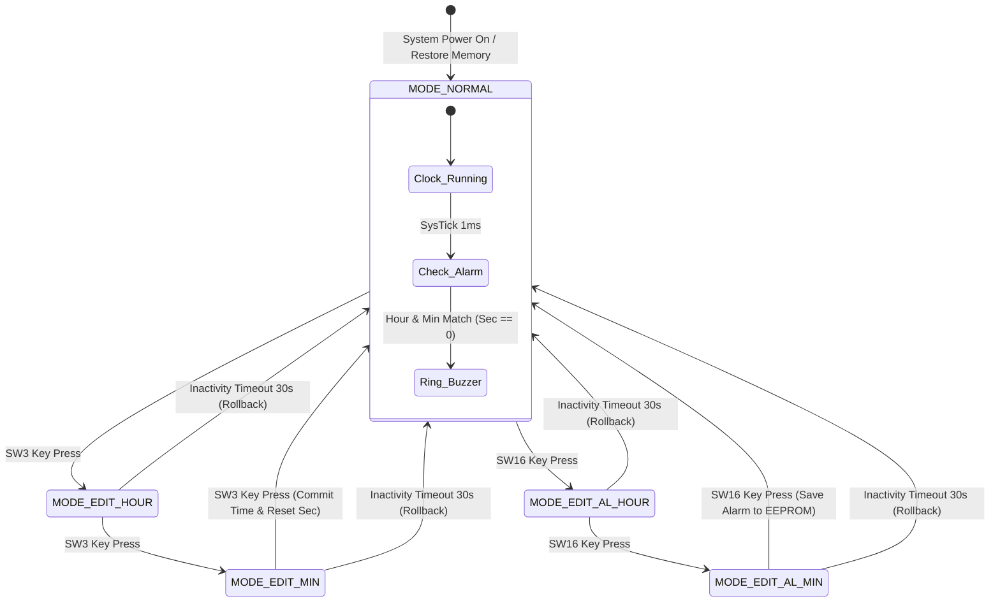
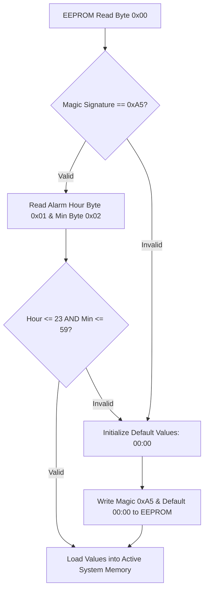
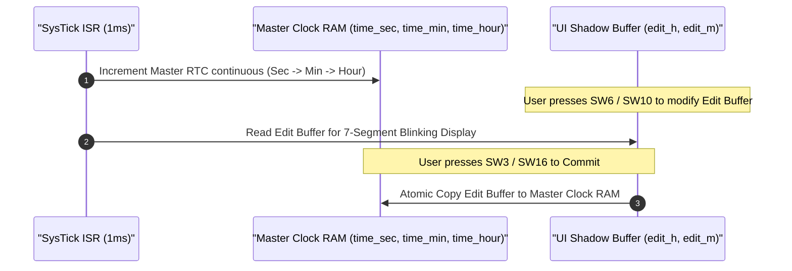
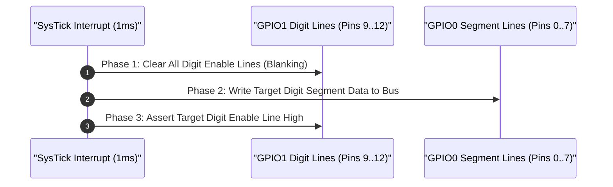
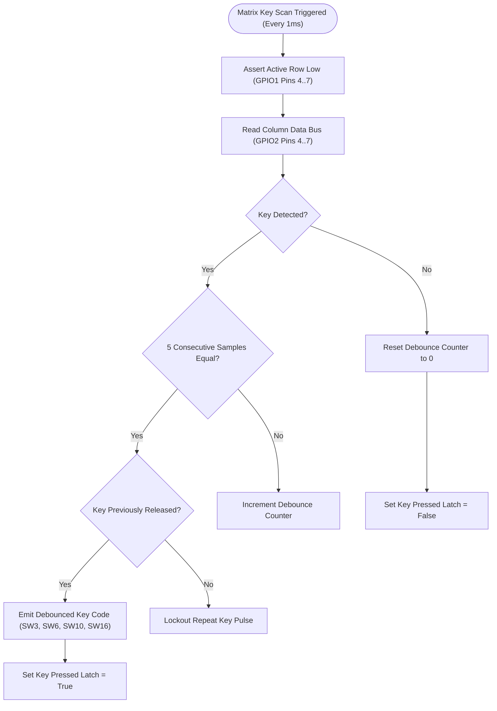
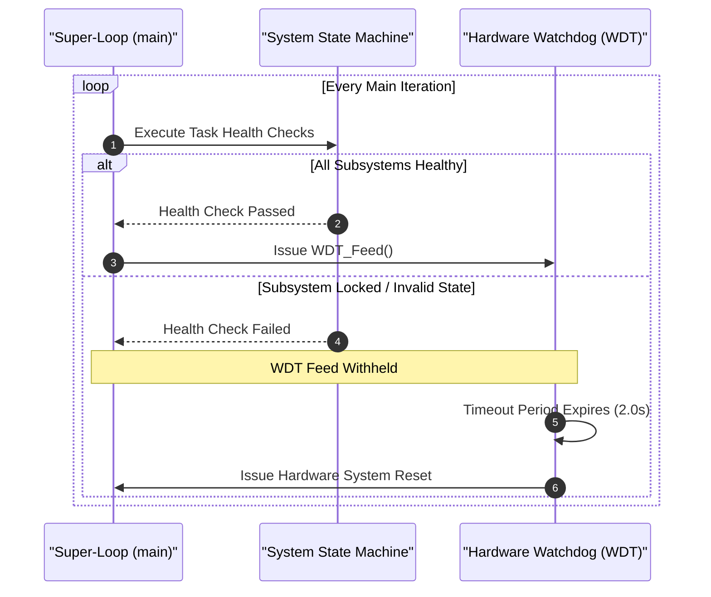

# SN32F407 Smart Digital Clock Firmware Specification (Da Nang MCU Contest 2026)

## System Abstract

This document details the production-grade firmware architecture for the **Smart Digital Clock and Alarm System** running on the **SN32F407_EVK** evaluation board (ARM Cortex-M0 core). 

The implementation applies **Defensive Embedded Programming** principles to guarantee zero-flicker display multiplexing, non-blocking I2C EEPROM storage, deterministic matrix key debouncing, and fault-tolerant finite state machine (FSM) execution.

---

## Competition Evaluation Criteria Breakdown

| Criteria Component | Weight | Implementation Strategy in Source Code |
| :--- | :--- | :--- |
| **Basic Digital Clock Functions** | 35% | SysTick $1\text{ms}$ ISR, 7-Segment driver $HH.MM$, $00..23$ hour rollover, $00..59$ minute rollover. |
| **Alarm Setting & EEPROM** | 15% | I2C0 driver, AT24C02 EEPROM read/write routines, persistent memory across resets. |
| **Bonus Features** | 10% | 30-second button inactivity timeout auto-rollback, status LED D6 blinking indicator. |
| **Demo Video Presentation** | 20% | System test flow, edge-case verification, team presentation skills. |
| **Code & Documentation** | 10% | Defensive programming style, modular file organization, zero compilation warnings. |
| **Technical Defense Q&A** | 10% | Peripheral register control, race condition prevention, hardware timing defense. |

---

## Hardware Peripheral Mapping (SN32F407_EVK)

| System Block | Target Hardware | MCU Pin Assignment | Electrical Configuration |
| :--- | :--- | :--- | :--- |
| **Display Bus** | 7-Segment Segment Lines (A..G, DP) | `GPIO0 [0..7]` | Push-Pull Output, Active High |
| **Display Driver** | 7-Segment Digit Select (D1..D4) | `GPIO1 [9..12]` | Push-Pull Output, Active High |
| **Key Matrix** | Matrix Key Row Drivers | `GPIO1 [4..7]` | Open-Drain / Push-Pull Scan Out |
| **Key Matrix** | Matrix Key Column Inputs | `GPIO2 [4..7]` | Input with Internal Pull-Up Resistors |
| **Non-Volatile Memory** | I2C EEPROM (AT24C02) SCL/SDA | `I2C0` (`GPIO0_10` / `GPIO0_11`) | Open-Drain, External $4.7\text{k}\Omega$ Pull-up |
| **Audio Output** | Piezo Electric Buzzer | `GPIO3 [0]` | NPN Transistor Driver, Active High |
| **Status Indicator** | Mode Status LED (Board D6) | `GPIO3 [8]` | Push-Pull Output, Active Low |

---

## Memory Architecture Map

```
SN32F407 Internal Flash Memory Map (64 KB):
+-----------------------+ 0x0000_0000
| Vector Table & Reset  | 
+-----------------------+ 0x0000_00C0
| Program Code (.text)  |
+-----------------------+ 0x0000_FFFF

SN32F407 Internal SRAM Memory Map (8 KB):
+-----------------------+ 0x2000_0000
| Globals & Static RAM  |
+-----------------------+ 0x2000_0400
| Call Stack & Heap     |
+-----------------------+ 0x2000_1FFF

External I2C EEPROM (AT24C02) Memory Map (Address 0xA0):
+------+-----------------------+---------------------------------------+
| Byte | Field Name            | Functional Description                |
+------+-----------------------+---------------------------------------+
| 0x00 | Magic Header          | Signature byte (Must equal 0xA5)      |
| 0x01 | Alarm Hour            | Stored Alarm Hour (Range: 0..23)      |
| 0x02 | Alarm Minute          | Stored Alarm Minute (Range: 0..59)    |
| 0x03 | Checksum              | Validation XOR Checksum               |
+------+-----------------------+---------------------------------------+
```

---

## System Finite State Machine (FSM) Diagram



---

## Core Engineering Principles and Implementation Design

### Principle 1: Memory Signature Validation and Boundary Clamping
Uninitialized or corrupted EEPROM cells return `0xFF` ($255$). If referenced directly in array indexing (`seg7[255/10]`), memory corruption or out-of-bounds exceptions occur. The system implements a **Magic Header Signature** check (`0xA5`) combined with strict numerical boundary clamping.



---

### Principle 2: Isolated Shadow Editing Buffers and Continuous Real-Time Ticking
Background time calculation must remain decoupled from user interface operations. Stopping the seconds counter during edit mode induces severe time drift. The firmware maintains an uninterrupted Real-Time Clock (RTC) counter in the SysTick interrupt while UI editing operates on isolated shadow variables (`edit_h`, `edit_m`).



---

### Principle 3: Edge-Triggered Single-Shot Alarm Activation
Comparing target time equality inside high-speed main execution loops causes thousands of re-triggering events during a single minute. The system utilizes an **Edge-Triggered Latch Flag** (`alarm_triggered_this_minute`) to ensure single-shot execution per minute boundary.

---

### Principle 4: Anti-Ghosting 7-Segment Multiplexing
Multiplexed displays suffer from crosstalk ghosting if segment lines transition while digit enable pins remain high. The driver enforces a 3-phase blanking sequence inside the 1ms SysTick ISR:



---

### Principle 5: Matrix Key Debouncing Flowchart



---

### Principle 6: Watchdog Supervisor Sequence Diagram



---

## Technical Comparison Matrix

| Functional Module | Naive Implementation | Production Firmware Architecture |
| :--- | :--- | :--- |
| **EEPROM Load** | Unchecked read; system crashes on unformatted `0xFF` memory. | Magic Byte validation ($0xA5$) + Range clamping ($0..23$, $0..59$). |
| **Clock Maintenance** | Seconds counter halted during user edit mode. | Continuous SysTick RTC background ticker; UI shadow edit buffer. |
| **Alarm Trigger** | Polling equality check; multiple re-triggers per minute. | Edge-triggered single-shot latch (`alarm_triggered_this_minute`). |
| **7-Segment Display** | Direct pin mutation; severe digit ghosting bleed. | 3-Phase timing sequence (Blanking $\rightarrow$ Data Load $\rightarrow$ Enable Digit). |
| **Key Processing** | Delay loop polling (`delay_ms(20)`); causes display jitter. | Integrator filter with consecutive sample validation (5ms window). |
| **Watchdog Supervision** | Fed inside timer ISR; fails to reset if main loop freezes. | Super-loop health check; fed exclusively in main loop cycle. |

---

## License

This software is released under the **MIT License**. Created for the **Da Nang FPGA & MCU Design Competition 2026**.
