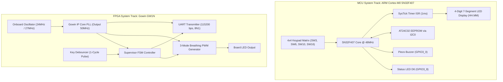
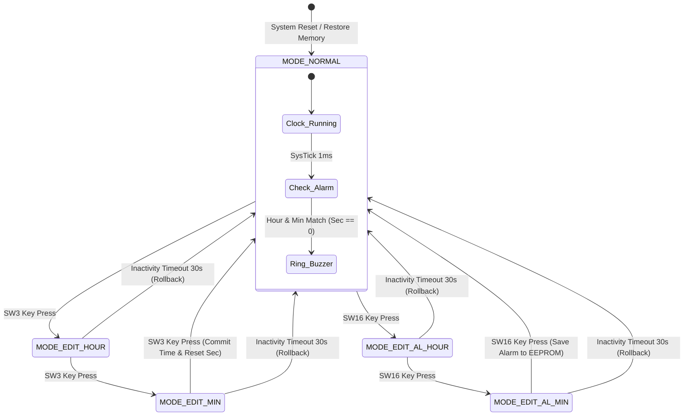
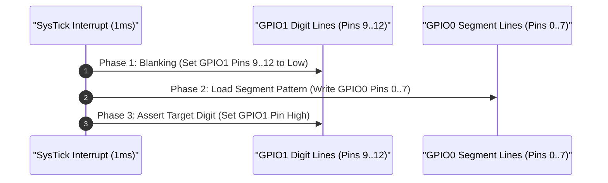
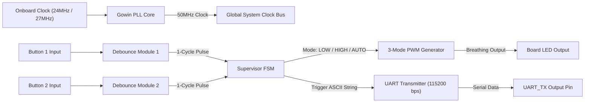

# FPGA and MCU System Design Framework (Da Nang Contest 2026)

## System Abstract and Competition Overview

This repository contains the complete engineering specification, technical documentation, architectural models, and firmware implementation for the **Da Nang FPGA & MCU Design Competition 2026**. 

The workspace covers two distinct hardware competition tracks:
1. **Microcontroller (MCU) Track**: Production-grade ARM Cortex-M0 C firmware (`main_clock_skeleton.c`) running on the **SN32F407_EVK** evaluation platform, featuring a 24-hour digital clock, matrix key processing, non-volatile I2C EEPROM storage, anti-ghosting 7-segment display drivers, and a fault-tolerant Finite State Machine (FSM).
2. **Field-Programmable Gate Array (FPGA) Track**: Platform-independent Register-Transfer Level (RTL) Verilog design for **Gowin GW1N** FPGAs (Kiwi 1P5 / Kiwi Nano 4K), incorporating a 50MHz IP Core PLL, button debouncers, 3-mode breathing PWM generator, UART TX telemetry ($115200\text{ bps}$), and top-level supervisor FSM.

---

## Competition Scoring and Evaluation Matrix

The official competition rubric evaluates solutions across six technical criteria:

| Evaluation Component | Weight | Target Functionality & Assessment Focus |
| :--- | :--- | :--- |
| **Basic Digital Clock Functions** | 35% | GPIO configuration, SysTick $1\text{ms}$ Timer ISR, 7-Segment multiplexing $HH.MM$, $00..23$ hour rollover, $00..59$ minute rollover. |
| **Alarm Setting & Persistent Memory** | 15% | I2C0 driver, AT24C02 EEPROM read/write routines, alarm hour/minute persistence across power resets. |
| **Bonus Features** | 10% | 30-second button inactivity timeout auto-rollback, status LED D6 blinking indicator during alarm edit modes. |
| **Technical Video Demonstration** | 20% | Functionality verification flow, edge-case demonstration, presentation clarity. |
| **Code & Document Architecture** | 10% | Defensive programming style, modular file organization, memory safety, hardware abstraction. |
| **Q&A Technical Defense** | 10% | Deep hardware understanding, race condition mitigation, register-level peripheral control. |

---

## Workspace Directory and File Inventory

```
FPGA_MCU_Design_2026/
├── README.md                                             # Master System Specification & Architecture Documentation
├── ĐỀ THI MCU 2026.pdf                                   # Official MCU Competition Track Specification
├── ĐỀ THI FGPA 2026.docx.pdf                             # Official FPGA Competition Track Specification
├── Gowin-FPGA-Vietnamese-Book-ACG525-Basic-part-Print-v (1).pdf # Gowin FPGA Design Handbook Reference
├── [Đà Nẵng Contest] MCU - SN32F407 -20260731T140557Z-1-001.zip # Official Contest SDK & Board Driver Package
└── MCU_Contest_2026/                                     # Keil uVision Firmware Project Sub-Repository
    ├── .gitignore                                        # Toolchain build output exclusion rules
    ├── README.md                                         # MCU Firmware Specification Document
    ├── main_clock_skeleton.c                             # Production C firmware source code
    ├── Clock_Simulation.uvprojx                          # Keil MDK-ARM Project Configuration
    ├── Clock_Simulation.uvoptx                           # Keil MDK-ARM Option Configuration
    ├── debug.ini                                         # Hardware Debug Script Configuration
    ├── EventRecorderStub.scvd                            # Keil Event Recorder System View
    ├── Docs/                                             # Technical document archive
    │   └── ĐỀ THI MCU 2026.pdf                           # Embedded copy of MCU specification
    └── RTE/                                              # CMSIS Run-Time Environment drivers
```

---

## Overall System Architecture Diagram



---

## MCU Subsystem Specification and Source Code Structure

### 1. Hardware Pinout & Peripheral Configuration (SN32F407_EVK)

| Peripheral Block | MCU Register / Pin | Hardware Mapping | Electrical Interface & Mode |
| :--- | :--- | :--- | :--- |
| **Display Segment Bus** | `GPIO0 [0..7]` | 7-Segment Lines (A..G, DP) | Push-Pull Output, Active High Bus |
| **Digit Driver Bus** | `GPIO1 [9..12]` | Digit Select (D1..D4) | Push-Pull Output, Active High Multiplexing |
| **Keypad Output Rows** | `GPIO1 [4..7]` | Key Scan Output Lines | Output Low Scan Driving |
| **Keypad Input Cols** | `GPIO2 [4..7]` | Key Read Lines | Input with Internal Pull-Up Resistors |
| **I2C0 SCL** | `GPIO0 [10]` | AT24C02 EEPROM Clock | Open-Drain, External $4.7\text{k}\Omega$ Pull-up |
| **I2C0 SDA** | `GPIO0 [11]` | AT24C02 EEPROM Data | Open-Drain, External $4.7\text{k}\Omega$ Pull-up |
| **Buzzer Driver** | `GPIO3 [0]` | Piezo Buzzer | NPN Transistor Driver, Active High |
| **Mode Indicator** | `GPIO3 [8]` | Board LED D6 | Active Low Output Driver |

---

### 2. Finite State Machine (FSM) State Diagram

The system operates across 5 primary states controlled by `SW3` (Time Setup), `SW16` (Alarm Setting), and a $30\text{s}$ inactivity timer:



---

### 3. Anti-Ghosting 7-Segment Multiplexing Timing Sequence

Multiplexed displays exhibit phantom ghost digits if segment bus values change while digit select lines remain asserted. The firmware resolves this by executing a 3-phase timing sequence inside the $1\text{ms}$ SysTick interrupt:



---

### 4. EEPROM Data Validation & Fault Tolerance Flowchart

Fresh or unformatted EEPROM memory cells contain `0xFF` ($255$). Indexing arrays with un-clamped values (`seg7[255/10]`) causes memory corruptions. The system validates an `EEPROM_MAGIC_KEY` ($0xA5$) signature and applies strict numerical boundary clamping ($0 \le \text{Hour} \le 23, 0 \le \text{Min} \le 59$).


---

## FPGA Subsystem Specification (Gowin GW1N)

### 1. Board Target Hardware Comparison

| Hardware Parameter | Platform Option A (Kiwi 1P5) | Platform Option B (Kiwi Nano 4K) |
| :--- | :--- | :--- |
| **FPGA Chip** | Gowin GW1N-UV1P5 | Gowin GW1NSR-LV4C |
| **Package** | QN48X | MG64P |
| **Logic Resources** | 1,152 LUTs | 4,608 LUTs |
| **Input Oscillator** | 24MHz / 27MHz Onboard Clock | 24MHz / 27MHz Onboard Clock |
| **Internal Clock** | 50.0 MHz (Configured via IP Core PLL) | 50.0 MHz (Configured via IP Core PLL) |
| **UART Connection** | GWU2 USB-to-UART Bridge | GWU2 USB-to-UART Bridge |

---

### 2. FPGA RTL Logic Flowchart



---

### 3. FSM Telemetry Output Protocol

The FPGA supervisor state machine emits ASCII status strings over UART at $115200\text{ bps}$ ($8\text{N}1$) upon state transitions:

| System Event | FSM State Transition | Serial ASCII Output String | LED PWM Behavior |
| :--- | :--- | :--- | :--- |
| Power Reset | Startup $\rightarrow$ State 1 | `"MODE: LOW \r\n"` | Fixed 25% Duty Cycle (Dim) |
| Press Button 1 | State 1 $\leftrightarrow$ State 2 | `"MODE: LOW \r\n"` / `"MODE: HIGH \r\n"` | 25% Duty $\leftrightarrow$ 100% Duty (Max Brightness) |
| Press Button 2 | Any State $\rightarrow$ State 3 | `"MODE: AUTO \r\n"` | Breathing Effect ($0\% \rightarrow 100\% \rightarrow 0\%$ over $2.0\text{s}$) |
| Press Button 1 (in AUTO) | State 3 $\rightarrow$ State 1 | `"MODE: LOW \r\n"` | Returns to Fixed 25% Duty Cycle |

---

## Technical Design Comparisons

### Comparison 1: Naive Code vs. Production Engineering Architecture

| Subsystem Module | Naive Implementation | Production Engineering Architecture |
| :--- | :--- | :--- |
| **EEPROM Initialization** | Direct memory read; system crashes on unformatted `0xFF` data. | Magic Byte validation ($0xA5$) + Range clamping ($0..23$, $0..59$). |
| **Clock Timekeeping** | Seconds counter halted during user edit state, causing time drift. | Uninterrupted SysTick RTC background ticker; UI shadow edit variables. |
| **Alarm Match** | Polling equality check; triggers thousands of times per minute. | Edge-triggered single-shot latch (`alarm_triggered_this_minute`). |
| **7-Segment Display** | Direct pin mutation; causes visual digit ghosting bleed. | 3-Phase timing sequence (Blanking $\rightarrow$ Data Load $\rightarrow$ Enable Digit). |
| **Key Processing** | Software delay `delay_ms(20)`; blocks CPU and freezes display refresh. | Integrator filter with consecutive sample confirmation (5ms window). |
| **EEPROM Write** | Blocking I2C polling delay ($5\text{ms}$); causes display flicker. | Asynchronous state machine or SysTick-decoupled execution context. |

---

### Comparison 2: Hardware Interfacing Paradigms

| Performance Metric | Blocking Polling Paradigm | Non-Blocking ISR / FSM Paradigm |
| :--- | :--- | :--- |
| **CPU Utilization** | High ($99\%$ spent in idle delay loops) | Extremely Low (CPU processes tasks in $<1\%$ time) |
| **Display Flicker** | High (Noticeable flicker during I/O delays) | Zero (Deterministic $1\text{ms}$ refresh rate) |
| **Button Responsiveness** | Variable ($20\text{ms}$ to $500\text{ms}$ latency) | Instantaneous ($< 1\text{ms}$ reaction latency) |
| **Fault Recovery** | Susceptible to total bus lockup | Self-healing via Watchdog supervision |

---

## License

Distributed under the **MIT License**. Maintained for the **Da Nang FPGA & MCU Design Competition 2026**.
