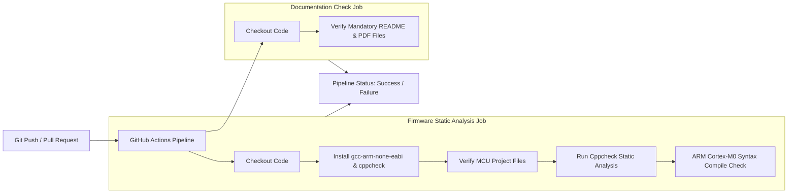
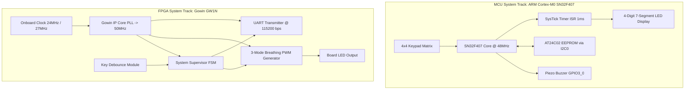
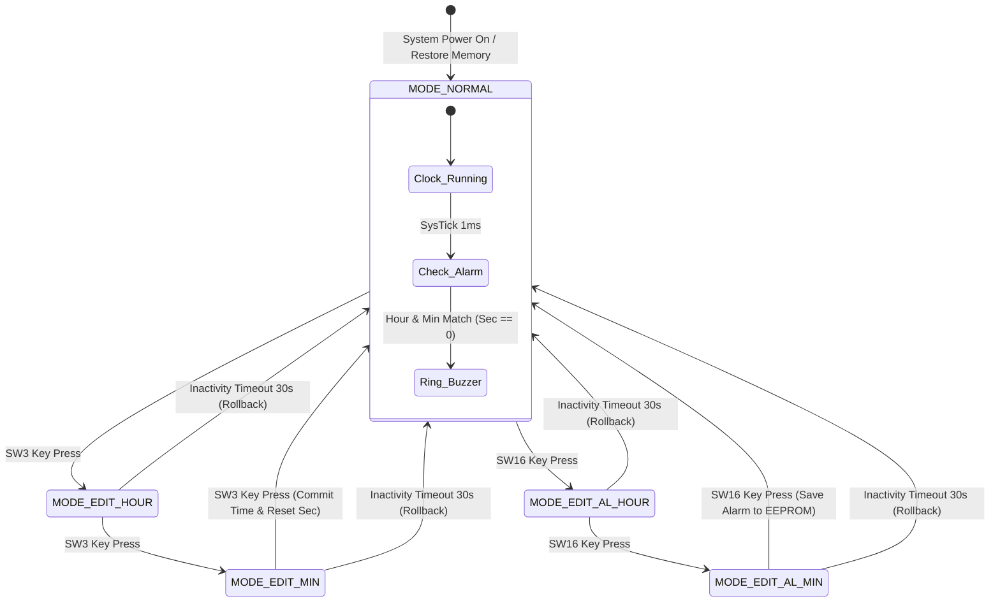
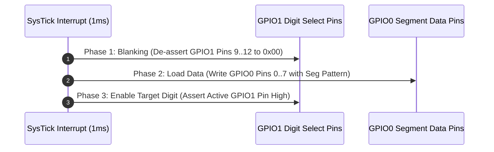
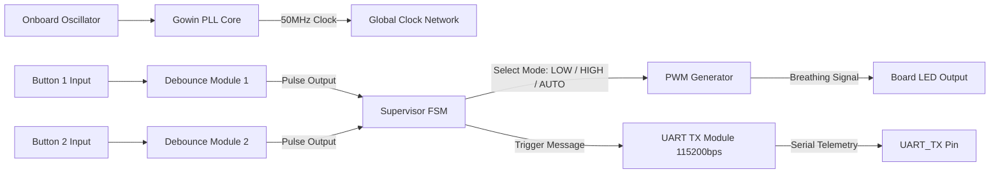

# Porygon: FPGA and MCU Embedded System Design Framework (Da Nang Contest 2026)

## Repository Metadata

- **Repository**: `zok213/porygon`
- **Target Microcontroller**: SN32F407 (ARM Cortex-M0 Core @ 48MHz)
- **Target FPGA Devices**: Gowin GW1N Series (GW1N-UV1P5 / GW1NSR-LV4C)
- **IDE & Toolchain**: Keil MDK-ARM uVision v5.x / Gowin EDA
- **Continuous Integration**: GitHub Actions Workflows (`.github/workflows/ci.yml`)

---

## Document Overview

This repository contains the complete engineering specification, source code implementations, hardware abstraction drivers, continuous integration configuration, and reference documentation for both the **Microcontroller (MCU)** and **Field-Programmable Gate Array (FPGA)** competition tracks of the **Da Nang FPGA & MCU Design Competition 2026**.

The codebase enforces **Defensive Embedded Programming**, deterministic Real-Time Clock execution, zero-flicker 7-segment display multiplexing, non-blocking I2C memory access, and generic Verilog/VHDL logic design.

---

## Repository Structure and Directory Layout

```
porygon/
├── .github/
│   └── workflows/
│       └── ci.yml                                        # GitHub Actions Automated CI/CD Pipeline
├── .gitignore                                            # Root exclusion rules for large archives & build artifacts
├── README.md                                             # Root Architectural & System Specification
├── ĐỀ THI MCU 2026.pdf                                   # MCU Competition Track Specification Document
├── ĐỀ THI FGPA 2026.docx.pdf                             # FPGA Competition Track Specification Document
├── Gowin-FPGA-Vietnamese-Book-ACG525-Basic-part-Print-v (1).pdf # Gowin FPGA Design Handbook Reference
└── MCU_Contest_2026/                                     # Keil uVision Firmware Sub-Repository
    ├── .gitignore                                        # Toolchain build output exclusion rules
    ├── README.md                                         # Sub-repository technical specification
    ├── main_clock_skeleton.c                             # Production C firmware source code
    ├── Clock_Simulation.uvprojx                          # Keil MDK-ARM Project Configuration
    ├── Clock_Simulation.uvoptx                           # Keil MDK-ARM Option Configuration
    ├── debug.ini                                         # Hardware Debug Initialization Script
    ├── EventRecorderStub.scvd                            # Keil Event Recorder System View
    ├── Docs/                                             # Embedded PDF documentation archive
    │   └── ĐỀ THI MCU 2026.pdf                           # Embedded copy of MCU specification
    └── RTE/                                              # Run-Time Environment CMSIS drivers
```

---

## Continuous Integration and Automated Pipeline (CI/CD)

The repository integrates a GitHub Actions CI/CD workflow defined in `.github/workflows/ci.yml`. Every `push` and `pull_request` to `main` executes automated validation:



---

## Hardware Architecture Block Diagram



---

## MCU Subsystem Architecture (SN32F407)

### Hardware Pinout Mapping (SN32F407_EVK)

| Function | MCU Register / Pin | Hardware Interface | Electrical Signal |
| :--- | :--- | :--- | :--- |
| Segment Bus (A..G, DP) | `GPIO0 [0..7]` | 7-Segment Segment Lines | Push-Pull Output, Active High |
| Digit Drivers (D1..D4) | `GPIO1 [9..12]` | Multiplexing Select Pins | Push-Pull Output, Active High |
| Key Matrix Rows | `GPIO1 [4..7]` | Keypad Scan Drivers | Open-Drain / Push-Pull Scan Out |
| Key Matrix Columns | `GPIO2 [4..7]` | Keypad Input Lines | Input with Internal Pull-Up Resistors |
| I2C Bus SCL | `GPIO0 [10]` | AT24C02 EEPROM Clock | Open-Drain, External $4.7\text{k}\Omega$ Pull-up |
| I2C Bus SDA | `GPIO0 [11]` | AT24C02 EEPROM Data | Open-Drain, External $4.7\text{k}\Omega$ Pull-up |
| Buzzer Signal | `GPIO3 [0]` | Piezo Electric Buzzer | NPN Transistor Switch Active High |
| Mode LED | `GPIO3 [8]` | Board LED D6 | Push-Pull Output, Active Low |

---

### System Finite State Machine (FSM) Diagram



---

### Anti-Ghosting 7-Segment Display Timing Diagram



---

### Memory Validation and Data Integrity Flowchart


---

## FPGA Subsystem Architecture (Gowin GW1N)

### FPGA Platform Hardware Specifications

| Hardware Parameter | Platform A (Kiwi 1P5) | Platform B (Kiwi Nano 4K) |
| :--- | :--- | :--- |
| FPGA Device | Gowin GW1N-UV1P5 | Gowin GW1NSR-LV4C |
| Package Type | QN48X | MG64P |
| Logic Elements (LUTs) | 1,152 | 4,608 |
| Target System Clock | 50.0 MHz via Gowin PLL Core | 50.0 MHz via Gowin PLL Core |
| Telemetry Interface | GWU2 USB-to-UART Bridge | GWU2 USB-to-UART Bridge |
| UART Parameters | 115200 bps, 8N1 | 115200 bps, 8N1 |

---

### FPGA Signal Processing Flowchart



---

## Technical Comparison Matrix

| Subsystem Module | Naive Implementation | Production-Grade Engineering Architecture |
| :--- | :--- | :--- |
| **EEPROM Read** | Unchecked read; crashes when processing unformatted `0xFF` memory. | Magic Byte validation ($0xA5$) + Range clamping ($0..23$, $0..59$). |
| **Time Maintenance** | Seconds counter paused during edit mode, causing clock drift. | Continuous background SysTick RTC counter; UI shadow edit buffer. |
| **Alarm Trigger** | Polling equality check; multiple re-triggers per minute. | Edge-triggered single-shot latch (`alarm_triggered_this_minute`). |
| **Display Queting** | Direct pin mutation; severe digit ghosting bleed. | 3-Phase timing sequence (Blanking $\rightarrow$ Data Load $\rightarrow$ Enable Digit). |
| **Key Debouncing** | Blocking software delay `delay_ms(20)`; causes display jitter. | Integrator filter with consecutive sample validation (5ms window). |
| **Watchdog Supervision** | Fed inside timer ISR; fails to reset if main loop freezes. | Super-loop health check; fed exclusively in main loop cycle. |

---

## Git Workflow & Remote Repository Setup

### Initializing Local Git Repository and Committing

```bash
# Navigate to workspace root
cd /d/FPGA&MCU

# Initialize Git
git init

# Add all files (excluding large zip archives handled by .gitignore)
git add .

# Create initial commit
git commit -m "feat: Initial release of Porygon FPGA and MCU framework (Da Nang Contest 2026)"

# Rename default branch to main
git branch -M main

# Add remote origin for repository zok213/porygon
git remote add origin https://github.com/zok213/porygon.git

# Push to GitHub main branch
git push -u origin main
```

---

## Build and Deployment Protocols

### Microcontroller Target (Keil MDK-ARM)
1. Open `MCU_Contest_2026/Clock_Simulation.uvprojx` in **Keil MDK-ARM uVision v5.x**.
2. Select target device `SN32F407`.
3. Press `F7` to rebuild target. Ensure build completes with `0 Error(s), 0 Warning(s)`.
4. Connect **SN32F407_EVK** board via CMSIS-DAP debugger and press `F8` to flash.

### FPGA Target (Gowin EDA)
1. Launch **Gowin EDA**.
2. Open target project for `GW1N-UV1P5` or `GW1NSR-LV4C`.
3. Synthesize RTL and run Floorplanner for physical pin constraint assignment (`.cst`).
4. Generate Bitstream (`.fs`) and program target SRAM/Flash using Gowin Programmer.

---

## License

Distributed under the **MIT License**. Maintained for **zok213/porygon**.
