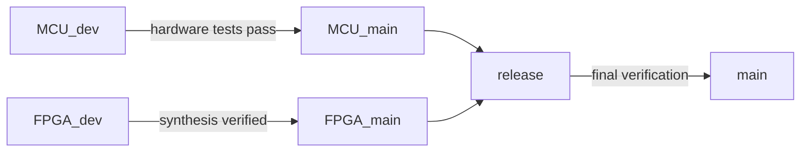

# Porygon: FPGA and MCU System Design Framework (Da Nang Contest 2026)

[](https://github.com/zok213/porygon/actions/workflows/ci.yml)

Engineering workspace for the **Da Nang FPGA & MCU Design Competition 2026**.

## The two firmware tracks, one rule

> **`main` carries the hardware-proven baseline (Quang build) — the version
> that runs on the MCU today, kept verbatim. All improvements live on
> `MCU_dev` until the hardware test matrix passes.**

1. **MCU track (SN32F407_EVK)** — 24-hour digital clock + alarm.
   - **`main` = baseline**: the working firmware as flashed on the board
     (`main_clock_skeleton.c` + SONiX `I2C0` library), byte-for-byte. Restore
     it any time with one checkout.
   - **`MCU_dev` = improved candidate** (`v1.1.0-rc3`): baseline's proven I2C
     layer + key debounce, audible buzzer, race-free alarm, EEPROM
     magic/checksum, modular code and a 55-check host simulation.
2. **FPGA track (Gowin GW1N)** — WIP skeleton; does not yet satisfy the
   FPGA đề bài ([FPGA/README.md](FPGA/README.md)).

## Repository at a Glance

```
porygon/
├── README.md                     ← you are here
├── CHANGELOG.md                  ← full history, baseline-relative
├── MCU_Contest_2026/             ← THE BASELINE (working, verbatim)  [README]
│   ├── main_clock_skeleton.c     ← application (single file)
│   ├── I2C0.c / I2C.h            ← SONiX interrupt-driven I2C driver
│   ├── Clock_Simulation.uvprojx  ← Keil MDK project
│   ├── TESTING.md                ← hardware matrix + demo script
│   ├── Docs/                     ← contest specification archive
│   └── RTE/                      ← CMSIS + SONiX device support
├── MCU_Contest_2026_Quang/       ← pristine original of the baseline [README]
├── FPGA/                         ← Gowin RTL (WIP)                 [README]
├── .github/                      ← CI pipeline, templates          [README]
├── SETUP.md                      ← toolchain setup notes
└── ĐỀ THI MCU 2026.pdf / ĐỀ THI FGPA 2026.docx.pdf / Gowin handbook
```

> The improved candidate (`MCU_dev`) adds: modular firmware
> (`main/clock/keypad/display/buzzer/eeprom`), `sim/` host simulation
> (55 checks), `CHANGES_VS_ORIGINAL.md`, and the full CI verification stack.

## Quick Start

| Goal | Path |
| :--- | :--- |
| Understand the assignment | `ĐỀ THI MCU 2026.pdf` |
| Build & flash the working baseline | Keil → `MCU_Contest_2026/Clock_Simulation.uvprojx` → rebuild → flash |
| Restore the known-working state | `git checkout main` (tag `v1.0.0-quang`) |
| Test the improved candidate | `git checkout MCU_dev` (tag `v1.1.0-rc3`) + `TESTING.md` |
| See what changed vs the baseline | `CHANGELOG.md` (baseline-relative change table) |

## MCU Baseline (what runs on the board)

### Hardware-proven characteristics

| Area | Behaviour (verified on silicon) |
| :--- | :--- |
| I2C pins | SCL0 = P0.10, SDA0 = P0.11 (PFPA option 2) — no 7-seg G/DP collision |
| I2C speed | 400 kHz, interrupt-driven — display never stops during EEPROM access |
| I2C hang guard | SysTick watchdog → `Timeout` after 50ms busy |
| Display | 4x7SEG HH.MM; DP tick-pulse 100ms/s in NORMAL, solid in edits |
| Alarm | 5s pip-pip single-shot; silenced by entering an edit mode |
| EEPROM | hour@0, minute@1; restored at boot with range clamping |

### Known defects (fixed on `MCU_dev`, not on `main`)

| Defect | Impact | Fixed as |
| :--- | :--- | :--- |
| No key debounce | Bounce can skip FSM states | 20ms debounce + release lockout |
| Buzzer ~10-15 kHz | Inaudible on piezo | ~4-5 kHz, bounded ISR |
| Alarm torn-read race | Can fire 1 min early | IRQ-safe snapshot |
| 00:00 alarm disarmed on power-off | Persistence bug | armed flag + checksum |
| No EEPROM validation | Corrupt bytes accepted | magic 0xA5 + XOR checksum |

### Requirement coverage

All nine requirements (đề bài) are functionally implemented by the
baseline; full matrix in [`MCU_Contest_2026/TESTING.md`](MCU_Contest_2026/TESTING.md).

## Branch Governance



| Branch | Role | Current state |
| :--- | :--- | :--- |
| `main` | Production baseline | **Quang build, verbatim** (tag `v1.0.0-quang`) — the working firmware |
| `MCU_dev` | MCU development + testing | Improved candidate `v1.1.0-rc3` (baseline I2C + fixes + simulation) |
| `MCU_main` / `release` / `FPGA_*` | Stable staging | `9c5efdf` governance baseline |

## FPGA Track: Status and Roadmap

**WIP skeleton — compiles with iverilog but does NOT yet satisfy the FPGA
đề bài** (no LOW/HIGH/AUTO FSM, UART sends `'A'` not `"MODE: ... \r\n"`,
the "PLL" is a divider, no `.cst`/testbench). Full gaps list and roadmap in
[FPGA/README.md](FPGA/README.md).

## License

Distributed under the **MIT License**. Maintained for **zok213/porygon**.
