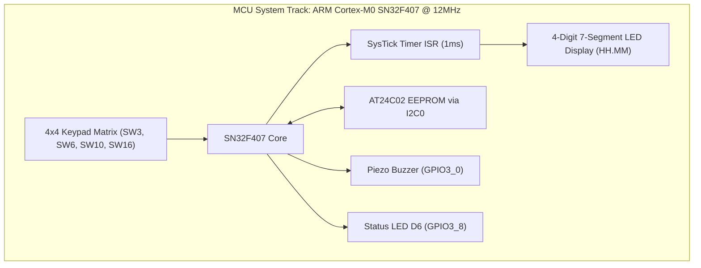
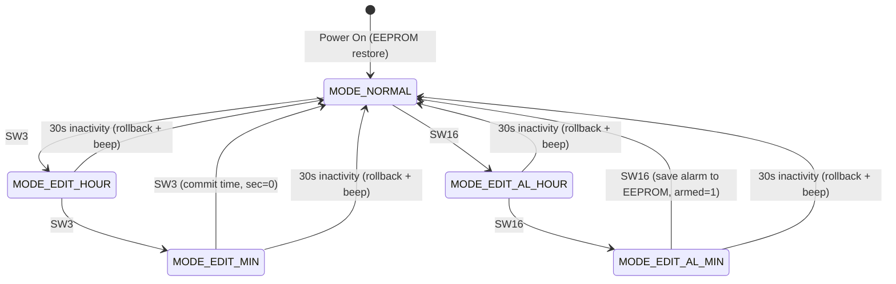

# Porygon: FPGA and MCU System Design Framework (Da Nang Contest 2026)

## System Abstract

Engineering workspace for the **Da Nang FPGA & MCU Design Competition 2026**:

1. **Microcontroller (MCU) Track - implemented**: 24-hour digital clock +
   alarm firmware for the **SN32F407_EVK** (ARM Cortex-M0 @ **12 MHz** IHRC).
   Modular C (6 modules), 4x4 keypad scanning with time-based debounce, I2C
   EEPROM persistence with magic/checksum validation, anti-ghosting 7-segment
   multiplexing, bounded ~4kHz buzzer tones, and a **host simulation harness
   that verifies all nine contest requirements** (54 checks, runs in CI).
2. **FPGA Track - not yet implemented**: the Gowin design (PLL 50MHz,
   debounce, 3-mode PWM, UART TX 115200, supervisor FSM) described in
   `ĐỀ THI FGPA 2026.docx.pdf` is planned but **no RTL code exists yet** in
   this repository. See [Roadmap](#fpga-track-status-and-roadmap).

## Current Firmware State

| Property | Value |
| :--- | :--- |
| MCU | SN32F407F (Cortex-M0), 12 MHz IHRC (`SYS0_CLKCFG_VAL=0`) |
| Toolchain | Keil MDK 5.43, ArmClang 6.24, SONiX SN32F4_DFP 1.1.1, CMSIS 6.3.0 |
| Code size | ~2.4 KB flash / ~0.6 KB RAM (IROM 32 KB, IRAM 8 KB) |
| Build status | 0 errors / 0 warnings; 54/54 host simulation checks pass |
| Keymap | SW3 setup, SW6 +, SW10 -, SW16 alarm |
| Display | 4x7SEG HH.MM, DP separator, 1s blink in edit modes |
| EEPROM | AT24C02 via I2C0 - magic 0xA5 + XOR checksum + armed flag |

## Repository Layout

```
porygon/
├── .github/workflows/ci.yml        # real gates: sim build+run, cppcheck, docs
├── CHANGELOG.md                    # change history (see latest release)
├── README.md                       # this file
├── CODE_OF_CONDUCT.md / CONTRIBUTING.md / LICENSE / SECURITY.md
├── ĐỀ THI MCU 2026.pdf             # MCU track specification
├── ĐỀ THI FGPA 2026.docx.pdf       # FPGA track specification
├── Gowin-FPGA-Vietnamese-Book...pdf# Gowin reference handbook
└── MCU_Contest_2026/               # Keil firmware project
    ├── main.c, app.h, system.h     # app glue: FSM, ISR, shared state
    ├── clock.c/h, keypad.c/h, display.c/h, buzzer.c/h, eeprom.c/h
    ├── sim/                        # host simulation (mock + harness + Makefile)
    ├── Clock_Simulation.uvprojx    # Keil MDK project
    ├── RTE/                        # CMSIS + SONiX device support
    └── README.md                   # MCU firmware specification (details)
```

See `MCU_Contest_2026/README.md` for the full firmware specification,
requirement-by-requirement coverage table, and design rationale.

## MCU System Architecture



### Finite State Machine



### EEPROM Persistent Record

```
addr 0 : 0xA5 magic header
addr 1 : alarm hour    (0..23)
addr 2 : alarm minute  (0..59)
addr 3 : armed flag    (0/1)
addr 4 : XOR checksum of addr 0..3
```

Blank (0xFF) or corrupted cells are detected by the magic/checksum check,
clamped to safe ranges and repaired to defaults - the display can never index
`seg7[]` out of bounds.

### Key Debounce

Each key must read stable for **20ms** before it is reported, and a press is
latched until the release is also stable for 20ms. One physical press (even
with severe bounce or a long hold) produces exactly one FSM event. Timing is
based on the system 1ms counter, independent of the main-loop call rate.

### Alarm Trigger (race-free)

`Clock_AlarmMatchNow()` snapshots time and alarm settings with interrupts
disabled, so a SysTick rollover can never tear the comparison and fire the
alarm one minute early. The ring is a single-shot 5s pip-pip (0.5s on /
0.5s off) and is silenced by entering any edit mode.

## Host Simulation & CI

`MCU_Contest_2026/sim/` contains a mock device layer plus a test harness that
runs the **unmodified firmware logic** on a PC:

```bash
cd MCU_Contest_2026 && make run
# -> 54 checks, 0 failures, exit code 0
```

Coverage: boot/blank-EEPROM recovery, debounce (bounce + hold), time/alarm
edit FSMs, blink phases, wraparound, commit semantics, 30s timeout + beep,
EEPROM persistence incl. 00:00-armed and corruption recovery, alarm fire at
hh:mm:00, 5s pip-pip pattern, silence after ring, cancel-on-edit,
23:59:59 -> 00:00:00 rollover.

The GitHub Actions pipeline (`ci.yml`) builds this simulation with gcc and
fails on any failed check, runs cppcheck, and verifies repository structure.

## Technical Notes (verified)

- **SysTick 1ms**: 12 MHz / 12000 - 1 = `LOAD 11999` - exact for the 12 MHz
  IHRC the device boots to (`SYS0_CLKCFG_VAL=0`).
- **Buzzer tone**: ~4-5 kHz NOP-loop square wave, burst-limited so the ISR
  stays bounded (~0.5 ms worst case during beeps only).
- **Flash/RAM**: project IROM = 0x7FFC (32 KB), IRAM = 0x2000 (8 KB);
  firmware uses ~2.4 KB code + ~0.6 KB RAM, 512 B stack.
- **Watchdog**: not enabled (not required by the assignment). All
  super-loop feed points are isolated in `main.c` for future enablement.

## FPGA Track: Status and Roadmap

**Status: not started.** The FPGA đề bài (Kiwi 1P5 `GW1N-UV1P5` or Kiwi Nano
4K `GW1NSR-LV4C`, GOWIN EDA) requires:

1. Gowin PLL IP core 24/27 MHz -> 50 MHz
2. Debounce module for 2 buttons (single-cycle pulse per press/hold)
3. PWM LED: Mode1 25%, Mode2 100%, Mode3 breathing 0-100-0 in exactly 2.0s
4. UART TX 115200 8N1 from 50 MHz ("MODE: LOW/HIGH/AUTO \r\n" on transitions)
5. Supervisor FSM (reset -> LOW; Button1 toggles LOW/HIGH; Button2 -> AUTO;
   in AUTO, Button1 -> LOW)
6. Deliverables: source + `.cst` constraints, testbench + waveforms, report
   PDF (block diagram, FSM diagram, baud divider table, serial terminal proof)

Planned as `FPGA_dev` branch workstream.

## License

Distributed under the **MIT License**. Maintained for **zok213/porygon**.
