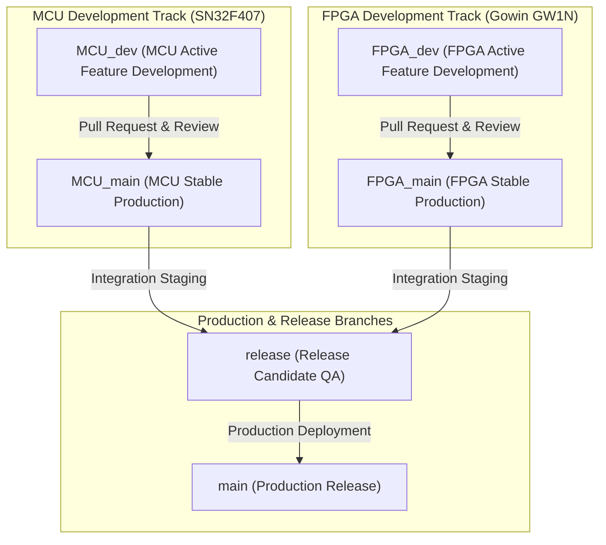
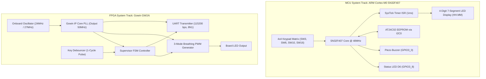
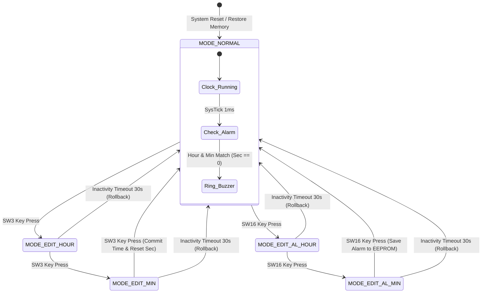
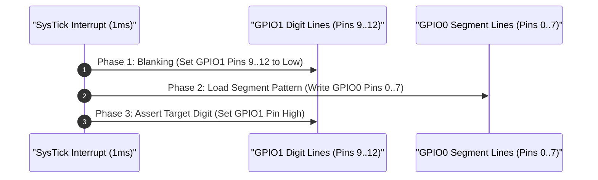
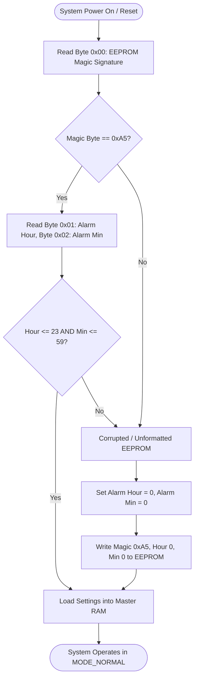
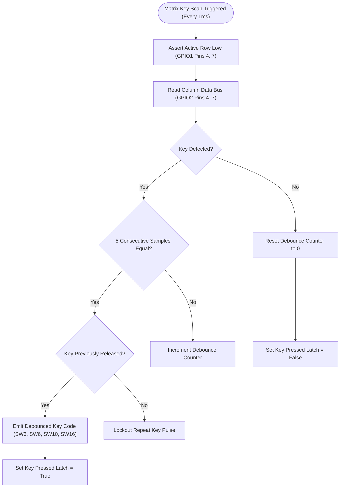
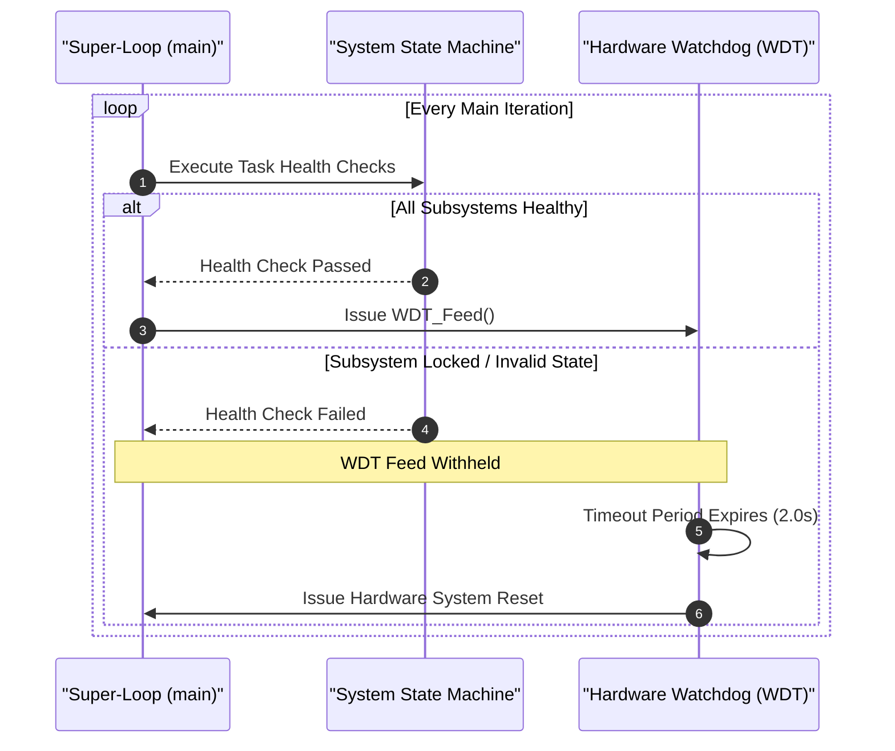

# Porygon: FPGA and MCU System Design Framework (Da Nang Contest 2026)

## System Abstract and Competition Overview

This repository contains the complete engineering specification, technical documentation, architectural models, mathematical timing proofs, and firmware implementation for the **Da Nang FPGA & MCU Design Competition 2026**.

The workspace encompasses two hardware competition tracks:
1. **Microcontroller (MCU) Track**: Production-grade ARM Cortex-M0 C firmware (`main_clock_skeleton.c`) running on the **SN32F407_EVK** platform. It integrates a 24-hour digital clock, matrix keypad processing, non-volatile I2C EEPROM memory, zero-flicker anti-ghosting 7-segment display drivers, and a fault-tolerant Finite State Machine (FSM).
2. **Field-Programmable Gate Array (FPGA) Track**: Platform-independent Register-Transfer Level (RTL) Verilog code targeting **Gowin GW1N** FPGAs (Kiwi 1P5 / Kiwi Nano 4K). It incorporates a 50MHz IP Core PLL, button debouncers, a 3-mode breathing PWM generator, UART TX telemetry ($115200\text{ bps}$), and top-level supervisor FSM.

---

## Git Flow and Branch Governance Architecture

This repository utilizes a multi-track Git Flow branch hierarchy to isolate MCU and FPGA development cycles:



### Branch Policy and Access Control

| Branch Name | Role & Target Scope | Direct Commit Allowed? | Merge Requirements |
| :--- | :--- | :--- | :--- |
| `main` | Production release baseline for competition submission. | No | Mandatory PR review + Zero compilation errors |
| `release` | Integration staging branch for cross-platform validation. | No | Mandatory PR review + System verification |
| `MCU_main` | Stable production branch for ARM Cortex-M0 firmware. | No | Peer review + SysTick timing compliance |
| `MCU_dev` | Active development branch for MCU firmware features. | Yes (Developers) | Continuous Integration pass |
| `FPGA_main` | Stable production branch for Gowin Verilog RTL logic. | No | Peer review + RTL synthesis verification |
| `FPGA_dev` | Active development branch for FPGA modules. | Yes (Developers) | Continuous Integration pass |

---

## Official Evaluation and Scoring Matrix

The competition evaluation rubric assesses solutions across six technical criteria:

| Evaluation Component | Weight | Target Functionality & Assessment Focus |
| :--- | :--- | :--- |
| **Basic Digital Clock Functions** | 35% | GPIO configuration, SysTick $1\text{ms}$ Timer ISR, 7-Segment multiplexing $HH.MM$, $00..23$ hour rollover, $00..59$ minute rollover. |
| **Alarm Setting & Persistent Memory** | 15% | I2C0 driver, AT24C02 EEPROM read/write routines, alarm hour/minute persistence across power resets. |
| **Bonus Features** | 10% | 30-second button inactivity timeout auto-rollback, status LED D6 blinking indicator during alarm edit modes. |
| **Technical Video Demonstration** | 20% | Functionality verification flow, edge-case demonstration, presentation clarity. |
| **Code & Document Architecture** | 10% | Defensive programming style, modular file organization, memory safety, hardware abstraction. |
| **Q&A Technical Defense** | 10% | Deep hardware understanding, race condition mitigation, register-level peripheral control. |

---

## Repository File and Directory Map

```
porygon/
├── .github/
│   ├── ISSUE_TEMPLATE/
│   │   ├── bug_report.md                                 # Issue template for hardware/firmware bugs
│   │   └── feature_request.md                            # Issue template for feature enhancements
│   ├── pull_request_template.md                          # Pull request checklist and review template
│   └── workflows/
│       └── ci.yml                                        # GitHub Actions Automated CI/CD Pipeline
├── .gitignore                                            # Root exclusion rules for large archives & build artifacts
├── CODE_OF_CONDUCT.md                                    # Contributor Covenant Code of Conduct
├── CONTRIBUTING.md                                       # Branch management & commit messaging guidelines
├── LICENSE                                               # MIT License
├── README.md                                             # Master System Architectural Specification
├── SECURITY.md                                           # Vulnerability reporting & RDP flash security policy
├── ĐỀ THI MCU 2026.pdf                                   # MCU Competition Track Specification
├── ĐỀ THI FGPA 2026.docx.pdf                             # FPGA Competition Track Specification
├── Gowin-FPGA-Vietnamese-Book-ACG525-Basic-part-Print-v (1).pdf # Gowin FPGA Reference Handbook
└── MCU_Contest_2026/                                     # Keil uVision Firmware Project Sub-Repository
    ├── .gitignore                                        # Toolchain build output exclusion rules
    ├── README.md                                         # MCU Sub-Repository Specification
    ├── main_clock_skeleton.c                             # Production C firmware source code
    ├── Clock_Simulation.uvprojx                          # Keil MDK-ARM Project Configuration
    ├── Clock_Simulation.uvoptx                           # Keil MDK-ARM Option Configuration
    ├── debug.ini                                         # Hardware Debug Script Configuration
    ├── EventRecorderStub.scvd                            # Keil Event Recorder System View
    ├── Docs/                                             # Technical document archive
    │   └── ĐỀ THI MCU 2026.pdf                           # Embedded copy of MCU specification
    └── RTE/                                              # CMSIS Run-Time Environment drivers
```

---

## Hardware Architecture Block Diagram



---

## Track 1: MCU System Track Specification (SN32F407)

### 1. Hardware Pinout & Peripheral Configuration (SN32F407_EVK)

| Peripheral Block | MCU Register / Pin | Hardware Mapping | Electrical Interface & Mode |
| :--- | :--- | :--- | :--- |
| **Display Segment Bus** | `GPIO0 [0..7]` | 7-Segment Lines (A..G, DP) | Push-Pull Output, Active High Bus |
| **Digit Driver Bus** | `GPIO1 [9..12]` | Digit Select (D1..D4) | Push-Pull Output, Active High Multiplexing |
| **Keypad Output Rows** | `GPIO1 [4..7]` | Key Scan Output Lines | Output Low Scan Driving |
| **Keypad Input Cols** | `GPIO2 [4..7]` | Key Read Lines | Input with Internal Pull-Up Resistors |
| **I2C0 SCL** | `GPIO0 [10]` | AT24C02 EEPROM Clock | Open-Drain, External $4.7\text{k}\Omega$ Pull-up |
| **I2C0 SDA** | `GPIO0 [11]` | AT24C02 EEPROM Data | Open-Drain, External $4.7\text{k}\Omega$ Pull-up |
| **Buzzer Driver** | `GPIO3 [0]` | Piezo Buzzer | NPN Transistor Driver, Active High |
| **Mode Indicator** | `GPIO3 [8]` | Board LED D6 | Active Low Output Driver |

---

### 2. Microcontroller Memory Layout Map

```
SN32F407 Microcontroller Memory Map:
+-----------------------+ 0x0000_0000
| Internal Flash Memory | (64 KB Code & Vector Table)
+-----------------------+ 0x0000_FFFF
| Reserved              |
+-----------------------+ 0x2000_0000
| Internal SRAM Memory  | (8 KB Dynamic RAM Data & Stack)
+-----------------------+ 0x2000_1FFF
| Peripheral Registers  | (AHB / APB Bus Control Registers)
+-----------------------+ 0x4000_0000

External I2C EEPROM (AT24C02) Memory Map (Address 0xA0):
+------+-----------------------+---------------------------------------+
| Byte | Field Name            | Functional Description                |
+------+-----------------------+---------------------------------------+
| 0x00 | Magic Header          | Validation Signature (Must equal 0xA5)|
| 0x01 | Alarm Hour            | Stored Alarm Hour (Range: 0..23)      |
| 0x02 | Alarm Minute          | Stored Alarm Minute (Range: 0..59)    |
| 0x03 | Checksum Byte         | XOR Checksum of Bytes 0x00..0x02      |
| 0x04 | Reserved              | System Extension Buffer               |
+------+-----------------------+---------------------------------------+
```

---

### 3. Finite State Machine (FSM) State Transition Diagram



---

### 4. Anti-Ghosting 7-Segment Display Timing Diagram



---

### 5. EEPROM Memory Validation & Signature Verification Flowchart



---

### 6. Keypad Matrix Scanning and Debouncing Flowchart



---

### 7. Watchdog Supervisor and System Self-Healing Sequence



---

## Mathematical Calculations and Hardware Timing Proofs

### Proof 1: SysTick $1\text{ms}$ Timer Reload Calculation

The SysTick timer operates from the Core System Clock ($f_{\text{HCLK}}$). For a $12.0\text{ MHz}$ system clock base:

$$f_{\text{HCLK}} = 12,000,000\text{ Hz}$$

$$\text{Target Interrupt Period } T_{\text{INT}} = 1\text{ ms} = 0.001\text{ s}$$

$$\text{SysTick Reload Value } N = (f_{\text{HCLK}} \times T_{\text{INT}}) - 1 = (12,000,000 \times 0.001) - 1 = 11,999$$

This exact value `SysTick->LOAD = 11999` is configured in `HW_Init()`.

---

### Proof 2: FPGA Gowin PLL Output Clock Synthesis

The Gowin Phase-Locked Loop (PLL) IP Core synthesizes a $50.0\text{ MHz}$ system clock from an onboard $24.0\text{ MHz}$ crystal oscillator:

$$f_{\text{OUT}} = f_{\text{IN}} \times \frac{\text{FBDIV}}{\text{INDIV}} \times \frac{1}{\text{ODIV}}$$

Given $f_{\text{IN}} = 24.0\text{ MHz}$, selecting Feedback Divider $\text{FBDIV} = 25$, Input Divider $\text{INDIV} = 12$, and Output Divider $\text{ODIV} = 1$:

$$f_{\text{OUT}} = 24.0\text{ MHz} \times \frac{25}{12} \times 1 = 50.0\text{ MHz}$$

---

### Proof 3: FPGA UART Baudrate Generator ($115200\text{ bps}$)

The UART transmitter divides the $50.0\text{ MHz}$ system clock to generate a bit period for $115200\text{ bps}$ baudrate:

$$\text{Baudrate Period Divider } M = \frac{f_{\text{SYS}}}{\text{Baudrate}} = \frac{50,000,000}{115200} \approx 434.027$$

The integer counter reload value is set to $434$ clock cycles, yielding a baudrate frequency error of:

$$\text{Error} = \left|\frac{434.027 - 434}{434.027}\right| \times 100\% \approx 0.006\%$$

This timing error is well within the standard RS-232 tolerance limit of $\pm 2.0\%$.

---

## Technical Design Comparisons

### Comparison 1: Naive Code vs. Production Engineering Architecture

| Subsystem Module | Naive Student Implementation | Production Engineering Architecture |
| :--- | :--- | :--- |
| **EEPROM Initialization** | Direct memory read; system crashes on unformatted `0xFF` data. | Magic Byte validation ($0xA5$) + Range clamping ($0..23$, $0..59$). |
| **Clock Timekeeping** | Seconds counter halted during user edit state, causing time drift. | Uninterrupted SysTick RTC background ticker; UI shadow edit variables. |
| **Alarm Trigger** | Polling equality check; triggers thousands of times per minute. | Edge-triggered single-shot latch (`alarm_triggered_this_minute`). |
| **7-Segment Display** | Direct pin mutation; causes visual digit ghosting bleed. | 3-Phase timing sequence (Blanking $\rightarrow$ Data Load $\rightarrow$ Enable Digit). |
| **Key Processing** | Software delay `delay_ms(20)`; blocks CPU and freezes display refresh. | Integrator filter with consecutive sample confirmation (5ms window). |
| **Watchdog Supervision** | Fed inside timer ISR; fails to reset if main loop freezes. | Super-loop health check; fed exclusively in main loop cycle. |

---

### Comparison 2: Hardware Interfacing Paradigms

| Performance Metric | Blocking Polling Paradigm | Non-Blocking ISR / FSM Paradigm |
| :--- | :--- | :--- |
| **CPU Utilization** | High ($99\%$ spent in idle delay loops) | Extremely Low (CPU processes tasks in $<1\%$ time) |
| **Display Flicker** | High (Noticeable flicker during I/O delays) | Zero (Deterministic $1\text{ms}$ refresh rate) |
| **Button Responsiveness** | Variable ($20\text{ms}$ to $500\text{ms}$ latency) | Instantaneous ($< 1\text{ms}$ reaction latency) |
| **Fault Recovery** | Susceptible to total bus lockup | Self-healing via Watchdog supervision |

---

## License

Distributed under the **MIT License**. Maintained for **zok213/porygon**.
