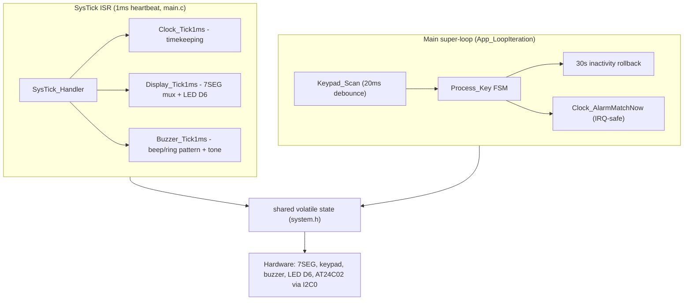
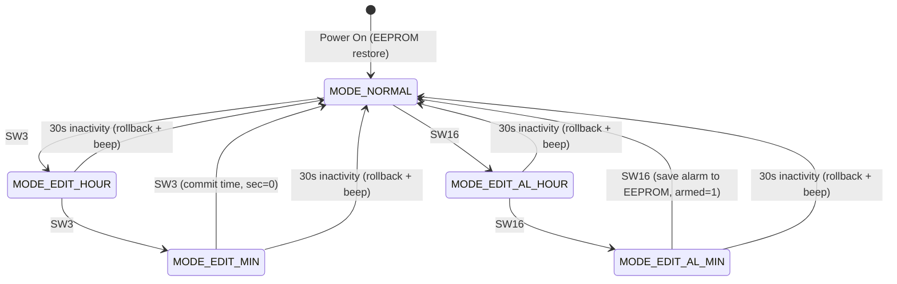
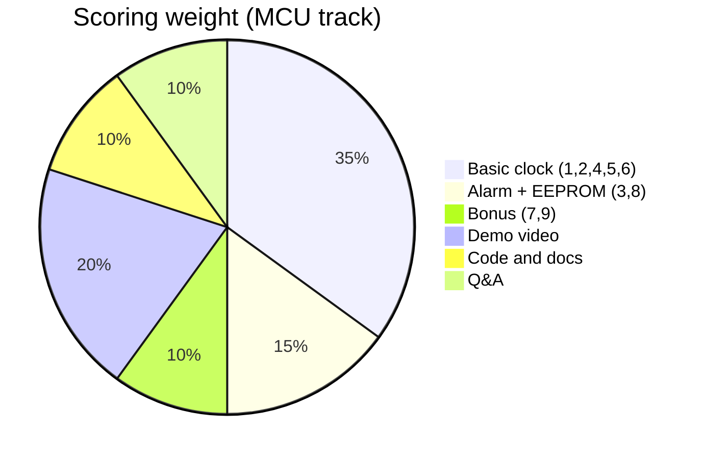
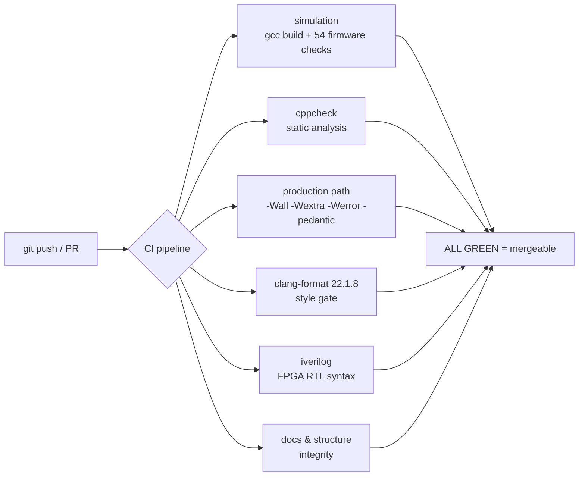
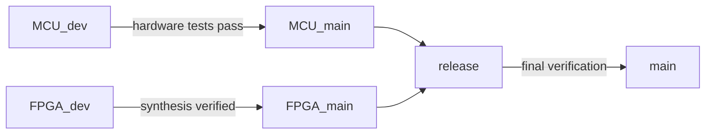

# Porygon: FPGA and MCU System Design Framework (Da Nang Contest 2026)

[](https://github.com/zok213/porygon/actions/workflows/ci.yml)

Engineering workspace for the **Da Nang FPGA & MCU Design Competition 2026**.
Two tracks, one repository:

1. **MCU track — implemented & under hardware test**: 24-hour digital clock +
   alarm for the **SN32F407_EVK** (ARM Cortex-M0 @ 12 MHz IHRC). Modular C
   firmware, time-based key debounce, I2C EEPROM persistence with
   magic/checksum, anti-ghosting 7-segment multiplexing, bounded ~4-5 kHz
   buzzer tones, and a **host simulation harness that verifies all nine
   contest requirements** (54 checks, enforced in CI).
2. **FPGA track — WIP skeleton**: Gowin GW1N design (PLL, debounce, 3-mode
   PWM, UART TX, supervisor FSM) exists as RTL but does **not yet satisfy
   the FPGA đề bài**. See [FPGA status](#fpga-track-status) and
   [FPGA/README.md](FPGA/README.md).

---

## Repository at a Glance

```
porygon/
├── README.md                     ← you are here
├── CHANGELOG.md                  ← full change history (rc1, rc2, ...)
├── .clang-format                 ← enforced coding standard (clang-format 22.1.8)
├── .github/                      ← CI pipeline, issue/PR templates  [README]
├── MCU_Contest_2026/             ← Keil firmware project            [README]
│   ├── main.c app.h system.h     ← app glue: FSM, ISR, shared state
│   ├── clock/ keypad/ display/ buzzer/ eeprom .c/.h
│   ├── sim/                      ← host simulation harness         [README]
│   ├── Docs/                     ← contest specification archive   [README]
│   ├── RTE/                      ← CMSIS + SONiX device support    [README]
│   ├── TESTING.md                ← hardware test guide + demo script
│   ├── CHANGES_VS_ORIGINAL.md    ← deep change analysis vs. the original
│   └── Clock_Simulation.uvprojx  ← Keil MDK project
├── FPGA/                         ← Gowin RTL (WIP)                 [README]
├── SETUP.md                      ← toolchain setup notes
└── ĐỀ THI MCU 2026.pdf / ĐỀ THI FGPA 2026.docx.pdf / Gowin handbook
```

`[README]` = folder has its own README with details.

## Quick Start

| Goal | Path |
| :--- | :--- |
| Understand the assignment | `ĐỀ THI MCU 2026.pdf` (+ `MCU_Contest_2026/Docs/`) |
| Run the firmware on your PC | `cd MCU_Contest_2026 && make run` (needs gcc) |
| Build for the board | Keil MDK → open `MCU_Contest_2026/Clock_Simulation.uvprojx` → rebuild → flash |
| Test on hardware | `MCU_Contest_2026/TESTING.md` (matrix R1-R9 + edge cases + demo script) |
| See what changed vs. the original | `MCU_Contest_2026/CHANGES_VS_ORIGINAL.md` |

---

## MCU Track (SN32F407_EVK)

### Current Firmware State

| Property | Value |
| :--- | :--- |
| MCU | SN32F407F (Cortex-M0), **12 MHz IHRC** (`SYS0_CLKCFG_VAL=0`) |
| Toolchain | Keil MDK 5.43, ArmClang 6.24, SONiX SN32F4_DFP 1.1.1, CMSIS 6.3.0 |
| Code size | ~2.4 KB flash / ~0.6 KB RAM (IROM 32 KB, IRAM 8 KB, stack 512 B) |
| Build gates | 0 errors/0 warnings · `-Wall -Wextra -Werror -pedantic` clean |
| Behaviour gate | 54/54 host simulation checks pass (exit code 0) |
| Style gate | clang-format enforced in CI |
| Static analysis | cppcheck clean on both build paths |
| Test status | **v1.1.0-rc2 on `MCU_dev` — awaiting hardware validation** |

### System Architecture



### Finite State Machine



### Requirement Coverage (Đề thi MCU 2026)

| # | Requirement | Weight | Implementation | Status |
| :- | :--- | :-: | :--- | :-: |
| 1 | 4x7SEG HH.MM, boot 00:00, min 0-59 → hour 0-23 | 35% | `Clock_Tick1ms` rollover + `Display_Tick1ms` | ✅ |
| 2 | SW3: edit hour (blink) → edit min (blink) → NORMAL | 35% | FSM + 1s blink | ✅ |
| 3 | SW16: alarm hour → alarm min → save EEPROM → NORMAL | 15% | FSM + `EEPROM_SaveAlarm` | ✅ |
| 4 | SW6 (+): hour 23→0, min 59→0 | 35% | `Clock_AdjustEdit` modular arithmetic | ✅ |
| 5 | SW10 (−): hour 0→23, min 0→59 | 35% | `Clock_AdjustEdit` modular arithmetic | ✅ |
| 6 | Buzzer: key pip 0.3s; alarm 5s pip-pip 0.5/0.5; timeout pip | 35% | `Buzzer_BeepKey` / `Buzzer_StartAlarm` | ✅ |
| 7 | LED D6 blinks 1s in alarm edit only | 10% | `Display_HW_LedOn/Off` | ✅ |
| 8 | EEPROM persists alarm hh:mm (sec=0) | 15% | magic 0xA5 + checksum + armed flag | ✅ |
| 9 | 30s no-key timeout in all edit modes | 10% | `inactivity_ms` + main-loop check | ✅ |

### Scoring Breakdown



### Timing Diagrams

**Alarm ring — 5s pip-pip (0.5s on / 0.5s off), requirement 6:**

```
Buzzer:  ████░░░░████░░░░████░░░░████░░░░████░░░░
         |<----------------- 5 seconds ----------->|
         █ = 0.5s tone on        ░ = 0.5s silent
```

**Edit-mode blink — 1s period (0.5s on / 0.5s off), requirements 2, 3, 7:**

```
Active field (HH or MM):  ████░░░░████░░░░████░░░░ ...
LED D6 (alarm edit only): ████░░░░████░░░░████░░░░ ...
                          |<--- 1s period --->|
```

**Key debounce — 20ms stability + 20ms release lockout:**

```
Raw pin:   ∧∧∧∧∧∨∨∨∨∨∧∧∧∧∧∨∨∨∨∨██████████████████∨∨∨∨∨∨∨∨∨∨∨∨∨∨∨
           <-- bounce (ignored) --><-20ms stable-><-20ms release->
Event:                                    ↑ one event only
```

### EEPROM Persistent Record

```
addr 0 : 0xA5 magic header
addr 1 : alarm hour    (0..23)
addr 2 : alarm minute  (0..59)
addr 3 : armed flag    (0/1)
addr 4 : XOR checksum of addr 0..3
```

Blank (0xFF) or corrupted cells are detected by the magic/checksum check,
clamped to safe ranges and repaired to defaults — the display can never index
`seg7[]` out of bounds, and an alarm set to 00:00 stays armed across power
cycles.

### Key Engineering Properties

- **Debounce**: 20ms stable-input + release lockout → one event per physical
  press, even with bounce or long hold. Timing uses the 1ms counter, so it is
  independent of main-loop speed.
- **Race-free alarm**: `Clock_AlarmMatchNow()` snapshots time + alarm
  settings with interrupts disabled — a SysTick rollover can never tear the
  comparison and fire the alarm one minute early.
- **Bounded ISR**: display + buzzer work in the 1ms SysTick ISR with a
  burst-limited tone (~0.5ms worst case during beeps only).
- **Continuous ticking**: the master clock runs in the ISR; edit modes use
  shadow buffers; time edit freezes the clock (stable value on screen),
  alarm edit does not.

---

## Host Simulation & CI

The firmware logic runs **unmodified** on a PC against a RAM-mocked SN32F400
device layer (`MCU_Contest_2026/sim/`). Hardware access goes through
abstraction seams (`Keypad_HW_*`, `Buzzer_HW_*`, `Display_HW_*`) that the
simulation overrides — nothing is re-implemented for testing.

```bash
cd MCU_Contest_2026 && make run      # 54 checks, exit code 0 = pass
```



See [`.github/README.md`](.github/README.md) for the job details.

---

## Branch Governance



| Branch | Role | Current state (2026-08-07) |
| :--- | :--- | :--- |
| `main` | Production release baseline | `f05428a` — contains rc2 firmware + FPGA WIP |
| `release` | Integration staging | `9c5efdf` — previous known-good (untouched) |
| `MCU_dev` | MCU active development + testing | `f05428a` — **v1.1.0-rc2, the hardware test candidate** |
| `MCU_main` | MCU stable production | `9c5efdf` — old firmware fallback until tests pass |
| `FPGA_dev` / `FPGA_main` | FPGA development / stable | `9c5efdf` — baseline (FPGA work pending) |

> The new MCU firmware is **not** merged into `MCU_main`/`release` until the
> hardware test matrix in `TESTING.md` passes. Flash candidates are tagged
> (`v1.1.0-rc1`, `v1.1.0-rc2`).

---

## FPGA Track: Status and Roadmap

**Status: WIP skeleton — compiles with iverilog, but does NOT yet satisfy the
FPGA đề bài.** Existing modules (`FPGA/`):

| Module | File | Honest status |
| :--- | :--- | :--- |
| Clock | `pll_50mhz.v` | Behavioral stub — **divides** 24 MHz to ~480 kHz; real Gowin PLL IP core required |
| Debounce | `debouncer.v` | 4-sample shift register, level output, 80 ns window — needs ~10-20 ms + single-cycle pulse |
| PWM | `breathing_pwm.v` | 3 modes but not the required 25% / 100% / 2.0s breathing |
| UART TX | `uart_tx.v` | Correct 115200 8N1 core (CLKS_PER_BIT = 434) ✅ |
| Top | `top.v` | Minimal 2-state FSM, one button, sends `'A'` — needs LOW/HIGH/AUTO FSM + `"MODE: ... \r\n"` strings |

**Missing deliverables**: `.cst` pin constraints (Kiwi Nano 4K `GW1NSR-LV4C`
or Kiwi 1P5 `GW1N-UV1P5`), testbench + waveforms, technical report PDF.

**Roadmap**: complete the FSM per đề bài → real PLL IP → proper debounce →
string UART sender → testbench → `.cst` → report → merge to `FPGA_main`.

See [FPGA/README.md](FPGA/README.md).

---

## How Correctness Is Proved (verification stack)

1. **Host simulation** — 54 behavioural checks on the real firmware logic
   (every push, `simulation` CI job).
2. **Compiler discipline** — `-Wall -Wextra -Werror -pedantic` on both build
   paths (production path = the exact code that ships).
3. **Static analysis** — cppcheck, zero findings on both paths.
4. **Style enforcement** — clang-format 22.1.8 pinned in CI.
5. **RTL syntax** — iverilog over all Verilog modules.
6. **Hardware matrix** — the final gate: `TESTING.md` R1-R9 + edge cases on
   the real board (currently in progress on `MCU_dev@v1.1.0-rc2`).

## License

Distributed under the **MIT License**. Maintained for **zok213/porygon**.
