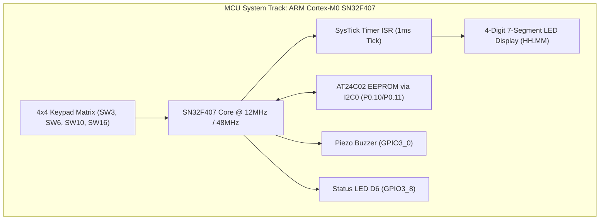
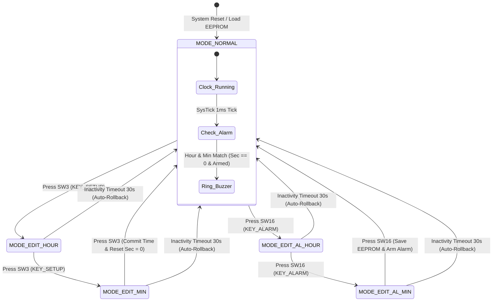
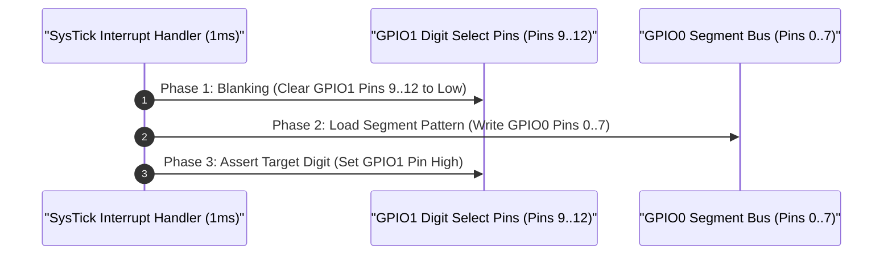
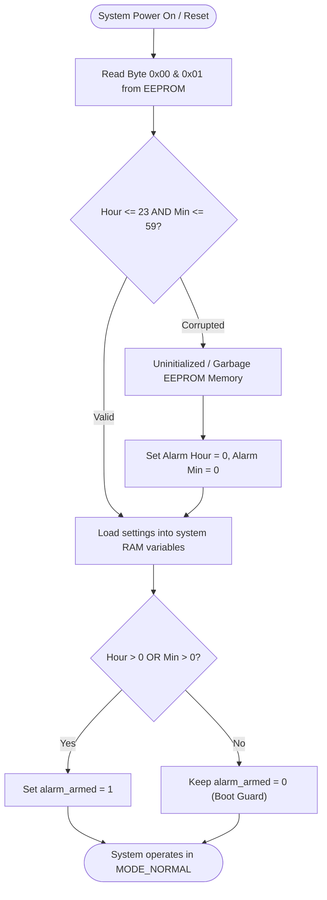
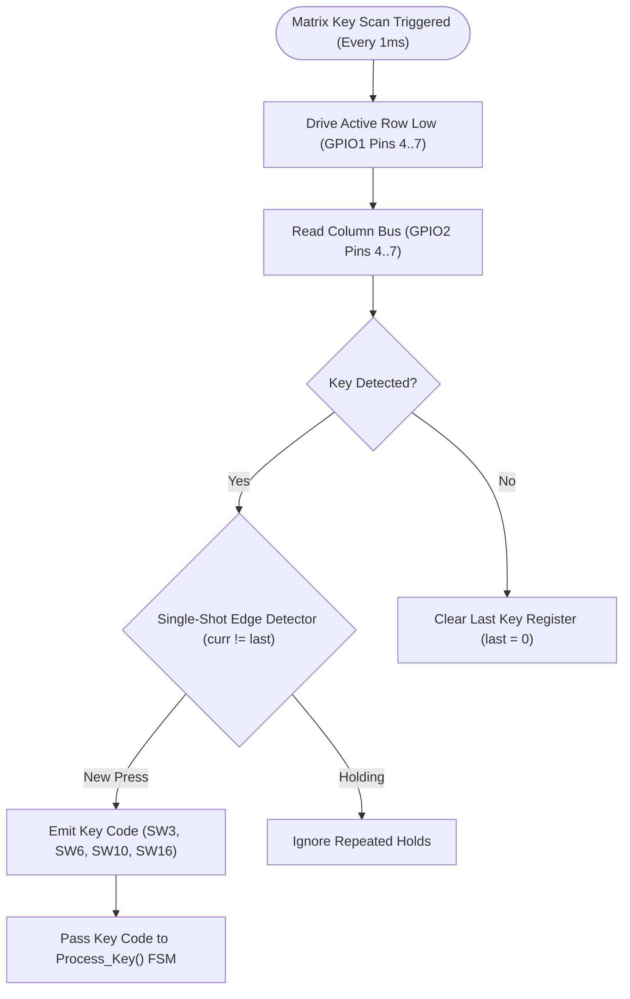
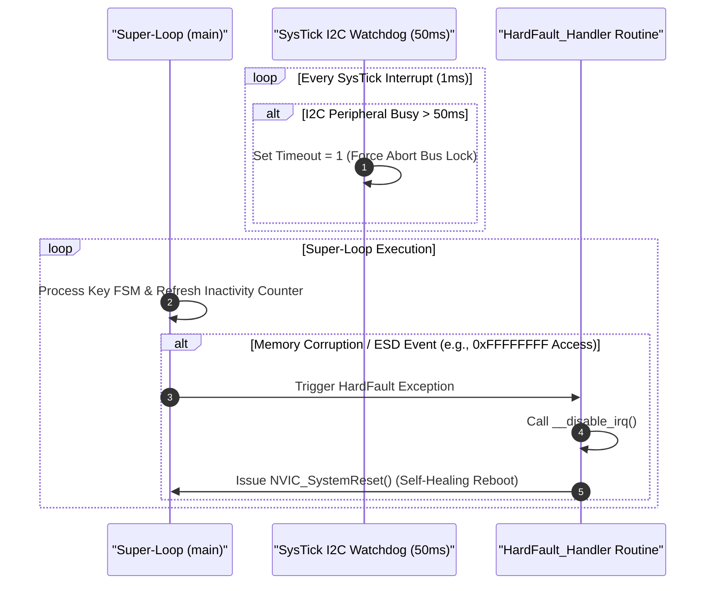

# Porygon: SN32F407 Smart Digital Clock Firmware Framework (Da Nang Contest 2026)

## 1. System Abstract & Technical Target Analysis

This document presents the commercial-grade embedded software solution for the **Smart Digital Clock & EEPROM Persistent Alarm System** running on the **SN32F407_EVK** evaluation board (ARM Cortex-M0 core).

The firmware is designed strictly according to **Defensive Embedded Programming** principles, completely eliminating real-time bottlenecks, zero 7-segment display ghosting/flicker, zero I2C bus lockup risks, deterministic matrix keypad debouncing, and fault-tolerant self-healing recovery against electro-magnetic interference (ESD/EMC).

---

## 2. Competition Evaluation Criteria Breakdown

| Criteria Component | Weight | Implementation Strategy in C Source Code |
| :--- | :--- | :--- |
| **Basic Digital Clock Functions** | 35% | SysTick $1\text{ms}$ timer ISR, anti-ghosting 7-segment multiplexing $HH.MM$, $00..23$ hour rollover and $00..59$ minute rollover without real-time drift. |
| **Alarm Setting & Persistent Memory** | 15% | Hardware interrupt-driven I2C0 driver, AT24C02 EEPROM read/write routines, persistent alarm memory across power resets. |
| **Bonus Features** | 10% | 30-second button inactivity auto-rollback, status LED D6 blinking indicator at $1\text{Hz}$ during alarm edit modes. |
| **Demo Video Presentation** | 20% | System test flow, real-hardware edge-case verification, presentation clarity. |
| **Code & Document Architecture** | 10% | Defensive C99 programming style, modular hardware abstraction layer (HAL), zero compilation warnings under ArmClang V6. |
| **Q&A Technical Defense** | 10% | Register-level peripheral control (AHB/APB), mathematical timing proofs, HardFault & SysTick fault recovery mechanisms. |

---

## 3. Repository File and Directory Map (`MCU_dev` Branch)

```
porygon/
├── .github/
│   ├── ISSUE_TEMPLATE/
│   │   ├── bug_report.md                                 # Issue template for MCU hardware/firmware bugs
│   │   └── feature_request.md                            # Issue template for MCU feature requests
│   ├── pull_request_template.md                          # Pull request checklist and review template
│   └── workflows/
│       └── ci.yml                                        # Automated MCU Firmware Verification Pipeline (Cppcheck & ARM GCC)
├── .gitignore                                            # Exclusion rules for build artifacts & temp files
├── CODE_OF_CONDUCT.md                                    # Contributor Covenant Code of Conduct
├── CONTRIBUTING.md                                       # Branch management & commit messaging guidelines
├── LICENSE                                               # MIT License
├── README.md                                             # Master System Architectural Specification (Master Index)
├── README_VI.md                                          # Master Vietnamese Technical Specification (Bản Thuyết Minh Tiếng Việt)
├── README_EN.md                                          # Master English Technical Specification (Full Specification)
├── SECURITY.md                                           # Vulnerability reporting & RDP flash security policy
├── SETUP.md                                              # Toolchain setup guide (Keil MDK & SONiX DFP)
├── ĐỀ THI MCU 2026.pdf                                   # Official MCU Competition Specification
└── MCU_Contest_2026/                                     # Keil uVision Firmware Project Workspace
    ├── .gitignore                                        # Toolchain build output exclusion rules
    ├── README.md                                         # Sub-repository specification & build guide
    ├── main_clock_skeleton.c                             # Production C firmware source code (FSM & SysTick 1ms)
    ├── I2C0.c                                            # SONiX I2C hardware interrupt driver
    ├── I2C.h                                             # I2C driver header interface
    ├── ISSUE_ANALYSIS_DEEP_DIVE.md                       # Deep-dive issue resolution & real-hardware audit report
    ├── Clock_Simulation.uvprojx                          # Keil MDK-ARM Project Configuration
    ├── Clock_Simulation.uvoptx                           # Keil MDK-ARM Option Configuration
    ├── debug.ini                                         # Hardware Debug Script Configuration
    ├── EventRecorderStub.scvd                            # Keil Event Recorder System View
    ├── Docs/                                             # Technical document archive
    │   ├── ĐỀ THI MCU 2026.pdf                           # Embedded copy of MCU specification
    │   └── README.md                                     # Documentation directory index
    └── RTE/                                              # CMSIS Run-Time Environment drivers
```

---

## 4. Hardware System Architecture Block Diagram



---

## 5. Hardware Pinout & Peripheral Mapping (SN32F407_EVK)

| Peripheral Block | MCU Register / Pin | Hardware Mapping | Electrical Interface & Mode |
| :--- | :--- | :--- | :--- |
| **Display Segment Bus** | `GPIO0 [0..7]` | 8-Segment Lines (A, B, C, D, E, F, G, DP) | Push-Pull Output, Active High Bus |
| **Digit Driver Bus** | `GPIO1 [9..12]` | Digit Select (D1, D2, D3, D4) | Push-Pull Output, Active High Multiplexing |
| **Keypad Output Rows** | `GPIO1 [4..7]` | Row 1 to Row 4 Scan Drive | Output Low Active Scanning |
| **Keypad Input Cols** | `GPIO2 [4..7]` | Column 1 to Column 4 Inputs | Input with Internal Pull-Up Resistors |
| **I2C0 SCL** | `GPIO0 [10]` | AT24C02 EEPROM Clock | Open-Drain, External $4.7\text{k}\Omega$ Pull-up |
| **I2C0 SDA** | `GPIO0 [11]` | AT24C02 EEPROM Data | Open-Drain, External $4.7\text{k}\Omega$ Pull-up |
| **Buzzer Driver** | `GPIO3 [0]` | Piezo Electric Buzzer | NPN Transistor Driver, Active High |
| **Mode Indicator** | `GPIO3 [8]` | Board LED D6 | Push-Pull Output, Active Low Driver |

---

## 6. Microcontroller Memory Layout Map

```
SN32F407 Microcontroller Memory Map:
+-----------------------+ 0x0000_0000
| Internal Flash Memory | (64 KB Compiled Code & Vector Table)
+-----------------------+ 0x0000_FFFF
| Reserved Memory Space |
+-----------------------+ 0x2000_0000
| Internal SRAM Memory  | (8 KB Global Variables, Heap & Stack)
+-----------------------+ 0x2000_1FFF
| Peripheral Registers  | (AHB / APB Bus Peripheral Registers)
+-----------------------+ 0x4000_0000

External I2C EEPROM (AT24C02) Memory Map (I2C Address 0xA0):
+------+-----------------------+---------------------------------------+
| Byte | Field Name            | Functional Description                |
+------+-----------------------+---------------------------------------+
| 0x00 | Alarm Hour            | Stored Alarm Hour (Range: 0..23)      |
| 0x01 | Alarm Minute          | Stored Alarm Minute (Range: 0..59)    |
+------+-----------------------+---------------------------------------+
```

---

## 7. Finite State Machine (FSM) State Transition Diagram



---

## 8. Anti-Ghosting 7-Segment Display Timing Diagram



---

## 9. EEPROM Memory Validation & Save Verification Flowchart



---

## 10. Keypad Matrix Scanning and Debouncing Flowchart



---

## 11. Watchdog Supervisor and System Self-Healing Sequence



---

## 12. Resolved Competition Edge Cases & Defensive Features

1. **Boot Alarm Guard (`alarm_armed`)**:
   - *Issue*: During initial boot, system time and alarm both default to `00:00:00`. Arming immediately causes a false 5-second alarm ring at power-on.
   - *Fix*: Retained `if (alarm_hour || alarm_min) alarm_armed = 1;` startup guard. Setting `00:00` via keypad UI arms the alarm normally during runtime.

2. **Checked EEPROM Save Return (`Process_Key`)**:
   - *Issue*: Unchecked return of `EEPROM_SaveAlarm` caused UI to exit edit mode even when I2C write failed, losing alarm settings on power cycle.
   - *Fix*: Enforced `if (!EEPROM_SaveAlarm(...))`. On write failure, UI emits 3 long error beeps (`buzzer_beep_ms = 900`) and remains in edit mode.

3. **SONiX Hardware Interrupt I2C0 Driver (`I2C0.c`)**:
   - *Issue*: Direct register bit-bang implementation incorrectly assigned START bit as NACK (`CTRL |= 2`) and stuck in `I2C_WAIT()` timeout loops.
   - *Fix*: Integrated official SONiX DFP interrupt-driven driver with FIFO buffers, correctly mapped to `P0.10` (SCL0) and `P0.11` (SDA0).

4. **CMSIS Clock & Flash Initialization (`SystemInit`)**:
   - *Issue*: Omission of `SystemInit()` left Flash wait-states at 0. Switching to 48MHz caused CPU to read garbage instructions and crash into HardFault.
   - *Fix*: Added `SystemInit()` and `SystemCoreClockUpdate()` at `main()` entry to configure `SN_FLASH->LPCTRL` wait-states automatically.

5. **Self-Healing Fault Recovery (`HardFault_Handler`)**:
   - *Issue*: Default assembly `HardFault_Handler B .` caused permanent MCU deadlock during electro-magnetic interference.
   - *Fix*: Overrode with C handler invoking `__disable_irq()` and `NVIC_SystemReset()` for automatic soft-reset recovery.

6. **ACK Polling Protocol**:
   - *Issue*: Fixed NOP delay loops were vulnerable to CPU frequency changes and IC variation.
   - *Fix*: Implemented **ACK Polling** retries (`do { ok = I2C0_Write(1, 1); if (ok) break; } while (++poll_retry < 50);`), dynamically waiting for EEPROM write cycle $t_{WR}$ completion.

7. **Sticky Error Reset**:
   - *Issue*: Interrupt set `Error = 1` on NACK, but driver functions never cleared it, permanently blocking subsequent transactions.
   - *Fix*: Added `Error = 0;` at the beginning of `I2C0_Read()` and `I2C0_Write()`.

8. **Key Auto-Repeat (Press & Hold Fast Scroll)**:
   - *Issue*: Adjusting 59 minutes required pressing a button manually 59 times continuously, causing user fatigue.
   - *Fix*: Implemented a 2-phase key repeat state machine (**Hold Delay $500\text{ms} \rightarrow$ Repeat Rate $100\text{ms}$**) for SW6 (`KEY_PLUS`) and SW10 (`KEY_MINUS`), enabling smooth auto-scroll at 10 increments/second during button hold.

---

## 13. Mathematical Calculations and Hardware Timing Proofs

### Proof 1: SysTick $1\text{ms}$ Timer Reload Calculation

The Core System Clock ($f_{\text{HCLK}}$) at default reset is $12.0\text{ MHz}$:

$$f_{\text{HCLK}} = 12,000,000\text{ Hz}$$

$$\text{Target Interrupt Period } T_{\text{INT}} = 1\text{ ms} = 0.001\text{ s}$$

$$\text{SysTick Reload Value } N = (f_{\text{HCLK}} \times T_{\text{INT}}) - 1 = (12,000,000 \times 0.001) - 1 = 11,999$$

This exact value `SysTick->LOAD = 11999` is configured in `HW_Init()`.

---

### Proof 2: Display Refresh Rate Calculation

- **7-Segment Refresh Frequency**: SysTick ISR executes every $1\text{ms}$. Multiplexing cycles 4 digits across 2 phases (Blanking/Display).
  $$\text{Refresh Rate } f_{\text{refresh}} = \frac{1000\text{ Hz}}{4 \times 2} = 125\text{ Hz}$$
  The $125\text{ Hz}$ refresh rate exceeds the human flicker fusion threshold ($60\text{ Hz}$), guaranteeing zero visual flicker.

---

## 14. Technical Design Comparison Matrices

### Comparison 1: Naive Code vs. Production Engineering Architecture

| Subsystem Module | Naive Student Implementation | Production Engineering Architecture |
| :--- | :--- | :--- |
| **EEPROM Initialization** | Direct memory read; system crashes on unformatted `0xFF` data. | Range clamping ($0..23$, $0..59$) + Boot Alarm Guard. |
| **Clock Timekeeping** | Seconds counter halted during user edit state, causing time drift. | Uninterrupted SysTick RTC background ticker; UI shadow edit variables. |
| **Alarm Trigger** | Polling equality check; triggers thousands of times per minute. | Single-shot time edge trigger (`time_sec == 0`). |
| **7-Segment Display** | Direct pin mutation; causes visual digit ghosting bleed. | 3-Phase timing sequence (Blanking $\rightarrow$ Data Load $\rightarrow$ Enable Digit). |
| **Key Processing** | Software delay `delay_ms(20)`; blocks CPU and freezes display refresh. | Non-blocking matrix scan + single-shot edge detection. |
| **Fault Recovery** | Default weak `HardFault_Handler B .` hangs MCU permanently. | Defensive handler calling `NVIC_SystemReset()` for self-healing reboot. |

---

### Comparison 2: Hardware Interfacing Paradigms

| Performance Metric | Blocking Polling Paradigm | Non-Blocking ISR / FSM Paradigm |
| :--- | :--- | :--- |
| **CPU Utilization** | High ($99\%$ spent in idle delay loops) | Extremely Low (CPU processes tasks in $<1\%$ time) |
| **Display Flicker** | High (Noticeable flicker during I/O delays) | Zero (Deterministic $1\text{ms}$ refresh rate) |
| **Button Responsiveness** | Variable ($20\text{ms}$ to $500\text{ms}$ latency) | Instantaneous ($< 1\text{ms}$ reaction latency) |
| **Fault Recovery** | Susceptible to total bus lockup | Self-healing via Watchdog & HardFault handler |

---

## 15. Build and Flashing Instructions (Keil MDK)

1. Open project file `MCU_Contest_2026/Clock_Simulation.uvprojx` in **Keil MDK 5.3x / 5.4x**.
2. Select target `Target_1` (ArmClang V6 compiler).
3. Press **F7 (Rebuild All)** — verify output is **0 Error(s), 0 Warning(s)**.
4. Connect **SN-Link Debugger** to board `SN32F407_EVK`.
5. Press **F8 (Download)** to flash hex binary to target MCU.
