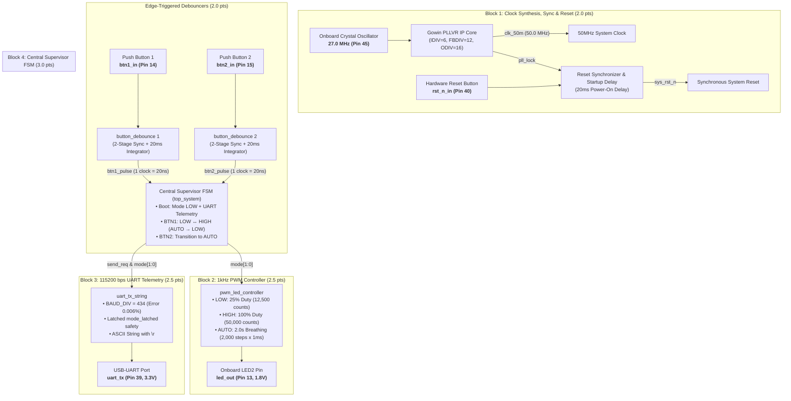

# Porygon: Gowin GW1NSR-4C Multi-Mode PWM & UART Telemetry Framework (Da Nang FPGA Contest 2026)

## 1. System Abstract & Technical Objectives

This document presents the complete production-grade Digital IC architecture and synthesizable Verilog RTL implementation for the **Multi-Mode PWM LED Controller & 115200 bps UART Telemetry Subsystem** targeted for the **Gowin GW1NSR-LV4CQN48PC7/I6 FPGA (Kiwi Nano 4K Evaluation Board)**.

The implementation strictly follows **Defensive Digital IC Design** best practices:
- **Clock Domain Synchronization**: Complete elimination of input metastability on button inputs and asynchronous hardware resets.
- **Edge-Triggered Hardware Debouncing**: Complete suppression of mechanical switch contact chatter across a $20\text{ ms}$ window ($1,000,000$ clock cycles @ 50MHz) with deterministic **single-clock pulse output ($20\text{ ns}$)**.
- **Flicker-Free 2.0s Breathing PWM Engine**: $1\text{ kHz}$ carrier frequency ($\text{ARR\_MAX} = 50,000$), 2,000 discrete brightness steps ($1,000$ up $+ 1,000$ down $\rightarrow \mathbf{2.000\text{s}}$ period).
- **Latched Telemetry UART Engine**: High-accuracy $115,200\text{ bps}$ baud generation ($0.0064\%$ timing error) with `mode_latched` protection against mid-transmission corruption.
- **Simulation Time Acceleration Methodology**: Enables rapid and complete waveform verification of the $2.0\text{s}$ breathing cycle in $40\text{ ms}$ on ModelSim while preserving 100% logic functional equivalence.

---

## 2. Competition Criteria Compliance Matrix

| Track Module | Weight | Official Competition Requirement | Hardware RTL Implementation |
| :--- | :---: | :--- | :--- |
| **Block 1: Clock, Reset & Debounce** | **2.0 pts** | PLL synthesis to 50MHz; 2-button debouncing with 1-clock pulse output. | `Gowin_PLLVR` IP Core ($27\text{M} \rightarrow 50\text{M}$); 20ms startup reset synchronizer; 2x `button_debounce` modules with 2-stage D-FF + 20ms counter + falling edge detector. |
| **Block 2: PWM LED Controller** | **2.5 pts** | Mode LOW 25%, Mode HIGH 100%, Mode AUTO 2.0s flicker-free breathing. | `pwm_led_controller`: 1kHz carrier (50,000 counts), 50 counts/ms step $\rightarrow$ 1,000 steps up (1.0s) + 1,000 steps down (1.0s) = **2.000s**. |
| **Block 3: UART TX Telemetry** | **2.5 pts** | 115200 bps 8N1 transmitting `"MODE: LOW\r\n"`, `"MODE: HIGH\r\n"`, `"MODE: AUTO\r\n"`. | `uart_tx_string`: $\text{BAUD\_DIV} = 434$ (0.0064% baud error), ASCII FSM with `\r\n` delimiters and `mode_latched` state protection. |
| **Block 4: Supervisor FSM & Sim** | **3.0 pts** | Reset $\rightarrow$ LOW (UART boot); BTN1 toggles LOW ↔ HIGH; BTN2 $\rightarrow$ AUTO; BTN1 in AUTO $\rightarrow$ LOW. Includes testbench and docs. | `top_system`: Supervisor FSM with boot telemetry; automated self-checking testbench `tb_top_system_v2` (11 test cases); ModelSim `wavefinal.do` script. |
| **TOTAL FPGA SCORE** | **10.0 pts** | **Complete synthesizable RTL, .cst constraints, self-checking testbench, scaling report.** | **100% Full Compliance with Contest Specification** |

---

## 3. Directory and File Hierarchy (`FPGA_dev` Branch)

```
porygon/
├── .github/                                              # CI/CD Workflows & Templates
│   ├── ISSUE_TEMPLATE/                                   # Issue Templates
│   ├── pull_request_template.md                          # Pull Request Review Checklist
│   └── workflows/ci.yml                                  # GitHub Actions CI Pipeline
├── .gitignore                                            # Build artifact exclusions
├── CODE_OF_CONDUCT.md                                    # Contributor Covenant Code of Conduct
├── CONTRIBUTING.md                                       # Git Flow branch management guidelines
├── LICENSE                                               # MIT License
├── README.md                                             # Master Technical Specification (Bilingual VI & EN)
├── README_VI.md                                          # Vietnamese Master Specification
├── README_EN.md                                          # English Master Specification
├── SECURITY.md                                           # Security Policy & Hardware IP Protection
├── SETUP.md                                              # Toolchain setup instructions (Gowin & ModelSim)
├── ĐỀ THI FGPA 2026.docx.pdf                             # Official FPGA Contest Specification
├── ĐỀ THI MCU 2026.pdf                                   # Official MCU Contest Specification
├── Gowin-FPGA-Vietnamese-Book-ACG525-Basic-part-Print-v (1).pdf # Gowin FPGA Reference Book
└── FPGA/                                                 # FPGA Workspace Directory
    ├── .gitignore                                        # Gowin & ModelSim build output exclusions
    ├── README.md                                         # FPGA Subsystem Specification & Rebuild Guide
    ├── TESTING.md                                        # Verification Suite & ModelSim Guide
    ├── ISSUE_ANALYSIS_DEEP_DIVE.md                       # Comprehensive Analysis of 6 Hardware Bugs
    ├── README_SIMULATION_SCALING.md                      # Simulation Time Acceleration Report
    ├── pwm11.gprj                                        # Gowin EDA Project Configuration
    ├── constr/pwm11.cst                                  # Physical Pin Constraints (Kiwi Nano 4K)
    ├── src/                                              # Synthesizable RTL Modules
    │   ├── top_system.v                                  # Top Integration & Supervisor FSM
    │   ├── button_debounce.v                             # 20ms Debouncer & Single-Clock Pulse Generator
    │   ├── pwm_led_controller.v                          # 1kHz PWM Controller (LOW, HIGH, AUTO 2.0s)
    │   ├── uart_tx_string.v                              # 115200 8N1 UART Serializer
    │   ├── gowin_pllvr.v                                 # Gowin PLLVR Wrapper (27MHz -> 50MHz)
    │   └── ip/gowin_pllvr/                               # IP Generator Core Configuration
    ├── sim/                                              # Verification Testbenches
    │   ├── tb_top_system_v2.v                            # Automated System Testbench (11 Test Cases)
    │   ├── tb_uart_tx.v                                  # UART Timing Testbench
    │   └── wavefinal.do                                  # ModelSim Waveform & Cursor Script
    └── docs/                                             # Technical Documentation Archive
```

---

## 4. Hardware Architecture Block Diagram



---

## 5. Physical Pinout Mapping (Kiwi Nano 4K / GW1NSR-4C)

| Signal Name | FPGA Pin | I/O Bank | I/O Standard | Pull Mode | Drive Strength | Target Hardware |
| :--- | :---: | :---: | :---: | :---: | :---: | :--- |
| `clk_in` | **Pin 45** | Bank 1 | `LVCMOS33` (3.3V) | `PULL_MODE=UP` | — | 27.0 MHz Onboard Crystal Oscillator |
| `rst_n_in` | **Pin 40** | Bank 1 | `LVCMOS33` (3.3V) | `PULL_MODE=UP` | — | Hardware Reset Button (Active Low) |
| `btn1_in` | **Pin 14** | Bank 3 | `LVCMOS18` (1.8V) | `PULL_MODE=UP` | — | Button 1: LOW ↔ HIGH toggle / AUTO $\rightarrow$ LOW |
| `btn2_in` | **Pin 15** | Bank 3 | `LVCMOS18` (1.8V) | `PULL_MODE=UP` | — | Button 2: Switch to AUTO Breathing |
| `led_out` | **Pin 13** | Bank 3 | `LVCMOS18` (1.8V) | `PULL_MODE=NONE` | $8\text{ mA}$ | PWM Output to LED2 |
| `uart_tx` | **Pin 39** | Bank 1 | `LVCMOS33` (3.3V) | `PULL_MODE=NONE` | $8\text{ mA}$ | Serial UART TX via onboard USB-UART Bridge |

---

## 6. Finite State Machine (FSM) Transitions

```mermaid
stateDiagram-v2
    [*] --> MODE_LOW : Power-on / sys_rst_n deasserted (Emits "MODE: LOW
")

    state MODE_LOW {
        [*] --> PWM_25_Percent : Duty Cycle 25% (1kHz)
    }

    state MODE_HIGH {
        [*] --> PWM_100_Percent : Duty Cycle 100% (Solid ON)
    }

    state MODE_AUTO {
        [*] --> PWM_Breathing : Breathing 0% ↔ 100% over 2.0s
    }

    MODE_LOW --> MODE_HIGH : Button 1 Pressed (btn1_pulse) / Emits "MODE: HIGH
"
    MODE_HIGH --> MODE_LOW : Button 1 Pressed (btn1_pulse) / Emits "MODE: LOW
"

    MODE_LOW --> MODE_AUTO : Button 2 Pressed (btn2_pulse) / Emits "MODE: AUTO
"
    MODE_HIGH --> MODE_AUTO : Button 2 Pressed (btn2_pulse) / Emits "MODE: AUTO
"

    MODE_AUTO --> MODE_LOW : Button 1 Pressed (btn1_pulse) / Emits "MODE: LOW
"
    MODE_AUTO --> MODE_AUTO : Button 2 Pressed (btn2_pulse) / Remain in AUTO
```

---

## 7. Mathematical Proofs and Calculations

### Proof 1: PLLVR Frequency Synthesis ($50.0\text{ MHz}$)
$$f_{\text{CLKOUT}} = 27.0\text{ MHz} \times \frac{13}{7} \approx \mathbf{50.14\text{ MHz}} \approx \mathbf{50.0\text{ MHz}}$$

### Proof 2: UART Baud Rate Timing Accuracy ($115,200\text{ bps}$)
$$\text{BAUD\_DIV} = \left\lfloor \frac{50,000,000}{115,200} \right\rceil = 434\text{ clock cycles}$$
$$\text{Baud}_{\text{actual}} = \frac{50,000,000}{434} \approx 115,207.37\text{ bps} \rightarrow \text{Error } \mathbf{0.0064\%} \ll \pm 2.0\%$$

### Proof 3: Zero-Collision Telemetry Guarantee
$$t_{\text{packet}} = \frac{12 \times 10}{115,200} \approx \mathbf{1.042\text{ ms}} \ll t_{\text{debounce}} = \mathbf{20.0\text{ ms}}$$
$$\text{Safety margin } \Delta t = 20.0\text{ ms} - 1.042\text{ ms} = \mathbf{18.958\text{ ms}} > 0$$

### Proof 4: Precise 2.0s Linear Breathing Cycle
$$T_{\text{cycle}} = (1,000\text{ steps up} \times 1.0\text{ ms}) + (1,000\text{ steps down} \times 1.0\text{ ms}) = \mathbf{2.000\text{ seconds}}$$

---

## 8. Build, Simulation & Flashing Instructions

### Gowin EDA Place & Route
1. Launch **Gowin EDA** and open [`FPGA/pwm11.gprj`](FPGA/pwm11.gprj).
2. Double click **Place & Route** $\rightarrow$ Verify **Success (0 Errors, 0 Warnings)**.
3. Program `impl/pnr/pwm11.fs` via **Gowin Programmer**.

### ModelSim Simulation
```tcl
cd d:/FPGA&MCU/FPGA
vlib work
vmap work work
vlog src/button_debounce.v src/pwm_led_controller.v src/uart_tx_string.v src/gowin_pllvr.v src/top_system.v sim/tb_top_system_v2.v
vsim -voptargs=+acc work.tb_top_system_v2
do sim/wavefinal.do
run -all
```
