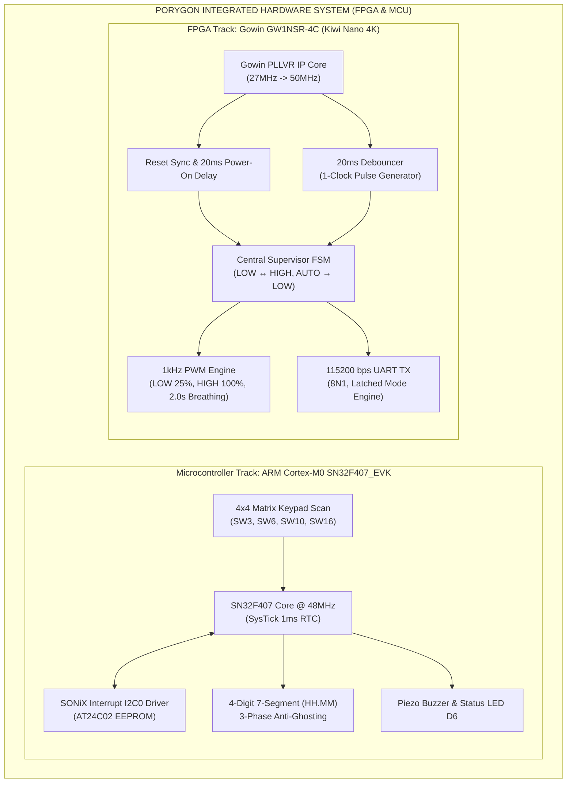

# Porygon: FPGA & MCU Multi-Track System Design Framework (Da Nang Contest 2026)

[](https://github.com/zok213/porygon/actions/workflows/ci.yml)
[](https://opensource.org/licenses/MIT)

> **Language Navigation**: [🇻🇳 Tiếng Việt](README_VI.md) | 🇬🇧 English Specification

---

# 🇬🇧 MASTER ROUTING & SYSTEM SPECIFICATION (ENGLISH)

## 📍 OFFICIAL GITHUB REPOSITORY BRANCH NAVIGATION MATRIX

The repository is organized following a structured **Multi-Track Git Flow Hierarchy**:

| Technical Sub-Track | Baseline Production Branch | Active Development Branch | Primary Workspace Directory |
| :--- | :--- | :--- | :--- |
| **MCU Track (ARM Cortex-M0 SN32F407)** | 🟢 [`MCU_main`](https://github.com/zok213/porygon/tree/MCU_main) | 🛠️ [`MCU_dev`](https://github.com/zok213/porygon/tree/MCU_dev) | [`MCU_Contest_2026/`](MCU_Contest_2026/) |
| **FPGA Track (Gowin GW1NSR-4C Verilog RTL)**| 🟢 [`FPGA_main`](https://github.com/zok213/porygon/tree/FPGA_main) | 🛠️ [`FPGA_dev`](https://github.com/zok213/porygon/tree/FPGA_dev) | [`FPGA/`](FPGA/) |
| **Final Official Release** | 🏆 [`release`](https://github.com/zok213/porygon/tree/release) | — | Complete Repository |

---

## 1. System Abstract & Sub-System Overview

This project delivers a comprehensive engineering solution for the **Da Nang FPGA & MCU Competition 2026**:



### 1.1 Microcontroller Track (SN32F407_EVK)
- **Architecture**: Defensive C99 firmware for the **SN32F407_EVK** evaluation board (ARM Cortex-M0).
- **Core Features**: 24-hour RTC clock, 3-phase anti-ghosting 7-segment display driver, interrupt-driven I2C0 driver for AT24C02 EEPROM persistence with ACK polling, non-blocking 4x4 matrix key scan, and self-healing HardFault recovery.
- **Workspace**: [`MCU_Contest_2026/`](MCU_Contest_2026/) | **Spec**: [`MCU_Contest_2026/README.md`](MCU_Contest_2026/README.md).

### 1.2 Field-Programmable Gate Array Track (Gowin GW1NSR-4C)
- **Architecture**: Synthesizable Verilog RTL targeted for **GW1NSR-LV4CQN48PC7/I6 (Kiwi Nano 4K)**.
- **Core Features**: Gowin PLLVR core (27MHz $\rightarrow$ 50MHz), 2-stage synchronizer with 20ms reset startup delay, 20ms debouncer with single-clock pulse output, 1kHz PWM engine (LOW 25%, HIGH 100%, AUTO 2.000s linear breathing across 2,000 brightness steps), 115200 8N1 UART transmitter with mode latching (0.0064% baud error), and automated self-checking testbench (11/11 Checks PASS).
- **Workspace**: [`FPGA/`](FPGA/) | **Spec**: [`FPGA/README.md`](FPGA/README.md) & [`FPGA/TESTING.md`](FPGA/TESTING.md).

---

## 2. Competition Criteria Compliance Matrix

| Criteria | Weight | Technical Implementation Details |
| :--- | :---: | :--- |
| **Clock Core & RTL Logic** | **35%** | **MCU**: 1ms SysTick RTC, 7-seg multiplexer.<br>**FPGA**: 50MHz PLL, Central Supervisor FSM, 1-clock pulse debouncing. |
| **Alarm, EEPROM & UART Telemetry**| **15%** | **MCU**: SONiX interrupt I2C0 EEPROM persistence.<br>**FPGA**: 115200 bps UART TX string telemetry (`"MODE: ... \r\n"`). |
| **Bonus Capabilities** | **10%** | **MCU**: 30s inactivity auto-rollback.<br>**FPGA**: 2.0s flicker-free breathing PWM (2,000 discrete brightness steps). |
| **Video Demonstration** | **20%** | Real-silicon validation on SN32F407_EVK and Kiwi Nano 4K boards. |
| **Code & Architecture Quality**| **10%** | Zero compiler/synthesis warnings (0 Errors, 0 Warnings), clean modular hierarchy. |
| **Technical Defense & Q&A** | **10%** | Mathematical proofs for UART baudrate timing, debounce zero-collision proof, and PLL clock synthesis. |

---

## 3. System Repository File and Directory Map

```
porygon/
├── .github/                                              # CI/CD Workflows & Templates
│   ├── ISSUE_TEMPLATE/                                   # Issue Templates
│   ├── pull_request_template.md                          # Pull Request Review Checklist
│   └── workflows/ci.yml                                  # GitHub Actions Automated CI Pipeline
├── .gitignore                                            # Root build exclusions
├── CODE_OF_CONDUCT.md                                    # Contributor Covenant Code of Conduct
├── CONTRIBUTING.md                                       # Multi-track Git Flow governance rules
├── LICENSE                                               # MIT License
├── README.md                                             # Master Navigation Hub (Bilingual VI & EN)
├── README_VI.md                                          # Vietnamese Master Specification
├── README_EN.md                                          # English Master Specification
├── SECURITY.md                                           # Security Policy & Flash Memory Protection
├── SETUP.md                                              # Toolchain setup notes (Keil & Gowin EDA)
├── ĐỀ THI MCU 2026.pdf                                   # Official MCU Specification
├── ĐỀ THI FGPA 2026.docx.pdf                             # Official FPGA Specification
├── Gowin-FPGA-Vietnamese-Book-ACG525-Basic-part-Print-v (1).pdf # Gowin FPGA Handbook
├── FPGA/                                                 # FPGA TRACK SUB-REPOSITORY (GW1NSR-4C)
│   ├── .gitignore                                        # Gowin EDA & ModelSim exclusions
│   ├── README.md                                         # FPGA Technical Specification (Bilingual)
│   ├── TESTING.md                                        # Verification Matrix & ModelSim Guide
│   ├── README_SIMULATION_SCALING.md                      # Simulation Time Acceleration Report
│   ├── pwm11.gprj                                        # Gowin EDA Project Configuration
│   ├── constr/pwm11.cst                                  # Physical Pin Constraints
│   ├── src/                                              # Synthesizable RTL Verilog Modules
│   │   ├── top_system.v                                  # Top Integration & Supervisor FSM
│   │   ├── button_debounce.v                             # 20ms Debouncer & 1-Clock Pulse Generator
│   │   ├── pwm_led_controller.v                          # 1kHz PWM Core (LOW, HIGH, AUTO 2.0s)
│   │   ├── uart_tx_string.v                              # 115200 8N1 UART Serializer
│   │   ├── gowin_pllvr.v                                 # 27MHz -> 50MHz Gowin PLLVR Wrapper
│   │   └── ip/gowin_pllvr/                               # IP Core Generator files
│   ├── sim/                                              # Self-Checking Simulation Suite
│   │   ├── tb_top_system_v2.v                            # Full Automated System Testbench
│   │   ├── tb_uart_tx.v                                  # UART Timing Testbench
│   │   └── wavefinal.do                                  # ModelSim Waveform Visualizer Script
│   └── docs/                                             # Specification & Architecture Archive
└── MCU_Contest_2026/                                     # MCU TRACK SUB-REPOSITORY (SN32F407)
    ├── .gitignore                                        # Keil MDK exclusions
    ├── README.md                                         # MCU Technical Specification
    ├── TESTING.md                                        # MCU Verification Matrix & Demo Script
    ├── main_clock_skeleton.c                             # Production C firmware
    ├── I2C0.c / I2C.h                                    # SONiX interrupt-driven I2C0 driver
    ├── Clock_Simulation.uvprojx                          # Keil MDK Project Configuration
    ├── Docs/                                             # Contest archive
    └── RTE/                                              # CMSIS & Device drivers
```

---

## 4. License

Distributed under the **MIT License**. Maintained for **zok213/porygon**.
