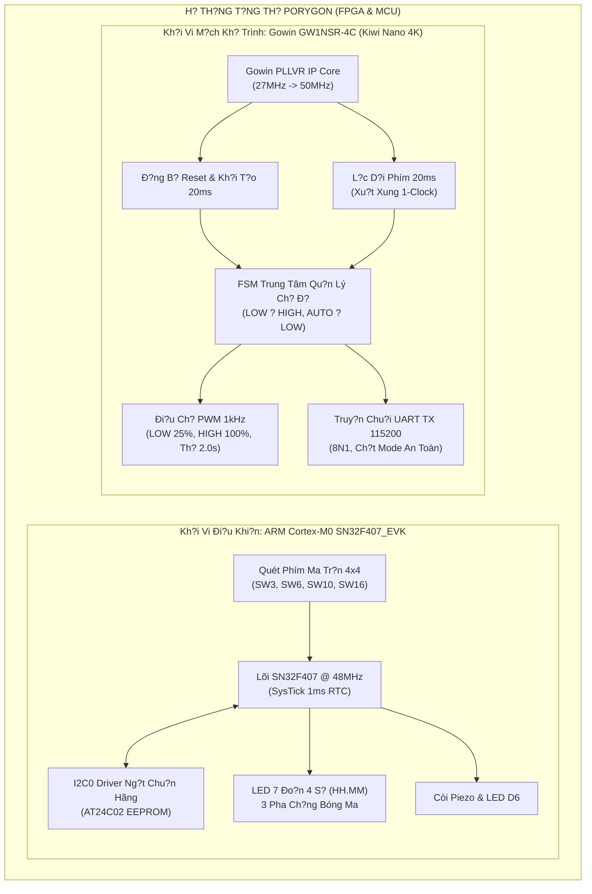

# Porygon: Khung Thi?t K? H? Th?ng FPGA & MCU (Ðà N?ng Contest 2026)

[](https://github.com/zok213/porygon/actions/workflows/ci.yml)
[](https://opensource.org/licenses/MIT)

> **Ði?u Hu?ng Ngôn Ng?**: ???? Ti?ng Vi?t | ???? [English Specification](README_EN.md)

---

# ???? B?N THUY?T MINH Ð?NH HU?NG & T?NG QUAN H? TH?NG MASTER

## ?? B?NG ÐI?U HU?NG CÁC NHÁNH D? ÁN TRÊN GITHUB

H? th?ng mã ngu?n du?c phân tách d?c l?p theo mô hình **Git Flow Ða Nhánh (Multi-Track Branching Strategy)**:

| Phân Kh?i K? Thu?t | Nhánh S?n Ph?m Baseline (Production) | Nhánh Phát Tri?n (Active Dev) | Thu M?c Mã Ngu?n |
| :--- | :--- | :--- | :--- |
| **MCU Track (ARM Cortex-M0 SN32F407)** | ?? [`MCU_main`](https://github.com/zok213/porygon/tree/MCU_main) | ??? [`MCU_dev`](https://github.com/zok213/porygon/tree/MCU_dev) | [`MCU_Contest_2026/`](MCU_Contest_2026/) |
| **FPGA Track (Gowin GW1NSR-4C Verilog RTL)**| ?? [`FPGA_main`](https://github.com/zok213/porygon/tree/FPGA_main) | ??? [`FPGA_dev`](https://github.com/zok213/porygon/tree/FPGA_dev) | [`FPGA/`](FPGA/) |
| **B?n Phát Hành Chính Th?c** | ?? [`release`](https://github.com/zok213/porygon/tree/release) | — | Toàn b? Repository |

---

## 1. Tóm T?t H? Th?ng & Ki?n Trúc 2 Kh?i Cu?c Thi

Tài li?u này trình bày gi?i pháp k? thu?t t?ng th? cho **H?i thi Thi?t k? H? th?ng Nhúng & Vi di?u khi?n Ðà N?ng 2026**, bao g?m hai kh?i ph?n c?ng chuyên bi?t:



### 1.1 Kh?i Vi di?u khi?n (MCU Track - SN32F407_EVK)
- **Ki?n trúc Mã ngu?n**: C99 chu?n nhúng phòng th? ch?y trên chip **SN32F407_EVK** (lõi ARM Cortex-M0).
- **Tính nang**: Ð?ng h? s? 24 gi?, quét da kênh LED 7 do?n ch?ng bóng ma, luu tr? báo th?c vào EEPROM AT24C02 qua I2C0 ng?t ph?n c?ng, thu?t toán ACK Polling, t? ph?c h?i l?i HardFault.
- **Thu m?c**: [`MCU_Contest_2026/`](MCU_Contest_2026/) | **Tài li?u**: [`MCU_Contest_2026/README.md`](MCU_Contest_2026/README.md).

### 1.2 Kh?i Vi m?ch Kh? trình (FPGA Track - Gowin GW1NSR-4C)
- **Ki?n trúc Mã ngu?n**: Verilog RTL chu?n hóa mô ph?ng và t?ng h?p trên FPGA **GW1NSR-LV4CQN48PC7/I6 (Kiwi Nano 4K)**.
- **Tính nang**: PLLVR t?ng h?p $50.0\text{MHz}$, b? l?c d?i phím ph?n c?ng $20\text{ms}$ xu?t xung 1-clock, PWM LED 3 ch? d? (LOW 25%, HIGH 100%, AUTO Th? tuy?n tính chính xác $2.000\text{s}$), truy?n telemetry chu?i UART TX $115,200\text{ bps}$ (sai s? $0.006\%$).
- **Thu m?c**: [`FPGA/`](FPGA/) | **Tài li?u**: [`FPGA/README.md`](FPGA/README.md) & [`FPGA/TESTING.md`](FPGA/TESTING.md).

---

## 2. B?ng Tiêu Chí Ðánh Giá Cu?c Thi (Scoring Rubric)

| Thành ph?n Ðánh giá | Tr?ng s? | Tri?n Khai Th?c T? Trong Mã Ngu?n |
| :--- | :---: | :--- |
| **Ch?c nang Ð?ng h? S? & RTL Core** | **35%** | **MCU**: Ng?t SysTick $1\text{ms}$, quét 7 do?n $HH.MM$.<br>**FPGA**: PLL $50\text{MHz}$, FSM di?u khi?n trung tâm, Debounce 1-clock. |
| **Báo th?c, EEPROM & UART Telemetry**| **15%** | **MCU**: Driver I2C0 ng?t ph?n c?ng d?c/ghi AT24C02.<br>**FPGA**: UART TX $115,200\text{ bps}$ phát chu?i `"MODE: ... \r\n"`. |
| **Tính nang Thu?ng (Bonus Features)** | **10%** | **MCU**: T? d?ng h?y ch?nh sau 30s không thao tác.<br>**FPGA**: Hi?u ?ng LED th? $2.0\text{s}$ m?n màng (2,000 n?c d? sáng). |
| **Thuy?t minh & Demo Video** | **20%** | K?ch b?n ki?m th? tr?c quan trên bo th?t SN32F407_EVK và Kiwi Nano 4K. |
| **Ki?n trúc Mã ngu?n & Tài li?u** | **10%** | Chu?n C99 phòng th? & Verilog chu?n công nghi?p, 0 l?i c?nh báo (0 Errors, 0 Warnings). |
| **Vòng Ph?ng v?n K? thu?t Q&A** | **10%** | Phân tích c?p thanh ghi AHB/APB MCU, ch?ng minh toán h?c PLL & Baudrate UART. |

---

## 3. B?n Ð? C?u Trúc Thu M?c H? Th?ng Master

```
porygon/
+-- .github/                                              # Quy trình CI/CD & M?u tài li?u GitHub
+-- .gitignore                                            # Quy t?c lo?i b? t?p rác Keil MDK & Gowin EDA
+-- CODE_OF_CONDUCT.md                                    # Quy t?c ?ng x? d? án
+-- CONTRIBUTING.md                                       # Quy d?nh qu?n lý nhánh Git Flow
+-- LICENSE                                               # Gi?y phép MIT
+-- README.md                                             # Master B?n Thuy?t minh Ð?nh hu?ng (VI & EN)
+-- README_VI.md                                          # B?n Thuy?t minh Ti?ng Vi?t Master
+-- README_EN.md                                          # Master Routing & System Specification (English)
+-- SECURITY.md                                           # Chính sách b?o m?t & b?o v? b? nh?
+-- SETUP.md                                              # Hu?ng d?n cài d?t toolchain Keil & Gowin
+-- Ð? THI MCU 2026.pdf                                   # Ð? thi chính th?c Kh?i Vi di?u khi?n
+-- Ð? THI FGPA 2026.docx.pdf                             # Ð? thi chính th?c Kh?i FPGA
+-- Gowin-FPGA-Vietnamese-Book-ACG525-Basic-part-Print-v (1).pdf # Tài li?u l?p trình Gowin FPGA
+-- FPGA/                                                 # SUB-REPOSITORY KH?I FPGA (GW1NSR-4C)
¦   +-- .gitignore                                        # Lo?i b? t?p rác impl/, work/, *.wlf
¦   +-- README.md                                         # Báo cáo k? thu?t chi ti?t kh?i FPGA (Song ng?)
¦   +-- TESTING.md                                        # Ma tr?n ki?m th? t? d?ng & Hu?ng d?n ModelSim
¦   +-- README_SIMULATION_SCALING.md                      # Thuy?t minh t? l? th?i gian mô ph?ng tang t?c
¦   +-- pwm11.gprj                                        # T?p d? án Gowin EDA (Kiwi Nano 4K)
¦   +-- constr/pwm11.cst                                  # Ràng bu?c chân v?t lý (Bank 1: 3.3V, Bank 3: 1.8V)
¦   +-- src/                                              # Mã ngu?n RTL t?ng h?p du?c
¦   ¦   +-- top_system.v                                  # Module c?p cao nh?t, Ð?ng b? Reset & FSM
¦   ¦   +-- button_debounce.v                             # L?c d?i phím 20ms xu?t xung 1-clock
¦   ¦   +-- pwm_led_controller.v                          # Ði?u ch? PWM 1kHz (LOW, HIGH, Th? 2.0s)
¦   ¦   +-- uart_tx_string.v                              # Truy?n chu?i UART 115200 8N1 ch?t mode
¦   ¦   +-- gowin_pllvr.v                                 # Wrapper IP Core PLL 27MHz -> 50MHz
¦   ¦   +-- ip/gowin_pllvr/                               # C?u hình IP Gowin PLLVR
¦   +-- sim/                                              # K?ch b?n ki?m th? mô ph?ng
¦   ¦   +-- tb_top_system_v2.v                            # Testbench t? d?ng ki?m tra 11 k?ch b?n
¦   ¦   +-- tb_uart_tx.v                                  # Testbench do th?i gian kh?i UART
¦   ¦   +-- wavefinal.do                                  # K?ch b?n d?ng sóng & Thu?c do ModelSim
¦   +-- docs/                                             # Tài li?u d? bài & Thuy?t minh k? thu?t
+-- MCU_Contest_2026/                                     # SUB-REPOSITORY KH?I MCU (SN32F407)
    +-- .gitignore                                        # Lo?i b? t?p build Keil MDK
    +-- README.md                                         # Báo cáo k? thu?t chi ti?t kh?i MCU
    +-- TESTING.md                                        # Ma tr?n ki?m th? & K?ch b?n demo MCU
    +-- main_clock_skeleton.c                             # Firmware C di?u khi?n FSM & SysTick 1ms
    +-- I2C0.c / I2C.h                                    # Driver I2C0 ng?t ph?n c?ng chu?n SONiX
    +-- Clock_Simulation.uvprojx                          # D? án Keil MDK uVision
    +-- Docs/                                             # Luu tr? d? thi MCU
    +-- RTE/                                              # Thu vi?n CMSIS & Startup SN32F400
```
