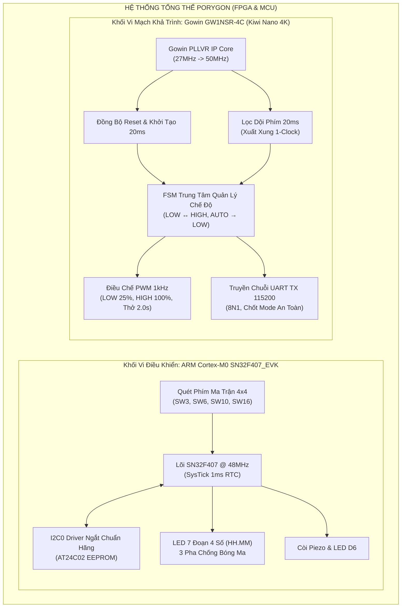

| :--- | :--- | :--- |
| **MCU Track (ARM Cortex-M0 SN32F407)** | 🟢 [`MCU_main`](https://github.com/zok213/porygon/tree/MCU_main) | 🛠️ [`MCU_dev`](https://github.com/zok213/porygon/tree/MCU_dev) | [`MCU_Contest_2026/`](MCU_Contest_2026/) |
| **FPGA Track (Gowin GW1NSR-4C Verilog RTL)**| 🟢 [`FPGA_main`](https://github.com/zok213/porygon/tree/FPGA_main) | 🛠️ [`FPGA_dev`](https://github.com/zok213/porygon/tree/FPGA_dev) | [`FPGA/`](FPGA/) |
| **Bản Phát Hành Chính Thức** | 🏆 [`release`](https://github.com/zok213/porygon/tree/release) | — | Toàn bộ Repository |

---

## 1. Tóm Tắt Hệ Thống & Kiến Trúc 2 Khối Cuộc Thi

Dự án tích hợp hai khối phần cứng chuyên biệt cho **Hội thi Thiết kế Hệ thống Nhúng & Vi điều khiển Đà Nẵng 2026**:



### 1.1 Khối Vi điều khiển (MCU Track — SN32F407_EVK)
- **Kiến trúc Mã nguồn**: C99 chuẩn nhúng phòng thủ (Defensive Embedded C) chạy trên chip **SN32F407_EVK** (lõi ARM Cortex-M0).
- **Tính năng**: Đồng hồ số 24 giờ, quét đa kênh LED 7 đoạn 3 pha chống bóng ma, lưu trữ báo thức vào EEPROM AT24C02 qua I2C0 ngắt phần cứng, thuật toán ACK Polling chống nghẽn bus, và tự phục hồi lỗi HardFault.
- **Thư mục**: [`MCU_Contest_2026/`](MCU_Contest_2026/) | **Tài liệu**: [`MCU_Contest_2026/README.md`](MCU_Contest_2026/README.md).

### 1.2 Khối Vi mạch Khả trình (FPGA Track — Gowin GW1NSR-4C)
- **Kiến trúc Mã nguồn**: Verilog RTL chuẩn công nghiệp tổng hợp trên FPGA **GW1NSR-LV4CQN48PC7/I6 (Kiwi Nano 4K)**.
- **Tính năng**: PLLVR tổng hợp $50.0\text{ MHz}$, bộ lọc dội phím phần cứng $20\text{ ms}$ xuất xung 1-clock, PWM LED 3 chế độ (LOW 25%, HIGH 100%, AUTO Thở tuyến tính chính xác $2.000\text{ s}$ gồm 2,000 nấc độ sáng), truyền telemetry chuỗi UART TX $115,200\text{ bps}$ (sai số $0.0064\% \ll \pm 2.0\%$), cơ chế chốt mode chống méo dạng khung truyền, và testbench tự động kiểm tra 11 kịch bản (11/11 Checks PASS).
- **Thư mục**: [`FPGA/`](FPGA/) | **Tài liệu**: [`FPGA/README.md`](FPGA/README.md) & [`FPGA/TESTING.md`](FPGA/TESTING.md).

---

## 2. Bảng Tiêu Chí Đánh Giá Cuộc Thi (Scoring Rubric)

| Thành phần Đánh giá | Trọng số | Triển Khai Thực Tế Trong Mã Nguồn |
| :--- | :---: | :--- |
| **Chức năng Đồng hồ Số & RTL Core** | **35%** | **MCU**: Ngắt SysTick $1\text{ms}$, quét 7 đoạn $HH.MM$.<br>**FPGA**: PLL $50\text{MHz}$, FSM điều khiển trung tâm, Debounce 1-clock. |
| **Báo thức, EEPROM & UART Telemetry**| **15%** | **MCU**: Driver I2C0 ngắt phần cứng đọc/ghi AT24C02.<br>**FPGA**: UART TX $115,200\text{ bps}$ phát chuỗi `"MODE: ... \r\n"`. |
| **Tính năng Thưởng (Bonus Features)** | **10%** | **MCU**: Tự động hủy chỉnh sau 30s không thao tác.<br>**FPGA**: Hiệu ứng LED thở $2.0\text{s}$ mịn màng (2,000 nấc độ sáng). |
| **Thuyết minh & Demo Video** | **20%** | Kịch bản kiểm thử trực quan trên bo thật SN32F407_EVK và Kiwi Nano 4K. |
| **Kiến trúc Mã nguồn & Tài liệu** | **10%** | Chuẩn C99 phòng thủ & Verilog chuẩn công nghiệp, 0 lỗi cảnh báo (0 Errors, 0 Warnings). |
| **Vòng Phỏng vấn Kỹ thuật Q&A** | **10%** | Phân tích cấp thanh ghi AHB/APB MCU, chứng minh toán học PLL & Baudrate UART. |

---

## 3. Bản Đồ Cấu Trúc Thư Mục Hệ Thống Master

```
porygon/
├── .github/                                              # Quy trình CI/CD & Mẫu tài liệu GitHub
├── .gitignore                                            # Quy tắc loại bỏ tệp rác Keil MDK & Gowin EDA
├── CODE_OF_CONDUCT.md                                    # Quy tắc ứng xử dự án
├── CONTRIBUTING.md                                       # Quy định quản lý nhánh Git Flow
├── LICENSE                                               # Giấy phép MIT
├── README.md                                             # Master Bản Thuyết minh Định hướng (VI & EN)
├── README_VI.md                                          # Bản Thuyết minh Tiếng Việt Master
├── README_EN.md                                          # Master Routing & System Specification (English)
├── SECURITY.md                                           # Chính sách bảo mật & bảo vệ bộ nhớ
├── SETUP.md                                              # Hướng dẫn cài đặt toolchain Keil & Gowin
├── ĐỀ THI MCU 2026.pdf                                   # Đề thi chính thức Khối Vi điều khiển
├── ĐỀ THI FGPA 2026.docx.pdf                             # Đề thi chính thức Khối FPGA
├── Gowin-FPGA-Vietnamese-Book-ACG525-Basic-part-Print-v (1).pdf # Tài liệu lập trình Gowin FPGA
├── FPGA/                                                 # SUB-REPOSITORY KHỐI FPGA (GW1NSR-4C)
│   ├── .gitignore                                        # Loại bỏ tệp rác impl/, work/, *.wlf
│   ├── README.md                                         # Báo cáo kỹ thuật chi tiết khối FPGA (Song ngữ)
│   ├── TESTING.md                                        # Ma trận kiểm thử tự động & Hướng dẫn ModelSim
│   ├── README_SIMULATION_SCALING.md                      # Thuyết minh tỷ lệ thời gian mô phỏng tăng tốc
│   ├── pwm11.gprj                                        # Tệp dự án Gowin EDA (Kiwi Nano 4K)
│   ├── constr/pwm11.cst                                  # Ràng buộc chân vật lý (Bank 1: 3.3V, Bank 3: 1.8V)
│   ├── src/                                              # Mã nguồn RTL tổng hợp được
│   │   ├── top_system.v                                  # Module cấp cao nhất, Đồng bộ Reset & FSM
│   │   ├── button_debounce.v                             # Lọc dội phím 20ms xuất xung 1-clock
│   │   ├── pwm_led_controller.v                          # Điều chế PWM 1kHz (LOW, HIGH, Thở 2.0s)
│   │   ├── uart_tx_string.v                              # Truyền chuỗi UART 115200 8N1 chốt mode
│   │   ├── gowin_pllvr.v                                 # Wrapper IP Core PLL 27MHz -> 50MHz
│   │   └── ip/gowin_pllvr/                               # Cấu hình IP Gowin PLLVR
│   ├── sim/                                              # Kịch bản kiểm thử mô phỏng
│   │   ├── tb_top_system_v2.v                            # Testbench tự động kiểm tra 11 kịch bản
│   │   ├── tb_uart_tx.v                                  # Testbench đo thời gian khối UART
│   │   └── wavefinal.do                                  # Kịch bản dạng sóng & Thước đo ModelSim
│   └── docs/                                             # Tài liệu đề bài & Thuyết minh kỹ thuật
└── MCU_Contest_2026/                                     # SUB-REPOSITORY KHỐI MCU (SN32F407)
    ├── .gitignore                                        # Loại bỏ tệp build Keil MDK
    ├── README.md                                         # Báo cáo kỹ thuật chi tiết khối MCU
    ├── TESTING.md                                        # Ma trận kiểm thử & Kịch bản demo MCU
    ├── main_clock_skeleton.c                             # Firmware C điều khiển FSM & SysTick 1ms
    ├── I2C0.c / I2C.h                                    # Driver I2C0 ngắt phần cứng chuẩn SONiX
    ├── Clock_Simulation.uvprojx                          # Dự án Keil MDK uVision
    ├── Docs/                                             # Lưu trữ đề thi MCU
    └── RTE/                                              # Thư viện CMSIS & Startup SN32F400
```

---