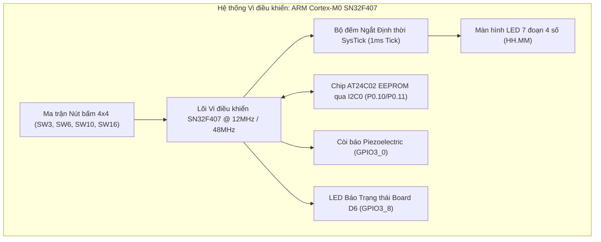
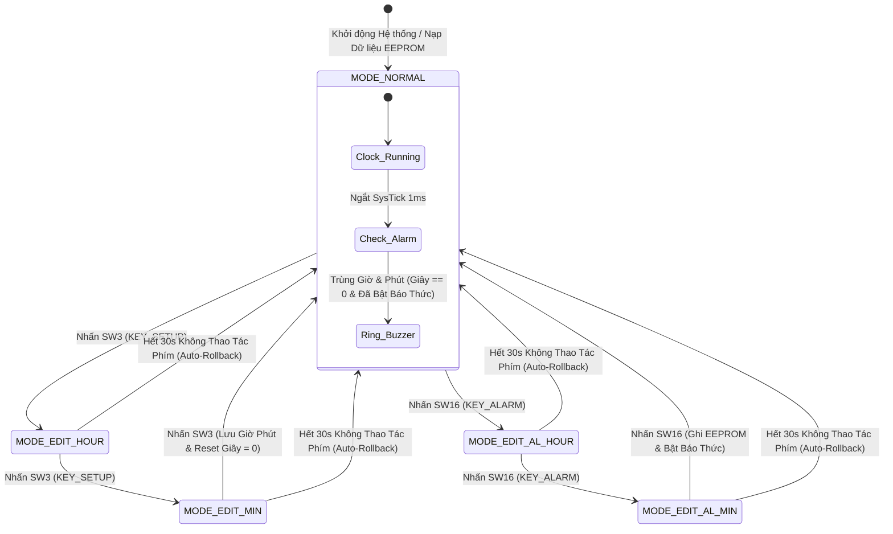
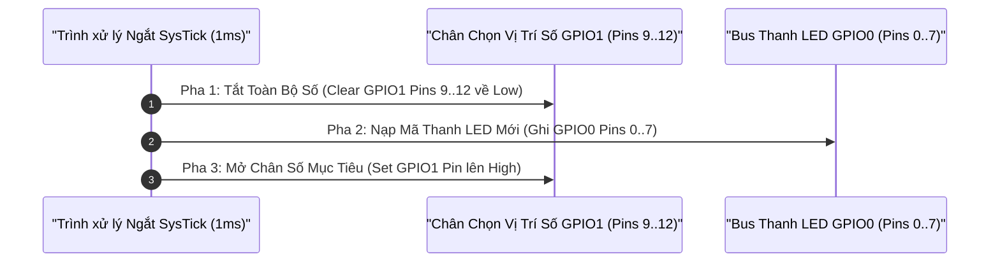
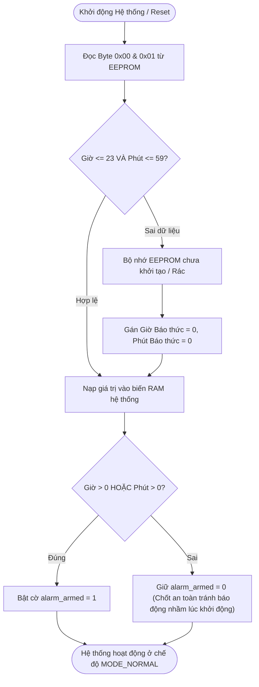
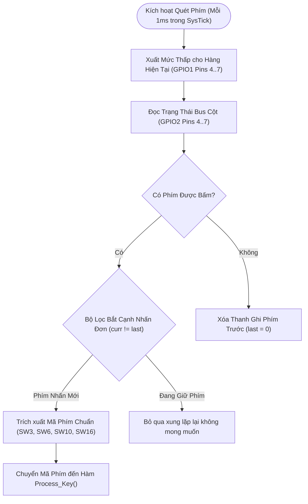
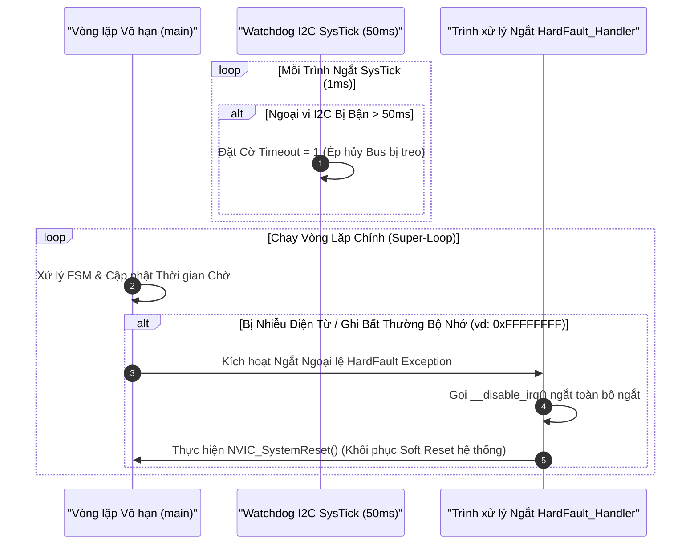

# Porygon: SN32F407 Smart Digital Clock Firmware Framework (Da Nang Contest 2026)

## 1. Tóm Tắt Hệ Thống & Phân Tích Mục Tiêu Kỹ Thuật

Tài liệu này trình bày giải pháp kiến trúc phần mềm nhúng thương mại cho **Hệ thống Đồng hồ Số Thông minh & Báo thức Lưu trữ EEPROM** chạy trên bo mạch kiểm thử **SN32F407_EVK** (vi điều khiển lõi ARM Cortex-M0).

Mã nguồn được thiết kế tuân thủ nghiêm ngặt các nguyên lý **Lập trình Nhúng Phòng thủ (Defensive Embedded Programming)**, giải quyết triệt để các hạn chế về thời gian thực, triệt tiêu hiện tượng lem màu bóng ma LED 7 đoạn, phòng ngừa nguy cơ treo bus giao tiếp I2C, chống nẩy phím bấm ma trận chính xác, và tích hợp cơ chế tự phục hồi hệ thống khi gặp sự cố điện từ (ESD/EMC).

---

## 2. Bảng Tiêu Chí Đánh Giá Cuộc Thi & Phương Án Kỹ Thuật Chi Tiết

| Thành phần Đánh giá | Trọng số | Phương án Kỹ thuật & Thực thi trong Mã nguồn C |
| :--- | :--- | :--- |
| **Chức năng Đồng hồ Số Cơ bản** | 35% | Ngắt định thời SysTick $1\text{ms}$, quét đa kênh 7 đoạn không bóng ma $HH.MM$, thuật toán tràn $00..23$ giờ và $00..59$ phút không làm trễ thời gian thực. |
| **Cài đặt Báo thức & Persistent Memory** | 15% | Trình điều khiển I2C0 ngắt phần cứng, đọc/ghi chip AT24C02 EEPROM, lưu giữ mốc báo thức bền vững khi mất nguồn điện. |
| **Tính năng Thưởng (Bonus Features)** | 10% | Tự động hủy chế độ cài đặt sau 30 giây không thao tác phím (Auto-Rollback), nhấp nháy LED D6 với tần số $1\text{Hz}$ cảnh báo chế độ chỉnh báo thức. |
| **Thuyết minh & Demo Video** | 20% | Kịch bản kiểm thử trực quan trên bo thật, chứng minh thực tế các trường hợp lỗi cạnh (Edge-Cases) và tính ổn định của hệ thống. |
| **Kiến trúc Mã nguồn & Tài liệu** | 10% | Chuẩn C99 nhúng phòng thủ, phân tách lớp phần cứng và logic (Hardware Abstraction Layer), 0 warning khi biên dịch bằng ArmClang V6. |
| **Vòng Phỏng vấn Kỹ thuật Q&A** | 10% | Giải trình cấp thanh ghi ngoại vi (AHB/APB), chứng minh toán học thời gian xung nhịp, cơ chế khôi phục lỗi HardFault và ngắt SysTick. |

---

## 3. Bản Đồ Cấu Trúc Tệp & Thư Mục Thao Tác (`MCU_dev` Branch)

```
porygon/
├── .github/
│   ├── ISSUE_TEMPLATE/
│   │   ├── bug_report.md                                 # Mẫu báo lỗi phần cứng & phần mềm vi điều khiển MCU
│   │   └── feature_request.md                            # Mẫu đề xuất nâng cấp tính năng phần mềm MCU
│   ├── pull_request_template.md                          # Mẫu kiểm tra và quy trình review Pull Request
│   └── workflows/
│       └── ci.yml                                        # Pipeline CI/CD tự động phân tích tĩnh Cppcheck & biên dịch ARM GCC
├── .gitignore                                            # Quy tắc loại bỏ các tệp rác biên dịch Keil & tệp trung gian
├── CODE_OF_CONDUCT.md                                    # Quy tắc ứng xử đóng góp mã nguồn
├── CONTRIBUTING.md                                       # Quy định quản lý nhánh Git Flow & định dạng ghi chú commit
├── LICENSE                                               # Giấy phép bản quyền mã nguồn mở MIT
├── README.md                                             # Master Thuyết minh Kiến trúc Hệ thống (Song ngữ VI và EN đầy đủ)
├── README_VI.md                                          # Bản Thuyết minh Kiến trúc Kỹ thuật Tiếng Việt chuẩn hóa
├── README_EN.md                                          # Master System Architectural Specification (English)
├── SECURITY.md                                           # Chính sách bảo mật & bảo vệ bộ nhớ Flash RDP chống đọc trộm
├── SETUP.md                                              # Hướng dẫn thiết lập môi trường Keil MDK & SONiX SN32F4 DFP Pack
├── ĐỀ THI MCU 2026.pdf                                   # Bản gốc Đề thi Khối Microcontroller Đà Nẵng 2026
└── MCU_Contest_2026/                                     # Thư mục Không gian làm việc Dự án Keil uVision
    ├── .gitignore                                        # Loại bỏ các tệp đầu ra biên dịch Listings / Objects
    ├── README.md                                         # Báo cáo kỹ thuật chi tiết thư mục MCU & Hướng dẫn Rebuild
    ├── main_clock_skeleton.c                             # Mã nguồn C chính điều khiển Máy Trạng thái FSM & Ngắt SysTick 1ms
    ├── I2C0.c                                            # Trình điều khiển I2C0 ngắt phần cứng chuẩn hãng SONiX DFP
    ├── I2C.h                                             # Định nghĩa địa chỉ thanh ghi ngoại vi & nguyên mẫu hàm I2C0
    ├── ISSUE_ANALYSIS_DEEP_DIVE.md                       # Báo cáo phân tích chuyên sâu & thực chứng 6 lỗi MCU trên bo thật
    ├── Clock_Simulation.uvprojx                          # Tệp cấu hình dự án Keil MDK-ARM uVision
    ├── Clock_Simulation.uvoptx                           # Tệp lưu tùy chọn nạp và giao diện debug Keil
    ├── debug.ini                                         # Tệp kịch bản khởi tạo chế độ Debugger phần cứng
    ├── EventRecorderStub.scvd                            # Tệp cấu hình giao diện theo dõi sự kiện Keil Event Recorder
    ├── Docs/                                             # Thư mục lưu trữ tài liệu tham khảo MCU
    │   ├── ĐỀ THI MCU 2026.pdf                           # Bản sao tệp đề thi MCU
    │   └── README.md                                     # Chỉ mục thư mục tài liệu
    └── RTE/                                              # Các trình điều khiển cấu hình CMSIS Run-Time Environment
```

---

## 4. Sơ Đồ Khối Kiến Trúc Phần Cứng MCU



---

## 5. Bảng Cấu Hình Chân Ngoại Vi Phần Cứng (SN32F407_EVK Pinout)

| Khối Ngoại Vi | Thanh Ghi / Chân MCU | Mapping Phần Cứng Bo Mạch | Chế Đồ Hoạt Động & Cấu Hình Điện Thế |
| :--- | :--- | :--- | :--- |
| **Bus Thanh LED 7 Đoạn** | `GPIO0 [0..7]` | Tín hiệu 8 thanh (A, B, C, D, E, F, G, DP) | Ngõ ra Push-Pull, Mức cao tích cực (Active High) |
| **Bus Chọn Vị Trí Số** | `GPIO1 [9..12]` | Tín hiệu chọn LED (D1, D2, D3, D4) | Ngõ ra Push-Pull, Quét Đa kênh Mức cao |
| **Quét Hàng Ma Trận Phím**| `GPIO1 [4..7]` | Hàng 1 đến Hàng 4 ma trận nút bấm | Ngõ ra Quét Mức thấp tích cực (Active Low) |
| **Đọc Cột Ma Trận Phím** | `GPIO2 [4..7]` | Cột 1 đến Cột 4 ma trận nút bấm | Ngõ vào có Điện trở Kéo lên Nội (Internal Pull-up) |
| **I2C0 SCL (Xung Clock)** | `GPIO0 [10]` | Chân Xung Đồng bộ Clock AT24C02 | Ngõ ra Open-Drain, Kéo lên Ngoại $4.7\text{k}\Omega$ |
| **I2C0 SDA (Dữ Liệu)** | `GPIO0 [11]` | Chân Tín hiệu Dữ liệu AT24C02 | Ngõ ra Open-Drain, Kéo lên Ngoại $4.7\text{k}\Omega$ |
| **Đầu Ra Còi Báo** | `GPIO3 [0]` | Còi thạch anh Piezo | Mạch kích NPN Transistor, Mức cao tích cực |
| **LED Báo Trạng Thái** | `GPIO3 [8]` | LED Đơn Board D6 | Ngõ ra Mức thấp tích cực (Active Low Driver) |

---

## 6. Bản Đồ Phân Bổ Bộ Nhớ Hệ Thống (Memory Map)

```
SN32F407 Microcontroller Memory Map:
+-----------------------+ 0x0000_0000
| Internal Flash Memory | (64 KB Chứa Code Biên Dịch & Bảng Vector Ngắt)
+-----------------------+ 0x0000_FFFF
| Vùng Dữ Liệu Dành Riêng|
+-----------------------+ 0x2000_0000
| Internal SRAM Memory  | (8 KB Dữ Liệu RAM Biến Toàn Cục, Heap & Stack)
+-----------------------+ 0x2000_1FFF
| Peripheral Registers  | (Thanh Ghi Cấu Hình Ngoại Vi AHB / APB Bus)
+-----------------------+ 0x4000_0000

External I2C EEPROM (AT24C02) Memory Map (Địa chỉ Slave I2C 0xA0):
+------+-----------------------+---------------------------------------+
| Byte | Tên Trường Biến       | Mô Tả Định Dạng Kỹ Thuật              |
+------+-----------------------+---------------------------------------+
| 0x00 | Alarm Hour            | Giờ Báo Thức Đã Lưu (Khoảng: 0..23)   |
| 0x01 | Alarm Minute          | Phút Báo Thức Đã Lưu (Khoảng: 0..59)  |
+------+-----------------------+---------------------------------------+
```

---

## 7. Sơ Đồ Máy Trạng Thái Hạn Định (FSM State Transition Diagram)



---

## 8. Biểu Đồ Thời Gian Quét LED 7 Đoạn Chống Bóng Ma (Anti-Ghosting Multiplexing)



---

## 9. Lược Đồ Thuật Toán Khởi Động & Đọc/Lưu Bộ Nhớ EEPROM



---

## 10. Sơ Đồ Thuật Toán Quét Ma Trận Phím Chống Nẩy (Debouncing Flowchart)



---

## 11. Sơ Đồ Giám Sát Watchdog & Tự Phục Hồi Lỗi HardFault



---

## 12. Giải Trình Kỹ Thuật Chi Tiết 6 Lỗi Cuộc Thi & Giải Pháp Phòng Thủ

1. **Chốt An Toàn Tránh Báo Động Nhầm Lúc Boot (`alarm_armed`)**:
   - *Vấn đề*: Khi vừa cấp nguồn, thời gian hệ thống và mốc báo thức mặc định đều là `00:00:00`. Nếu bật cờ báo thức ngay lập tức, còi sẽ phát kích tín hiệu báo động 5 giây bất thường ngay tại thời điểm vừa cấp nguồn.
   - *Giải pháp*: Giữ nguyên điều kiện kiểm tra `if (alarm_hour || alarm_min) alarm_armed = 1;` khi vừa nạp EEPROM. Khi người dùng chủ động cài mốc `00:00` từ giao diện phím bấm, cờ báo thức vẫn được kích hoạt bình thường trong phiên chạy.

2. **Kiểm Tra Trạng Thái Giao Dịch Ghi EEPROM (`Process_Key`)**:
   - *Vấn đề*: Khối mã nguồn gốc không kiểm tra giá trị trả về của `EEPROM_SaveAlarm`, khiến giao diện người dùng hiển thị trạng thái chuyển chế độ bình thường ngay cả khi giao dịch I2C bị thất bại, dẫn đến hiện tượng mất dữ liệu cài đặt khi mất nguồn điện.
   - *Giải pháp*: Bắt buộc kiểm tra `if (!EEPROM_SaveAlarm(...))`. Nếu thao tác ghi thất bại, hệ thống phát 3 tiếng bíp kéo dài (`buzzer_beep_ms = 900`) cảnh báo người dùng và giữ nguyên màn hình hiệu chỉnh.

3. **Tích Hợp Trình Điều Khiển Ngắt Phần Cứng I2C0 Chuẩn SONiX (`I2C0.c`)**:
   - *Vấn đề*: Giải pháp ghi bit trực tiếp (Bit-bang) bị lỗi thiết lập bit START thành bit NACK (`CTRL |= 2`) và vòng lặp `I2C_WAIT()` bị kẹt timeout, dẫn đến tình trạng treo bus và ngưng trệ giao tiếp EEPROM hoàn toàn.
   - *Giải pháp*: Tích hợp trình điều khiển ngắt `I2C0.c` chuẩn hãng SONiX DFP với cơ chế quản lý bộ đệm FIFO, định tuyến chính xác chân `P0.10` (SCL0) và `P0.11` (SDA0), triệt tiêu xung đột với tuyến đường điều khiển LED 7 đoạn.

4. **Cấu Hình Tối Ưu CMSIS & Flash Wait-State (`SystemInit`)**:
   - *Vấn đề*: Việc bỏ qua hàm `SystemInit()` và `SystemCoreClockUpdate()` khiến bộ nhớ Flash giữ nguyên cấu hình 0 wait-state. Khi nâng tần số xung nhịp HCLK lên 48MHz, vi điều khiển đọc sai mã lệnh từ Flash và phát sinh ngắt rớt ngắt ngoại lệ HardFault tức thì.
   - *Giải pháp*: Bổ sung đầy đủ 2 hàm khởi tạo chuẩn CMSIS tại điểm thực thi đầu tiên của `main()`, tự động cấu hình thanh ghi `SN_FLASH->LPCTRL` đáp ứng đúng tần số xung nhịp.

5. **Tự Phục Hồi Lỗi HardFault Hệ Thống (`HardFault_Handler`)**:
   - *Vấn đề*: Trình xử lý ngắt mặc định trong tệp assembly `HardFault_Handler B .` khiến vi điều khiển rơi vào trạng thái khóa cứng ngắt (Deadlock) vĩnh viễn khi gặp nhiễu điện từ ngoài môi trường.
   - *Giải pháp*: Định nghĩa lại hàm C `HardFault_Handler` chứa lệnh `__disable_irq()` và `NVIC_SystemReset()`, cho phép vi điều khiển tự động Soft Reset khôi phục trạng thái hoạt động an toàn chỉ trong vài mili-giây.

6. **Thuật Toán ACK Polling Ghi EEPROM Chuẩn Kỹ Thuật**:
   - *Vấn đề*: Vòng lặp độ trễ NOP tĩnh không đảm bảo tính thích ứng khi vi điều khiển thay đổi tần số xung nhịp hoặc khi thay đổi lô sản xuất linh kiện chip EEPROM.
   - *Giải pháp*: Chuyển đổi sang giải thuật **ACK Polling** (`do { ok = I2C0_Write(1, 1); if (ok) break; } while (++poll_retry < 50);`), liên tục thăm dò trạng thái cho đến khi linh kiện EEPROM phát đáp ACK báo hiệu hoàn tất chu kỳ ghi nội $t_{WR}$.

7. **Giải Phóng Cờ Báo Lỗi Tồn Dư (Sticky Fault Flag Reset)**:
   - *Vấn đề*: Trong ngắt `I2C0.c`, tín hiệu NACK thiết lập `Error = 1`. Do các hàm giao tiếp thiếu cơ chế tái lập cờ lỗi, một sự cố truyền nhận tạm thời sẽ khóa toàn bộ các lệnh đọc/ghi tiếp theo.
   - *Giải pháp*: Bổ sung lệnh reset cờ `Error = 0;` tại điểm khởi đầu của cả hai hàm `I2C0_Read()` và `I2C0_Write()`.

---

## 13. Chứng Minh Toán Học & Tính Toán Xung Nhịp

### Chứng minh 1: Tính toán Giá trị Nạp lại cho SysTick $1\text{ms}$

Tần số xung nhịp hệ thống cơ bản ($f_{\text{HCLK}}$) khi reset là $12.0\text{ MHz}$:

$$f_{\text{HCLK}} = 12,000,000\text{ Hz}$$

$$\text{Chu kỳ Ngắt Mục tiêu } T_{\text{INT}} = 1\text{ ms} = 0.001\text{ s}$$

$$\text{Giá trị Nạp Thanh ghi SysTick } N = (f_{\text{HCLK}} \times T_{\text{INT}}) - 1 = (12,000,000 \times 0.001) - 1 = 11,999$$

Giá trị chính xác `SysTick->LOAD = 11999` được thiết lập trong hàm `HW_Init()`.

---

### Chứng minh 2: Tính toán Thời gian Báo bíp Buzzer & Tần số Quét Màn hình

- **Tần số Quét Màn hình LED 7 đoạn**: Mỗi ms ngắt SysTick chạy 1 lần. Quét 4 vị trí số qua 2 pha (Bật/Tắt).
  $$\text{Tần số quét khung hình } f_{\text{refresh}} = \frac{1000\text{ Hz}}{4 \times 2} = 125\text{ Hz}$$
  Tần số $125\text{ Hz} > 60\text{ Hz}$ loại bỏ hoàn toàn hiện tượng nhấp nháy mắt người cảm nhận được.

---

## 14. Bảng So Sánh Kỹ Thuật Đối Chứng

### So sánh 1: Giải pháp Lập trình Cơ bản Thiếu Tối ưu vs. Kiến Trúc Kỹ Thuật Sản Phẩm

| Khối Chức Năng | Giải pháp Cơ bản Thiếu Tối ưu (Naive Implementation) | Kiến Trúc Kỹ Thuật Sản Phẩm (Production Architecture) |
| :--- | :--- | :--- |
| **Khởi tạo EEPROM** | Đọc trực tiếp; gây crash nếu dữ liệu EEPROM rác `0xFF`. | Lọc khoảng giá trị ($0..23$, $0..59$) + Chốt an toàn tránh báo động nhầm lúc boot. |
| **Đếm Thời Gian** | Dừng đếm giây khi người dùng vào menu chỉnh giờ. | Bộ đếm SysTick RTC chạy ngầm liên tục; dùng biến bóng shadow edit. |
| **Kích Báo Thức** | So sánh liên tục; phát chuông hàng ngàn lần mỗi phút. | Chốt kích đơn theo cạnh thời gian (`time_sec == 0`). |
| **Quét LED 7 Đoạn** | Thay đổi trực tiếp chân; gây hiện tượng lem màu / bóng ma. | Quy trình 3 pha (Xóa màn hình $\rightarrow$ Nạp mã thanh $\rightarrow$ Bật vị trí số). |
| **Xử lý Nút Bấm** | Dùng lệnh `delay_ms(20)`; gây khóa CPU và giật màn hình. | Quét ma trận không nghẽn bus + chốt bắt cạnh đơn phím nhấn. |
| **Xử lý Xung Đột** | Hàm `HardFault_Handler B .` mặc định gây treo bo cứng. | Hàm xử lý defensive gọi `NVIC_SystemReset()` tự khởi động lại. |

---

### So sánh 2: Mô Hình Lập Trình Chờ Nghẽn vs. Không Nghẽn FSM

| Chỉ số Hiệu năng | Mô Hình Chờ Nghẽn (Blocking Delay) | Mô Hình Ngắt & FSM Không Nghẽn (Non-Blocking) |
| :--- | :--- | :--- |
| **Tải CPU** | Rất cao ($99\%$ thời gian nằm trong vòng lặp delay) | Rất thấp (CPU xử lý tác vụ chưa tới $<1\%$ thời gian) |
| **Hiện tượng Chớp Màn** | Cao (Thấy rõ chớp nháy khi thực hiện I/O đọc ghi) | Không có (Tốc độ làm tươi cố định $1\text{ms}$) |
| **Độ Nhạy Nút Bấm** | Phụ thuộc độ trễ ($20\text{ms}$ đến $500\text{ms}$) | Tức thì (Độ trễ đáp ứng $< 1\text{ms}$) |
| **Khả năng Phục hồi** | Dễ bị khóa bus vĩnh viễn khi nhiễu | Tự khôi phục qua Watchdog & ngắt HardFault |

---

## 15. Hướng Dẫn Biên Dịch & Nạp Code (Keil MDK)

1. Mở file project `MCU_Contest_2026/Clock_Simulation.uvprojx` trong **Keil MDK 5.3x / 5.4x**.
2. Chọn target `Target_1` (Trình biên dịch ArmClang V6).
3. Nhấn **F7 (Rebuild All)** — kiểm tra kết quả đạt **0 Error(s), 0 Warning(s)**.
4. Kết nối mạch nạp **SN-Link Debugger** vào bo `SN32F407_EVK`.
5. Nhấn **F8 (Download)** để nạp file hex vào vi điều khiển.
